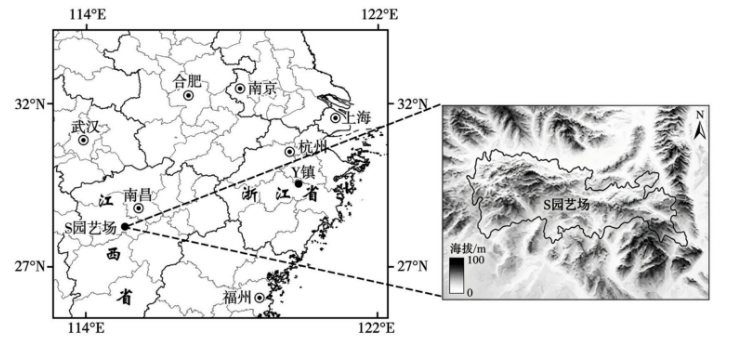

# 2026年广东高考地理真题 · 第18题

## 来源
- 来源文档：2026年高考地理试卷（广东）（空白卷）.docx（及 2026年高考地理试卷（广东）（解析卷）.docx）
- 题号：18(1)、18(2)、18(3)

## 题组材料
18\. 阅读图文资料，完成下列要求。

江西省樟树市拥有悠久的中医药文化历史，有“中国药都”之称，位于其西南部丘陵区的S园艺场种有多种中草药，种植面积达七千余亩。2024年，该园艺场在气象部门、高校和相关企业支持下，建立了多个气象观测点，将气象要素深度融入中药材产业中，建成为全国首个“中药气象小镇”，实现了药材提质增产及旅游增收。其所打造的“气象+中药+文旅”融合发展模式具有一定的推广价值。下图示意该园艺场地理位置及地形。

## 相关图片


### 第18题（1）
question_id: `2026-广东-地理-2026年广东高考地理真题-Q18-1`

**题干**：

（1）从气象条件与中草药种植关系的角度，分析S园艺场建立多个气象观测点的必要性。

**答案**：

【答案】（1）丘陵地形，水热条件的空间分布差异较大；草药种类多，对水热条件的需求差异大；设置多个气象站，为关注中草药的种植情况提供气象数据。

**解析**：

【小问1详解】

本题可根据区域丘陵地形、中药材种植两类背景，从局地气象差异、作物需求差异、产业生产需求三层推导必要性。首先，依托S园艺场地处丘陵区的地形特征，可推知丘陵起伏导致局地海拔、坡向差异大，水热、光照等气象要素空间分布不均，单一处观测点无法覆盖全域气象状况；然后，依托园艺场种植多种中草药的作物背景，可推知不同中药材生长所需气温、降水、湿度等气象条件差异显著，需要分区精准气象数据匹配种植管理；最后，依托“气象+中药”产业提质增产的发展需求，可推知多点观测能持续采集全域精细化气象数据，精准预测气象灾害、匹配药材生长周期，指导科学种植，保障药材品质与产量。

**知识点归属**：
- **核心考点 · 权重 1.0**：人文地理 → 产业区位 → 农业区位因素
  - 依据：丘陵区水热空间差异和多种中草药需求差异共同决定气象观测需要多点布设。
- **支撑知识 · 权重 0.7**：自然地理 → 自然环境的整体性与差异性 → 地方性分异规律
  - 依据：局地海拔、坡向变化形成水热条件差异，单一观测点难以代表全园。

**具体考查**：丘陵药材种植的多点气象观测

**整体置信度**：高

**待复核**：否

<!-- MANAGED-KM-START Q18-1
```yaml
question_id: "2026-广东-地理-2026年广东高考地理真题-Q18-1"
question_number: 18
sub_question: 1
knowledge_points:
  - role: core_exam_point
    weight: 1.0
    domain_id: DM-HUM
    domain: "人文地理"
    theme_id: TH-HUM-INDUSTRY
    theme: "产业区位"
    knowledge_unit_id: KU-HUM-IND-001
    knowledge_unit: "农业区位因素"
    evidence: "丘陵区水热空间差异和多种中草药需求差异共同决定气象观测需要多点布设。"
  - role: supporting_knowledge
    weight: 0.7
    domain_id: DM-NAT
    domain: "自然地理"
    theme_id: TH-NAT-INTEGRITY
    theme: "自然环境的整体性与差异性"
    knowledge_unit_id: KU-NAT-INTEGRITY-007
    knowledge_unit: "地方性分异规律"
    evidence: "局地海拔、坡向变化形成水热条件差异，单一观测点难以代表全园。"
extra_tags:
  - "丘陵药材种植的多点气象观测"
taxonomy_version: "config-v0.2-draft"
confidence: "high"
label_status: "completed"
needs_review: false
taxonomy_review:
  needs_review: false
  issue_type: "none"
  review_note: ""
note: ""
```
-->

### 第18题（2）
question_id: `2026-广东-地理-2026年广东高考地理真题-Q18-2`

**题干**：

（2）“中药气象小镇”建成后，该园艺场哪些方面的区位条件得以改善？请说明理由。

**答案**：

【答案】（2）技术水平：气象要素（数据）服务于中草药种植，提升农文旅产业技术含量；文化：“中药气象小镇”农文旅融合进一步弘扬中药历史文化；市场：药材提质增产，游客量增多，增强品牌与市场影响力；劳动力：校-企合作，增强劳动力专业素质和服务能力；基础设施：产业融合改善了基础设施，增强了集聚效应；政策与资金：政-校-企的支持与合作，政策、资金、产业协作等条件得到优化。

**解析**：

【小问2详解】

根据材料气象部门、高校、企业多方扶持、农文旅融合发展的背景，从技术、文化品牌、市场、劳动力、基础设施、政策资金六大维度逐层推导。技术条件：依托气象观测、高校科研技术落地的产业背景，可推知气象数据深度赋能中药材种植，引入科研技术，提升种植、文旅全产业链技术水平；文化与品牌条件：依托樟树“中国药都”中医药文化、全国首个中药气象小镇的独有定位，可推知融合气象与中医药文化，打造独特文旅IP，提升区域品牌知名度；市场条件：依托药材提质增产、文旅观光增收的产业成效，可推知药材产量品质提升拓宽农产品市场，特色小镇吸引游客，扩大消费市场，增强市场影响力；劳动力条件：依托高校、企业校-企合作的协作背景，可推知开展专业种植、文旅服务培训，提升本地劳动力专业素养与产业服务能力；基础设施条件：依托农文旅融合产业集聚发展的建设需求，可推知配套完善种植、观光、交通等基础设施，产业集聚效应增强；政策与资金条件：依托气象部门、高校、相关企业多方扶持的政策背景，可推知政-企-校协同合作，获得政策扶持、科研资金、产业协作资源，优化产业发展支撑条件。

**知识点归属**：
- **核心考点 · 权重 1.0**：人文地理 → 产业区位 → 农业区位因素
  - 依据：气象服务和政校企协作改善中草药产业的技术、市场、劳动力及政策资金等区位条件。
- **支撑知识 · 权重 0.7**：人文地理 → 产业区位 → 服务业区位因素
  - 依据：农文旅融合改善品牌、客源与服务设施，解释旅游服务业区位条件的同步改善。

**具体考查**：农文旅融合的区位条件改善

**整体置信度**：高

**待复核**：否

<!-- MANAGED-KM-START Q18-2
```yaml
question_id: "2026-广东-地理-2026年广东高考地理真题-Q18-2"
question_number: 18
sub_question: 2
knowledge_points:
  - role: core_exam_point
    weight: 1.0
    domain_id: DM-HUM
    domain: "人文地理"
    theme_id: TH-HUM-INDUSTRY
    theme: "产业区位"
    knowledge_unit_id: KU-HUM-IND-001
    knowledge_unit: "农业区位因素"
    evidence: "气象服务和政校企协作改善中草药产业的技术、市场、劳动力及政策资金等区位条件。"
  - role: supporting_knowledge
    weight: 0.7
    domain_id: DM-HUM
    domain: "人文地理"
    theme_id: TH-HUM-INDUSTRY
    theme: "产业区位"
    knowledge_unit_id: KU-HUM-IND-003
    knowledge_unit: "服务业区位因素"
    evidence: "农文旅融合改善品牌、客源与服务设施，解释旅游服务业区位条件的同步改善。"
extra_tags:
  - "农文旅融合的区位条件改善"
taxonomy_version: "config-v0.2-draft"
confidence: "high"
label_status: "completed"
needs_review: false
taxonomy_review:
  needs_review: false
  issue_type: "none"
  review_note: ""
note: ""
```
-->

### 第18题（3）
question_id: `2026-广东-地理-2026年广东高考地理真题-Q18-3`

**题干**：

（3）浙江省Y镇（上图）有大量银杏树和多样的岩溶、构造地貌，2021年被评为国家地质文化镇。有人建议，该镇可借鉴江西省S园艺场“中药气象小镇”建设经验，打造“地质+银杏+文旅”发展新模式，以期进一步促进“农-文-旅”深度融合。请从Y镇特色资源的融合角度，说明该建议所提出的新发展模式具有的合理性。

**答案**：

【答案】（3）该镇拥有独特的地质资源和优质的银杏资源；地质和银杏具有较高的融合性和地理适配度，产业融合和产业链延长，可以吸引大量游客；该镇已被评为地质文化镇，知名度高，可以利用品牌效应增强旅游吸引力。

**解析**：

【小问3详解】

依托Y镇地质、银杏两类特色资源、原有地质文化镇品牌基础，从资源互补融合、产业链延伸、品牌叠加三个层面推导合理性。首先，依托Y镇拥有多样岩溶、构造地貌的地质资源与大面积银杏农林资源的资源背景，可推知两类资源空间分布适配、景观互补，农林资源与地质景观可组合打造复合型游览路线，丰富旅游体验；然后，依托银杏兼具农林经济价值、地质资源具备科普研学价值的资源属性，可推知两类资源融合延伸产业链，同步发展银杏种植加工、地质科普观光，实现农、文、旅产业深度融合，提升综合收益；最后，依托该镇已获评国家地质文化镇的品牌基础，可推知叠加银杏农林特色资源，形成双重品牌效应，丰富旅游吸引物，扩大客源市场，提升区域旅游竞争力。

**知识点归属**：
- **核心考点 · 权重 1.0**：区域发展 → 区域与区域发展 → 因地制宜与区域发展
  - 依据：利用当地地质与银杏特色资源的适配性及既有品牌，因地制宜组织农文旅融合。
- **支撑知识 · 权重 0.7**：人文地理 → 产业区位 → 服务业区位因素
  - 依据：资源组合丰富旅游体验并延伸产业链，已有地质文化镇品牌增强游客吸引力。

**具体考查**：地质与农林资源融合；旅游产业链延伸

**整体置信度**：高

**待复核**：否

<!-- MANAGED-KM-START Q18-3
```yaml
question_id: "2026-广东-地理-2026年广东高考地理真题-Q18-3"
question_number: 18
sub_question: 3
knowledge_points:
  - role: core_exam_point
    weight: 1.0
    domain_id: DM-REG
    domain: "区域发展"
    theme_id: TH-REG-REGION
    theme: "区域与区域发展"
    knowledge_unit_id: KU-REG-REGION-005
    knowledge_unit: "因地制宜与区域发展"
    evidence: "利用当地地质与银杏特色资源的适配性及既有品牌，因地制宜组织农文旅融合。"
  - role: supporting_knowledge
    weight: 0.7
    domain_id: DM-HUM
    domain: "人文地理"
    theme_id: TH-HUM-INDUSTRY
    theme: "产业区位"
    knowledge_unit_id: KU-HUM-IND-003
    knowledge_unit: "服务业区位因素"
    evidence: "资源组合丰富旅游体验并延伸产业链，已有地质文化镇品牌增强游客吸引力。"
extra_tags:
  - "地质与农林资源融合"
  - "旅游产业链延伸"
taxonomy_version: "config-v0.2-draft"
confidence: "high"
label_status: "completed"
needs_review: false
taxonomy_review:
  needs_review: false
  issue_type: "none"
  review_note: ""
note: ""
```
-->

## 教学备注
<!-- TEACHER-NOTES-START -->
- 易错点：
- 课堂提示：
- 讲解建议：
<!-- TEACHER-NOTES-END -->
