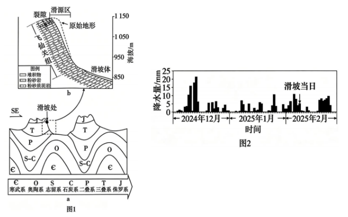

# 2026年广东高考地理真题 · 第19题

## 来源
- 来源文档：2026年高考地理试卷（广东）（空白卷）.docx（及 2026年高考地理试卷（广东）（解析卷）.docx）
- 题号：19(1)、19(2)、19(3)、19(4)

## 题组材料
19\. 阅读图文资料，完成下列要求。

位于我国西南地区乌蒙山余脉的某山区冬季多雨雾，气温常低于零摄氏度。2025年2月上旬，该地一处高陡斜坡突发山体滑坡，滑源区位于主要有粉砂岩和粉砂质泥岩（岩性较粉砂岩软，且吸湿性较强）构成的三叠系飞仙关组地层。此次滑坡发生前已连续多日降水，有雾气从滑源区顶部宽大裂隙中冒出，呈现“水汽升腾”现象。图1a示意此次滑坡发生的地貌部位和地层剖面；图1b示意飞仙关组地层结构；图2反映2024年12月至2025年2月当地日降水量。

## 相关图片


### 第19题（1）
question_id: `2026-广东-地理-2026年广东高考地理真题-Q19-1`

**题干**：

（1）图1a所示7组地层中，只有2组属于中生代，请写出它们的名称。

**答案**：

【答案】（1）三叠系；侏罗系

**解析**：

【小问1详解】

本体问题的关键词为中生代，地质年代中生代包含三叠系、侏罗系、白垩系，图1给出的7套地层里仅三叠系（T）、侏罗系（J）属于中生代，其余均为古生代地层。

**知识点归属**：
- **核心考点 · 权重 1.0**：自然地理 → 地球的结构与演化 → 地质年代表
  - 依据：对照地质年代表，将图中三叠系与侏罗系识别为中生代地层。

**具体考查**：中生代地层识别

**整体置信度**：高

**待复核**：否

<!-- MANAGED-KM-START Q19-1
```yaml
question_id: "2026-广东-地理-2026年广东高考地理真题-Q19-1"
question_number: 19
sub_question: 1
knowledge_points:
  - role: core_exam_point
    weight: 1.0
    domain_id: DM-NAT
    domain: "自然地理"
    theme_id: TH-NAT-EARTH-STRUCTURE
    theme: "地球的结构与演化"
    knowledge_unit_id: KU-NAT-EARTH-STRUCTURE-004
    knowledge_unit: "地质年代表"
    evidence: "对照地质年代表，将图中三叠系与侏罗系识别为中生代地层。"
extra_tags:
  - "中生代地层识别"
taxonomy_version: "config-v0.2-draft"
confidence: "high"
label_status: "completed"
needs_review: false
taxonomy_review:
  needs_review: false
  issue_type: "none"
  review_note: ""
note: ""
```
-->

### 第19题（2）
question_id: `2026-广东-地理-2026年广东高考地理真题-Q19-2`

**题干**：

（2）根据图1a，分析此次滑坡所在谷地的形成原因。

**答案**：

【答案】（2）该谷地位于背斜顶部，受到较强张力作用；岩石易风化破碎，后期遭受侵蚀形成负地形(背斜谷)。

**解析**：

【小问2详解】

本题问题的关键词为谷地，破题关键信息为背斜谷，此次滑坡所在谷地位于背斜顶部。背斜拱起过程中顶部岩层受张力，裂隙发育、岩石破碎；破碎岩石抗侵蚀能力弱，长期流水风化、侵蚀剥离顶部岩层，背斜顶部被侵蚀下凹，形成谷地（背斜谷，负地形）。

**知识点归属**：
- **核心考点 · 权重 1.0**：自然地理 → 地表形态 → 地质构造与地貌
  - 依据：背斜顶部受张力使岩石破碎、易受侵蚀，形成背斜谷这一地形倒置。
- **支撑知识 · 权重 0.7**：自然地理 → 地表形态 → 塑造地表形态的内力与外力作用
  - 依据：褶皱形成后风化侵蚀持续削弱顶部岩层，体现内外力共同塑造地貌。

**具体考查**：背斜谷形成机制

**整体置信度**：高

**待复核**：否

<!-- MANAGED-KM-START Q19-2
```yaml
question_id: "2026-广东-地理-2026年广东高考地理真题-Q19-2"
question_number: 19
sub_question: 2
knowledge_points:
  - role: core_exam_point
    weight: 1.0
    domain_id: DM-NAT
    domain: "自然地理"
    theme_id: TH-NAT-LANDFORM
    theme: "地表形态"
    knowledge_unit_id: KU-NAT-LANDFORM-008
    knowledge_unit: "地质构造与地貌"
    evidence: "背斜顶部受张力使岩石破碎、易受侵蚀，形成背斜谷这一地形倒置。"
  - role: supporting_knowledge
    weight: 0.7
    domain_id: DM-NAT
    domain: "自然地理"
    theme_id: TH-NAT-LANDFORM
    theme: "地表形态"
    knowledge_unit_id: KU-NAT-LANDFORM-006
    knowledge_unit: "塑造地表形态的内力与外力作用"
    evidence: "褶皱形成后风化侵蚀持续削弱顶部岩层，体现内外力共同塑造地貌。"
extra_tags:
  - "背斜谷形成机制"
taxonomy_version: "config-v0.2-draft"
confidence: "high"
label_status: "completed"
needs_review: false
taxonomy_review:
  needs_review: false
  issue_type: "none"
  review_note: ""
note: ""
```
-->

### 第19题（3）
question_id: `2026-广东-地理-2026年广东高考地理真题-Q19-3`

**题干**：

（3）阐述图1b中飞仙关组地层结构和岩性特征对此次滑坡的诱发作用。

**答案**：

【答案】（3）软硬岩层互层，存在差异风化，联结性较差（裂隙发育）；粉砂质泥岩吸湿性较强，遇水易软化（形成润滑层）；软岩易在上覆岩体挤压下发生蠕变破坏（形变），导致岩体失稳，促使滑坡发生。

**解析**：

【小问3详解】

本题问题的关键词为滑坡成因，破题关键信息为地层结构、岩性特性。材料提及飞仙关组地层存在软硬岩层互层情况，推出差异风化，使得岩层联结性变差，裂隙发育。再根据粉砂质泥岩吸湿性强，遇水容易软化，形成润滑层，而软岩在上覆岩体挤压下易发生岩体失稳。

**知识点归属**：
- **核心考点 · 权重 1.0**：自然地理 → 自然灾害 → 地质灾害
  - 依据：软硬互层差异风化、泥岩遇水软化及受压蠕变共同降低岩体稳定性并诱发滑坡。

**具体考查**：软硬互层与滑坡失稳

**整体置信度**：高

**待复核**：否

<!-- MANAGED-KM-START Q19-3
```yaml
question_id: "2026-广东-地理-2026年广东高考地理真题-Q19-3"
question_number: 19
sub_question: 3
knowledge_points:
  - role: core_exam_point
    weight: 1.0
    domain_id: DM-NAT
    domain: "自然地理"
    theme_id: TH-NAT-HAZARD
    theme: "自然灾害"
    knowledge_unit_id: KU-NAT-HAZARD-002
    knowledge_unit: "地质灾害"
    evidence: "软硬互层差异风化、泥岩遇水软化及受压蠕变共同降低岩体稳定性并诱发滑坡。"
extra_tags:
  - "软硬互层与滑坡失稳"
taxonomy_version: "config-v0.2-draft"
confidence: "high"
label_status: "completed"
needs_review: false
taxonomy_review:
  needs_review: false
  issue_type: "none"
  review_note: ""
note: ""
```
-->

### 第19题（4）
question_id: `2026-广东-地理-2026年广东高考地理真题-Q19-4`

**题干**：

（4）解释此次滑坡发生前滑源区顶部裂隙处“水汽升腾”现象的发生机理。

**答案**：

【答案】（4）顶部温度较裂隙中低，裂隙中空气受热上升；顶部地表空气流动更快，气压较裂隙中低，利于裂隙中水汽上升；裂隙中水汽向上运动冒出地表，遇冷凝结，形成水汽升腾现象。

**解析**：

【小问4详解】

本题问题的关键词为水汽升腾，破题关键为水汽运动机制。材料提及该地气温常低于零摄氏度，山体顶部地表温度更低，裂隙内部水体温度高于表层，裂隙内热空气受热向上运动；同时，顶部地表空气流动更快，气压较裂隙中低，这种气压差利于裂隙中水汽上升。最终推出裂隙中水汽遇冷凝结，从而形成“水汽升腾”现象。

**知识点归属**：
- **核心考点 · 权重 1.0**：自然地理 → 大气 → 雾的形成机制
  - 依据：裂隙中的水汽上升出露后遇冷凝结，形成可见雾气的升腾现象。
- **支撑知识 · 权重 0.7**：自然地理 → 大气 → 大气热力环流
  - 依据：裂隙内部较暖，空气受热上升，为水汽向地表运动提供热力条件。
- **支撑知识 · 权重 0.7**：自然地理 → 大气 → 大气的水平运动
  - 依据：答案提出地表与裂隙中的气压差有利于水汽沿裂隙向外流动。

**具体考查**：裂隙水汽出露与凝结

**整体置信度**：高

**待复核**：否

<!-- MANAGED-KM-START Q19-4
```yaml
question_id: "2026-广东-地理-2026年广东高考地理真题-Q19-4"
question_number: 19
sub_question: 4
knowledge_points:
  - role: core_exam_point
    weight: 1.0
    domain_id: DM-NAT
    domain: "自然地理"
    theme_id: TH-NAT-ATMOSPHERE
    theme: "大气"
    knowledge_unit_id: KU-NAT-ATM-WEATHER-001
    knowledge_unit: "雾的形成机制"
    evidence: "裂隙中的水汽上升出露后遇冷凝结，形成可见雾气的升腾现象。"
  - role: supporting_knowledge
    weight: 0.7
    domain_id: DM-NAT
    domain: "自然地理"
    theme_id: TH-NAT-ATMOSPHERE
    theme: "大气"
    knowledge_unit_id: KU-NAT-ATM-HEAT-005
    knowledge_unit: "大气热力环流"
    evidence: "裂隙内部较暖，空气受热上升，为水汽向地表运动提供热力条件。"
  - role: supporting_knowledge
    weight: 0.7
    domain_id: DM-NAT
    domain: "自然地理"
    theme_id: TH-NAT-ATMOSPHERE
    theme: "大气"
    knowledge_unit_id: KU-NAT-ATM-HEAT-006
    knowledge_unit: "大气的水平运动"
    evidence: "答案提出地表与裂隙中的气压差有利于水汽沿裂隙向外流动。"
extra_tags:
  - "裂隙水汽出露与凝结"
taxonomy_version: "config-v0.2-draft"
confidence: "high"
label_status: "completed"
needs_review: false
taxonomy_review:
  needs_review: false
  issue_type: "none"
  review_note: ""
note: ""
```
-->

## 教学备注
<!-- TEACHER-NOTES-START -->
- 易错点：
- 课堂提示：
- 讲解建议：
<!-- TEACHER-NOTES-END -->
