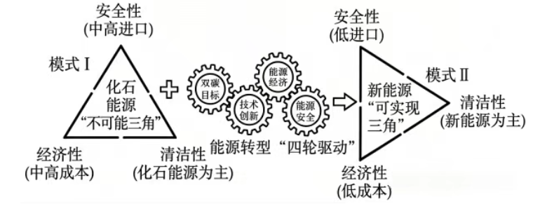

# 2026年广东高考地理真题 · 第1—2题

## 来源
- 来源文档：2026年高考地理试卷（广东）（空白卷）.docx（及 2026年高考地理试卷（广东）（解析卷）.docx）
- 题号：第1题、第2题

## 题组材料
针对传统能源结构中化石能源的清洁性、经济性和安全性难以同时实现的困境，有学者认为通过能源转型“四轮驱动”，可促进化石能源“不可能三角”（模式Ⅰ）转变为新能源“可实现三角”（模式Ⅱ）（下图）。据此完成下面小题。

## 相关图片


## 第1题
question_id: `2026-广东-地理-2026年广东高考地理真题-Q1`

**题干**：

1.据上图可判断，在模式Ⅰ向模式Ⅱ转变过程中，能源转型“四轮驱动”中最关键的驱动因素是（   ）

A.“双碳”目标的引领

B.新能源技术创新应用

C.能源利用的成本下降

D.能源安全的迫切需求

**答案**：

【答案】1. B

**解析**：

【解析】

【1题详解】

能源转型核心是依靠技术突破让新能源兼顾清洁、经济、安全，技术创新是实现模式转换的核心支撑，B正确。“双碳”目标属于政策引领，是转型推力而非实现新能源三角的核心关键，A错误。能源利用成本下降是技术创新带来的结果，并非根本驱动因素，C错误。能源安全需求是转型的外部动力，无法直接突破化石能源的固有局限，D错误。

**知识点归属**：
- **核心考点 · 权重 1.0**：资源、环境与国家安全 → 资源安全 → 能源安全
  - 依据：技术创新使新能源同时满足清洁、经济和安全要求，是能源结构转型的关键支撑。

**具体考查**：能源转型的技术驱动

**整体置信度**：高

**待复核**：否

<!-- MANAGED-KM-START Q1
```yaml
question_id: "2026-广东-地理-2026年广东高考地理真题-Q1"
question_number: 1
knowledge_points:
  - role: core_exam_point
    weight: 1.0
    domain_id: DM-RES
    domain: "资源、环境与国家安全"
    theme_id: TH-RES-RES
    theme: "资源安全"
    knowledge_unit_id: KU-RES-RES-002
    knowledge_unit: "能源安全"
    evidence: "技术创新使新能源同时满足清洁、经济和安全要求，是能源结构转型的关键支撑。"
extra_tags:
  - "能源转型的技术驱动"
taxonomy_version: "config-v0.2-draft"
confidence: "high"
label_status: "completed"
needs_review: false
taxonomy_review:
  needs_review: false
  issue_type: "none"
  review_note: ""
note: ""
```
-->

## 第2题
question_id: `2026-广东-地理-2026年广东高考地理真题-Q2`

**题干**：

2.新能源“可实现三角”模式的实践，对于我国能源转型的积极影响表现为（   ）

①有利于促进能源消费结构多元化

②改变我国化石能源的自然禀赋格局

③有效降低新能源研发的技术门槛

④有利于降低对进口化石能源的依赖

A.①③   B.①④   C.②③   D.②④

**答案**：

【答案】2. B

**解析**：

【解析】

【2题详解】

大力发展新能源，风能、太阳能、水能等多元能源并行，促进能源消费结构多元化，①正确。化石能源自然禀赋是地质历史形成的资源储量分布，能源转型无法改变资源天然储量格局，②错误。新能源规模化应用会持续推进高精尖技术研发，抬高而非降低研发技术门槛，③错误。新能源自给为主，减少海外油气进口，降低对进口化石能源依赖，④正确。

**知识点归属**：
- **核心考点 · 权重 1.0**：资源、环境与国家安全 → 资源安全 → 能源安全
  - 依据：发展多元新能源可优化能源消费结构并降低对进口化石能源的依赖。

**具体考查**：能源消费结构多元化；进口能源依赖降低

**整体置信度**：高

**待复核**：否

<!-- MANAGED-KM-START Q2
```yaml
question_id: "2026-广东-地理-2026年广东高考地理真题-Q2"
question_number: 2
knowledge_points:
  - role: core_exam_point
    weight: 1.0
    domain_id: DM-RES
    domain: "资源、环境与国家安全"
    theme_id: TH-RES-RES
    theme: "资源安全"
    knowledge_unit_id: KU-RES-RES-002
    knowledge_unit: "能源安全"
    evidence: "发展多元新能源可优化能源消费结构并降低对进口化石能源的依赖。"
extra_tags:
  - "能源消费结构多元化"
  - "进口能源依赖降低"
taxonomy_version: "config-v0.2-draft"
confidence: "high"
label_status: "completed"
needs_review: false
taxonomy_review:
  needs_review: false
  issue_type: "none"
  review_note: ""
note: ""
```
-->

## 教学备注
<!-- TEACHER-NOTES-START -->
- 易错点：
- 课堂提示：
- 讲解建议：
<!-- TEACHER-NOTES-END -->
