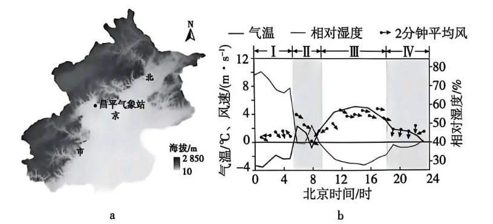

# 2026年广东高考地理真题 · 第3—4题

## 来源
- 来源文档：2026年高考地理试卷（广东）（空白卷）.docx（及 2026年高考地理试卷（广东）（解析卷）.docx）
- 题号：第3题、第4题

## 题组材料
图a 示意北京市昌平气象站位置及周边地形；图b 反映2015年12月30日该站所测气象要素变化。据此完成下面两题。

## 相关图片


## 第3题
question_id: `2026-广东-地理-2026年广东高考地理真题-Q3`

**题干**：

3.据上图判断，该日4—8时昌平气象站所在地经历的最显著天气过程是(   )

A.寒潮入侵   B.强沙尘暴掠过

C.焚风过境   D.温带气旋经过

**答案**：

【答案】3. C

**解析**：

【解析】

【3题详解】

从图b可知，4-8时昌平气象站气温快速升高，相对湿度显著下降，呈现干热特征：寒潮入侵带来降温，不符合气温升高的特征，A错误；强沙尘暴多伴随冷空气活动，不会出现明显骤增温，B错误；焚风是气流越过山地后下沉增温减湿的天气，符合气温骤升、湿度骤降的特征，且昌平北、西靠山地，具备焚风形成的地形条件，C正确；温带气旋过境多伴随降水，温度上升，不符合特征，D错误。

**知识点归属**：
- **核心考点 · 权重 1.0**：自然地理 → 大气 → 大气热力环流
  - 依据：山地背风侧气流下沉增温减湿，解释图中清晨气温升高和相对湿度下降。

**具体考查**：焚风的下沉增温减湿

**整体置信度**：中

**待复核**：现有大气热力环流主干强调冷热不均形成的闭合环流，未直接覆盖地形强迫下沉的焚风与绝热增温机制；暂用最近主干并保留具体标签。

<!-- MANAGED-KM-START Q3
```yaml
question_id: "2026-广东-地理-2026年广东高考地理真题-Q3"
question_number: 3
knowledge_points:
  - role: core_exam_point
    weight: 1.0
    domain_id: DM-NAT
    domain: "自然地理"
    theme_id: TH-NAT-ATMOSPHERE
    theme: "大气"
    knowledge_unit_id: KU-NAT-ATM-HEAT-005
    knowledge_unit: "大气热力环流"
    evidence: "山地背风侧气流下沉增温减湿，解释图中清晨气温升高和相对湿度下降。"
extra_tags:
  - "焚风的下沉增温减湿"
taxonomy_version: "config-v0.2-draft"
confidence: "medium"
label_status: "needs_review"
needs_review: true
taxonomy_review:
  needs_review: true
  issue_type: "taxonomy_gap"
  review_note: "现有大气热力环流主干强调冷热不均形成的闭合环流，未直接覆盖地形强迫下沉的焚风与绝热增温机制；暂用最近主干并保留具体标签。"
note: ""
```
-->

## 第4题
question_id: `2026-广东-地理-2026年广东高考地理真题-Q4`

**题干**：

4.在图b 所示四个阶段中(   )

A.阶段Ⅰ谷风风速最大，相对湿度最高

B.阶段Ⅱ太阳辐射最强，气温变幅最大

C.阶段Ⅲ气温最高，地面长波辐射最强

D.阶段Ⅳ风向变化最大，海风影响最强

**答案**：

【答案】4. C

**解析**：

【解析】

【4题详解】

阶段Ⅰ为凌晨（0-4时），夜晚山坡冷却，吹山风不是谷风，且该阶段风速远小于阶段Ⅱ，A错误；一天中太阳辐射最强出现在正午，属于阶段Ⅲ，阶段Ⅱ（4-8时）为清晨，太阳辐射弱，B错误；从气温曲线可见，阶段Ⅲ气温达到一天最高，地面长波辐射强度与地面温度正相关，温度越高地面长波辐射越强，C正确；该地位于北京内陆，不临海，不存在海风影响；且风向变化最大的是4-8时的阶段Ⅱ，D错误。

**知识点归属**：
- **核心考点 · 权重 1.0**：自然地理 → 大气 → 大气的受热过程
  - 依据：阶段Ⅲ气温最高，答案以地面温度越高、地面长波辐射越强的关系判定。

**具体考查**：地面长波辐射与温度关系

**整体置信度**：高

**待复核**：否

<!-- MANAGED-KM-START Q4
```yaml
question_id: "2026-广东-地理-2026年广东高考地理真题-Q4"
question_number: 4
knowledge_points:
  - role: core_exam_point
    weight: 1.0
    domain_id: DM-NAT
    domain: "自然地理"
    theme_id: TH-NAT-ATMOSPHERE
    theme: "大气"
    knowledge_unit_id: KU-NAT-ATM-HEAT-003
    knowledge_unit: "大气的受热过程"
    evidence: "阶段Ⅲ气温最高，答案以地面温度越高、地面长波辐射越强的关系判定。"
extra_tags:
  - "地面长波辐射与温度关系"
taxonomy_version: "config-v0.2-draft"
confidence: "high"
label_status: "completed"
needs_review: false
taxonomy_review:
  needs_review: false
  issue_type: "none"
  review_note: ""
note: ""
```
-->

## 教学备注
<!-- TEACHER-NOTES-START -->
- 易错点：
- 课堂提示：
- 讲解建议：
<!-- TEACHER-NOTES-END -->
