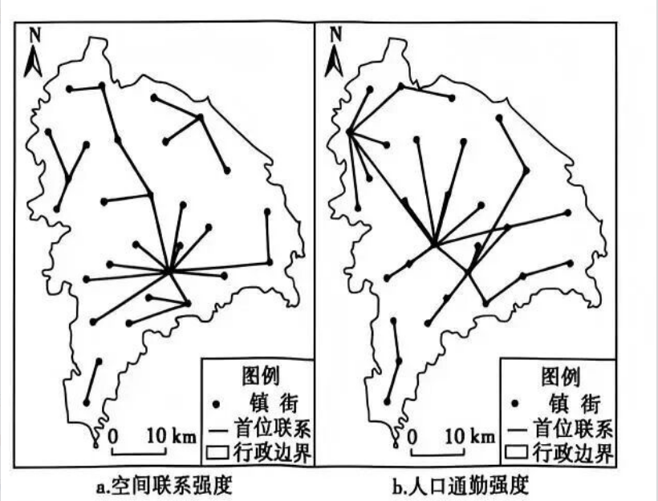

# 2026年广东高考地理真题 · 第5—6题

## 来源
- 来源文档：2026年高考地理试卷（广东）（空白卷）.docx（及 2026年高考地理试卷（广东）（解析卷）.docx）
- 题号：第5题、第6题

## 题组材料
基于人口规模、经济产业、交通成本等要素综合计算出的城镇间空间联系强度，能反映城镇的综合实力及对外联系能力；城镇间人口通勤强度则反映两地实际人口流动联系的强弱。图a和图b分别示意2020年一段时间内天津市某区各镇街之间的空间联系强度和人口通勤强度的首位联系（某一镇街与其他所有镇街联系中强度最高的联系）分布。据此完成下面小题。

## 相关图片


## 第5题
question_id: `2026-广东-地理-2026年广东高考地理真题-Q5`

**题干**：

5.据图a 可判断，该区镇街的（   ）

A.城镇规模存在层级性  B.服务范围和功能相同

C.产业趋同且均衡发展  D.交通网络缺乏互通性

**答案**：

【答案】5. A

**解析**：

【解析】

【5题详解】

图a为空间联系强度，由人口规模、经济产业、交通成本等要素综合计算，代表城镇综合实力。图中所有镇街的首位联系全部汇聚到同一个核心镇街，说明核心镇街综合实力远高于周边，镇街之间人口、经济规模差异明显，城镇规模存在清晰层级性，A正确。核心镇街综合实力强，服务范围更大、功能更完善，各镇街服务范围与功能不同，B错误；核心镇街产业集聚优势突出，发展不均衡，产业不会趋同均衡，C错误；各镇街均能与核心镇街建立紧密首位联系，交通网络互通性较好，D错误。

**知识点归属**：
- **核心考点 · 权重 1.0**：区域发展 → 城市与区域发展 → 城市体系与区域空间组织
  - 依据：空间首位联系集中指向核心镇街，反映区域内城镇综合实力与规模的等级差异。

**具体考查**：城镇规模等级判读

**整体置信度**：高

**待复核**：否

<!-- MANAGED-KM-START Q5
```yaml
question_id: "2026-广东-地理-2026年广东高考地理真题-Q5"
question_number: 5
knowledge_points:
  - role: core_exam_point
    weight: 1.0
    domain_id: DM-REG
    domain: "区域发展"
    theme_id: TH-REG-CITY
    theme: "城市与区域发展"
    knowledge_unit_id: KU-REG-CITY-003
    knowledge_unit: "城市体系与区域空间组织"
    evidence: "空间首位联系集中指向核心镇街，反映区域内城镇综合实力与规模的等级差异。"
extra_tags:
  - "城镇规模等级判读"
taxonomy_version: "config-v0.2-draft"
confidence: "high"
label_status: "completed"
needs_review: false
taxonomy_review:
  needs_review: false
  issue_type: "none"
  review_note: ""
note: ""
```
-->

## 第6题
question_id: `2026-广东-地理-2026年广东高考地理真题-Q6`

**题干**：

6.上图信息表明，该区（   ）

A.其他镇街的人口通勤均与中心镇街有首位联系

B.中心镇街与其他镇街的通勤人口数量大致相等

C.各镇街间空间距离对通勤人口流动的影响不大

D.综合实力最强的镇街对通勤人口吸引并非最强

**答案**：

【答案】6. D

**解析**：

【解析】

【6题详解】

空间联系强度=综合实力；人口通勤强度=实际人口流动吸引力。图b存在部分镇街首位通勤联系不是中心镇街，“均与中心镇街”表述绝对，A错误；线条仅代表联系强度排名，无法体现通勤人口数量多少，不能判断数量大致相等，B错误；距离核心镇街近的镇街大多以核心为首位通勤联系，空间距离明显影响人口流动，C错误；图a核心镇街综合实力最强，但图b通勤首位联系并非全部指向它，说明综合实力最强的镇街对通勤人口的吸引力并非全区最强，D正确。

**知识点归属**：
- **核心考点 · 权重 1.0**：区域发展 → 城市与区域发展 → 城市体系与区域空间组织
  - 依据：比较空间联系与实际通勤联系网络，识别综合实力与人口通勤吸引力并不完全一致。

**具体考查**：空间首位联系与通勤首位联系比较

**整体置信度**：高

**待复核**：否

<!-- MANAGED-KM-START Q6
```yaml
question_id: "2026-广东-地理-2026年广东高考地理真题-Q6"
question_number: 6
knowledge_points:
  - role: core_exam_point
    weight: 1.0
    domain_id: DM-REG
    domain: "区域发展"
    theme_id: TH-REG-CITY
    theme: "城市与区域发展"
    knowledge_unit_id: KU-REG-CITY-003
    knowledge_unit: "城市体系与区域空间组织"
    evidence: "比较空间联系与实际通勤联系网络，识别综合实力与人口通勤吸引力并不完全一致。"
extra_tags:
  - "空间首位联系与通勤首位联系比较"
taxonomy_version: "config-v0.2-draft"
confidence: "high"
label_status: "completed"
needs_review: false
taxonomy_review:
  needs_review: false
  issue_type: "none"
  review_note: ""
note: ""
```
-->

## 教学备注
<!-- TEACHER-NOTES-START -->
- 易错点：
- 课堂提示：
- 讲解建议：
<!-- TEACHER-NOTES-END -->
