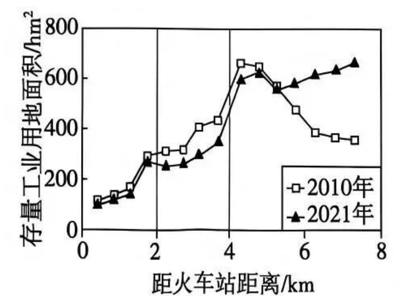

# 2026年广东高考地理真题 · 第7—8题

## 来源
- 来源文档：2026年高考地理试卷（广东）（空白卷）.docx（及 2026年高考地理试卷（广东）（解析卷）.docx）
- 题号：第7题、第8题

## 题组材料
下图反映2010年和2021年河北省H 市中心城区自火车站(位于市中心)向外 500 m间距的不同圈层的存量工业用地面积变化。据此完成下面两题。

## 相关图片


## 第7题
question_id: `2026-广东-地理-2026年广东高考地理真题-Q7`

**题干**：

7.上图显示，相较于2010年，2021年2\~4 km圈层存量工业用地面积发生变化，其最可能的原因是该圈层（   ）

A.工业企业外迁，用地功能调整

B.工业企业上楼，工业用地增加

C.城市人口外迁，用工规模减小

D.工业厂房翻新，配套设施完善

**答案**：

【答案】7. A

**解析**：

【解析】

【7题详解】

从图中可知，相较于2010年，2021年2\~4km靠近市中心的圈层存量工业用地面积减少。随着城市发展，中心城区地价上升，工业付租能力低于商业、居住，因此原有工业企业向外围搬迁，原工业用地调整为其他城市功能用地，导致存量工业用地减少，A正确；该圈层存量工业面积减少，与“工业用地增加”矛盾，B错误；我国当前该发展阶段，城市人口整体向中心城区集聚，没有大规模人口外迁，也不是工业用地减少的原因，C错误；工业厂房翻新仅改造原有建筑，不会改变存量工业用地的总面积，D错误。

**知识点归属**：
- **核心考点 · 权重 1.0**：人文地理 → 乡村与城镇 → 城镇内部空间结构的形成与变化
  - 依据：中心城区地价及用地竞争促使工业企业外迁，原工业用地调整为其他功能。

**具体考查**：存量工业用地功能调整

**整体置信度**：高

**待复核**：否

<!-- MANAGED-KM-START Q7
```yaml
question_id: "2026-广东-地理-2026年广东高考地理真题-Q7"
question_number: 7
knowledge_points:
  - role: core_exam_point
    weight: 1.0
    domain_id: DM-HUM
    domain: "人文地理"
    theme_id: TH-HUM-SETTLEMENT
    theme: "乡村与城镇"
    knowledge_unit_id: KU-HUM-SET-003
    knowledge_unit: "城镇内部空间结构的形成与变化"
    evidence: "中心城区地价及用地竞争促使工业企业外迁，原工业用地调整为其他功能。"
extra_tags:
  - "存量工业用地功能调整"
taxonomy_version: "config-v0.2-draft"
confidence: "high"
label_status: "completed"
needs_review: false
taxonomy_review:
  needs_review: false
  issue_type: "none"
  review_note: ""
note: ""
```
-->

## 第8题
question_id: `2026-广东-地理-2026年广东高考地理真题-Q8`

**题干**：

8.2010—2021年，不同圈层存量工业用地面积变化给该市中心城区带来的整体影响是（   ）

A.逆城市化进程加速   B.单位工业产值能耗增加

C.利于产业结构升级   D.中心城区地租水平降低

**答案**：

【答案】8. C

**解析**：

【解析】

【8题详解】

从整体变化来看，2010-2021年该城市工业由市中心附近的内圈层向城市外围圈层转移。中心城区腾出土地后，可以发展高端服务业、高新技术产业等高附加值产业，优化了城市产业布局，利于城市产业结构升级，C正确；我国目前仍处于城市化发展阶段，并未进入逆城市化加速阶段，工业向城市外围搬迁属于城市内部功能结构调整，不属于逆城市化，A错误；向外搬迁的多是传统高能耗工业，外迁后中心城区整体产业的单位工业产值能耗会下降，B错误；中心城区调整为附加值更高的产业后，土地利用效率提升，地租水平会上升，D错误。

**知识点归属**：
- **核心考点 · 权重 1.0**：区域发展 → 产业结构变化与区域发展 → 产业结构的升级
  - 依据：内圈工业用地减少并向外围调整，腾出的空间有利于发展附加值更高的产业。
- **支撑知识 · 权重 0.7**：人文地理 → 乡村与城镇 → 城镇内部空间结构的形成与变化
  - 依据：工业向外围搬迁属于城市内部用地功能调整，是中心城区产业升级的空间条件。

**具体考查**：工业外迁与中心城区升级

**整体置信度**：高

**待复核**：否

<!-- MANAGED-KM-START Q8
```yaml
question_id: "2026-广东-地理-2026年广东高考地理真题-Q8"
question_number: 8
knowledge_points:
  - role: core_exam_point
    weight: 1.0
    domain_id: DM-REG
    domain: "区域发展"
    theme_id: TH-REG-INDUSTRY
    theme: "产业结构变化与区域发展"
    knowledge_unit_id: KU-REG-INDUSTRY-002
    knowledge_unit: "产业结构的升级"
    evidence: "内圈工业用地减少并向外围调整，腾出的空间有利于发展附加值更高的产业。"
  - role: supporting_knowledge
    weight: 0.7
    domain_id: DM-HUM
    domain: "人文地理"
    theme_id: TH-HUM-SETTLEMENT
    theme: "乡村与城镇"
    knowledge_unit_id: KU-HUM-SET-003
    knowledge_unit: "城镇内部空间结构的形成与变化"
    evidence: "工业向外围搬迁属于城市内部用地功能调整，是中心城区产业升级的空间条件。"
extra_tags:
  - "工业外迁与中心城区升级"
taxonomy_version: "config-v0.2-draft"
confidence: "high"
label_status: "completed"
needs_review: false
taxonomy_review:
  needs_review: false
  issue_type: "none"
  review_note: ""
note: ""
```
-->

## 教学备注
<!-- TEACHER-NOTES-START -->
- 易错点：
- 课堂提示：
- 讲解建议：
<!-- TEACHER-NOTES-END -->
