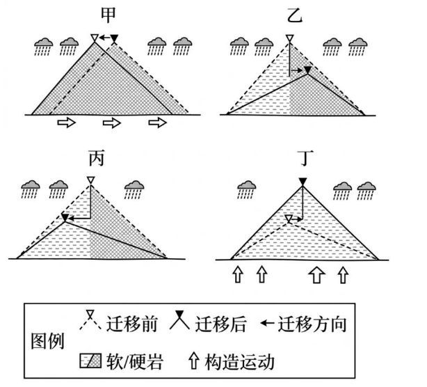

# 2026年广东高考地理真题 · 第9—10题

## 来源
- 来源文档：2026年高考地理试卷（广东）（空白卷）.docx（及 2026年高考地理试卷（广东）（解析卷）.docx）
- 题号：第9题、第10题

## 题组材料
分水岭的迁移对自然地理环境有重要影响。某研学小组在考虑了降水、构造运动和岩性软硬差异三个影响分水岭迁移的关键因素后，绘出如下图所示四种分水岭迁移模式。据此完成下面小题。

## 相关图片


## 第9题
question_id: `2026-广东-地理-2026年广东高考地理真题-Q9`

**题干**：

9.上图中，正确反映以侵蚀作用为主导的分水岭迁移模式是（   ）

A. 甲   B.乙   C.丙   D.丁

**答案**：

【答案】9. B

**解析**：

【解析】

【9题详解】

侵蚀主导型分水岭迁移的核心逻辑：侵蚀能力更强的一侧会不断蚕食另一侧，推动分水岭向侵蚀能力更弱的一侧移动。侵蚀能力受降水、岩性影响：软岩比硬岩更易被侵蚀，降水更多的一侧径流量大，侵蚀能力更强。甲图中分水岭整体向左迁移，属于构造运动主导的水平移动，不存在一侧侵蚀优势，A错误；乙图中左侧整体为软岩，抗侵蚀能力弱，侵蚀作用更强，因此分水岭向抗侵蚀能力更强的右侧移动，与图示迁移模式吻合，B正确；丙图存在明显不同软硬的岩性分区(不同填充纹理代表不同岩性)，左侧岩性软，右侧岩性硬，左侧受侵蚀快，分水岭应向右侧迁移，但图中分水岭向左侧迁移，并非以侵蚀作用为主导，C错误；丁图下方标注了构造抬升箭头，属于构造运动主导的分水岭迁移，D错误。

**知识点归属**：
- **核心考点 · 权重 1.0**：自然地理 → 地表形态 → 塑造地表形态的内力与外力作用
  - 依据：两侧岩性与侵蚀能力差异使分水岭向侵蚀较弱的一侧迁移，据此识别乙模式。
- **支撑知识 · 权重 0.7**：自然地理 → 地表形态 → 河流地貌
  - 依据：流水侵蚀改变坡面与流域边界，为分水岭迁移提供地貌过程解释。

**具体考查**：分水岭迁移；岩性差异与侵蚀能力

**整体置信度**：高

**待复核**：否

<!-- MANAGED-KM-START Q9
```yaml
question_id: "2026-广东-地理-2026年广东高考地理真题-Q9"
question_number: 9
knowledge_points:
  - role: core_exam_point
    weight: 1.0
    domain_id: DM-NAT
    domain: "自然地理"
    theme_id: TH-NAT-LANDFORM
    theme: "地表形态"
    knowledge_unit_id: KU-NAT-LANDFORM-006
    knowledge_unit: "塑造地表形态的内力与外力作用"
    evidence: "两侧岩性与侵蚀能力差异使分水岭向侵蚀较弱的一侧迁移，据此识别乙模式。"
  - role: supporting_knowledge
    weight: 0.7
    domain_id: DM-NAT
    domain: "自然地理"
    theme_id: TH-NAT-LANDFORM
    theme: "地表形态"
    knowledge_unit_id: KU-NAT-LANDFORM-002
    knowledge_unit: "河流地貌"
    evidence: "流水侵蚀改变坡面与流域边界，为分水岭迁移提供地貌过程解释。"
extra_tags:
  - "分水岭迁移"
  - "岩性差异与侵蚀能力"
taxonomy_version: "config-v0.2-draft"
confidence: "high"
label_status: "completed"
needs_review: false
taxonomy_review:
  needs_review: false
  issue_type: "none"
  review_note: ""
note: ""
```
-->

## 第10题
question_id: `2026-广东-地理-2026年广东高考地理真题-Q10`

**题干**：

10.丁模式所示分水岭的迁移可导致（   ）

①分水岭两侧水热空间分布调整

②扩张流域地表侵蚀强度减弱

③分水岭两侧垂直带谱趋于简单

④萎缩流域的物种间竞争加强

A.①②   B.②③   C.③④   D.①④

**答案**：

【答案】10. D

**解析**：

【解析】

【10题详解】

丁模式分水岭迁移后，会形成一侧流域扩张、一侧流域萎缩的结果，分水岭是流域的天然边界，迁移后流域范围、汇水格局改变，会推动两侧水热空间分布重新调整，①正确；扩张流域汇水面积增大，径流量增加，河流侵蚀能力增强，地表侵蚀强度会升高，②错误；流域一扩一缩，地形高差、流域范围变化，垂直带谱会更复杂，不会趋于简单，③错误；萎缩流域面积缩小，生物生存空间、生存资源减少，因此物种间的竞争会加剧，④正确。

**知识点归属**：
- **核心考点 · 权重 1.0**：自然地理 → 自然环境的整体性与差异性 → 自然环境对干扰的整体响应
  - 依据：分水岭迁移改变流域范围和汇水格局，引起水热分布及生物竞争的连锁变化。

**具体考查**：流域边界变化的水热与生态响应

**整体置信度**：高

**待复核**：否

<!-- MANAGED-KM-START Q10
```yaml
question_id: "2026-广东-地理-2026年广东高考地理真题-Q10"
question_number: 10
knowledge_points:
  - role: core_exam_point
    weight: 1.0
    domain_id: DM-NAT
    domain: "自然地理"
    theme_id: TH-NAT-INTEGRITY
    theme: "自然环境的整体性与差异性"
    knowledge_unit_id: KU-NAT-INTEGRITY-004
    knowledge_unit: "自然环境对干扰的整体响应"
    evidence: "分水岭迁移改变流域范围和汇水格局，引起水热分布及生物竞争的连锁变化。"
extra_tags:
  - "流域边界变化的水热与生态响应"
taxonomy_version: "config-v0.2-draft"
confidence: "high"
label_status: "completed"
needs_review: false
taxonomy_review:
  needs_review: false
  issue_type: "none"
  review_note: ""
note: ""
```
-->

## 教学备注
<!-- TEACHER-NOTES-START -->
- 易错点：
- 课堂提示：
- 讲解建议：
<!-- TEACHER-NOTES-END -->
