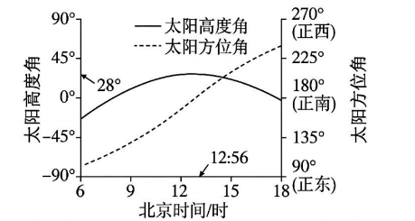

# 2026年广东高考地理真题 · 第11—12题

## 来源
- 来源文档：2026年高考地理试卷（广东）（空白卷）.docx（及 2026年高考地理试卷（广东）（解析卷）.docx）
- 题号：第11题、第12题

## 题组材料
某光伏发电场利用太阳自动跟踪系统维持光伏面板始终垂直于太阳光线，以达到最大发电效率。下图表示2024年冬至日6—18时该光伏发电场所在地的太阳高度角和太阳方位角变化。据此完成下面两题。

## 相关图片


## 第11题
question_id: `2026-广东-地理-2026年广东高考地理真题-Q11`

**题干**：

11.据上图可确定，该地的地理坐标约为（   ）

A.38.5°N,106.0°E     B.38.5°N,134.0°E

C.28.0°N,119.0°E     D.28.0°N,106.0°E

**答案**：

【答案】11. A

**解析**：

【解析】

【11题详解】

确定纬度：冬至日太阳直射南回归线（23.5°S），从图中可知该地正午太阳高度为28°。根据正午太阳高度计算公式H=90°−∣φ−δ∣（其中H为正午太阳高度，φ为当地纬度，δ为太阳直射点纬度），解得φ=38.5°N。确定经度：图中显示北京时间12:56时该地太阳高度达到最大，即地方时为12时。北京时间是120°E的地方时，根据地方时计算，经度相差1°，时间相差4分钟，该地比120°E时间晚56分钟，经度相差14°，所以该地经度为106°E。因此，该地的地理坐标约为38.5°N，106°E，A正确。

**知识点归属**：
- **核心考点 · 权重 1.0**：自然地理 → 地球的运动 → 正午太阳高度的变化
  - 依据：冬至日正午太阳高度28°与太阳直射纬度共同确定当地纬度为38.5°N。
- **核心考点 · 权重 1.0**：自然地理 → 地球的运动 → 地球的自转
  - 依据：北京时间12:56达到当地正午，利用地方时与经度差的关系求得106°E。

**具体考查**：由太阳高度和正午时刻反推坐标

**整体置信度**：高

**待复核**：否

**映射说明**：经纬度双设问分别依赖正午太阳高度与地方时机制，因此保留两个核心考点。

<!-- MANAGED-KM-START Q11
```yaml
question_id: "2026-广东-地理-2026年广东高考地理真题-Q11"
question_number: 11
knowledge_points:
  - role: core_exam_point
    weight: 1.0
    domain_id: DM-NAT
    domain: "自然地理"
    theme_id: TH-NAT-EARTH-MOTION
    theme: "地球的运动"
    knowledge_unit_id: KU-NAT-EARTH-MOTION-007
    knowledge_unit: "正午太阳高度的变化"
    evidence: "冬至日正午太阳高度28°与太阳直射纬度共同确定当地纬度为38.5°N。"
  - role: core_exam_point
    weight: 1.0
    domain_id: DM-NAT
    domain: "自然地理"
    theme_id: TH-NAT-EARTH-MOTION
    theme: "地球的运动"
    knowledge_unit_id: KU-NAT-EARTH-MOTION-001
    knowledge_unit: "地球的自转"
    evidence: "北京时间12:56达到当地正午，利用地方时与经度差的关系求得106°E。"
extra_tags:
  - "由太阳高度和正午时刻反推坐标"
taxonomy_version: "config-v0.2-draft"
confidence: "high"
label_status: "completed"
needs_review: false
taxonomy_review:
  needs_review: false
  issue_type: "none"
  review_note: ""
note: "经纬度双设问分别依赖正午太阳高度与地方时机制，因此保留两个核心考点。"
```
-->

## 第12题
question_id: `2026-广东-地理-2026年广东高考地理真题-Q12`

**题干**：

12.据上图可知，在冬至日该地地方时正午时刻，光伏面板朝向的方位角是（   ）

A.135°   B.180°   C.195°   D.210°

**答案**：

【答案】12. B

**解析**：

【解析】

【12题详解】

地方时正午时刻太阳位于正南方向，从图中太阳方位角的标注可知，正南方向对应的方位角是180°，所以在冬至日该地地方时正午时刻，光伏面板朝向的方位角是180°，B正确。

**知识点归属**：
- **核心考点 · 权重 1.0**：自然地理 → 地球的运动 → 地球的自转
  - 依据：太阳周日视运动中当地正午太阳位于正南，垂直太阳光线的面板对应180°方位角。
- **支撑知识 · 权重 0.7**：自然地理 → 地球的运动 → 黄赤交角与太阳直射点的回归运动
  - 依据：冬至日太阳直射南回归线，结合当地北纬38.5°可确定正午太阳在南侧。

**具体考查**：正午太阳方位角与光伏面板朝向

**整体置信度**：中

**待复核**：现有地球自转主干未独立表达太阳周日方位变化及太阳方位角判读，暂挂最近主干并保留具体标签。

<!-- MANAGED-KM-START Q12
```yaml
question_id: "2026-广东-地理-2026年广东高考地理真题-Q12"
question_number: 12
knowledge_points:
  - role: core_exam_point
    weight: 1.0
    domain_id: DM-NAT
    domain: "自然地理"
    theme_id: TH-NAT-EARTH-MOTION
    theme: "地球的运动"
    knowledge_unit_id: KU-NAT-EARTH-MOTION-001
    knowledge_unit: "地球的自转"
    evidence: "太阳周日视运动中当地正午太阳位于正南，垂直太阳光线的面板对应180°方位角。"
  - role: supporting_knowledge
    weight: 0.7
    domain_id: DM-NAT
    domain: "自然地理"
    theme_id: TH-NAT-EARTH-MOTION
    theme: "地球的运动"
    knowledge_unit_id: KU-NAT-EARTH-MOTION-003
    knowledge_unit: "黄赤交角与太阳直射点的回归运动"
    evidence: "冬至日太阳直射南回归线，结合当地北纬38.5°可确定正午太阳在南侧。"
extra_tags:
  - "正午太阳方位角与光伏面板朝向"
taxonomy_version: "config-v0.2-draft"
confidence: "medium"
label_status: "needs_review"
needs_review: true
taxonomy_review:
  needs_review: true
  issue_type: "taxonomy_gap"
  review_note: "现有地球自转主干未独立表达太阳周日方位变化及太阳方位角判读，暂挂最近主干并保留具体标签。"
note: ""
```
-->

## 教学备注
<!-- TEACHER-NOTES-START -->
- 易错点：
- 课堂提示：
- 讲解建议：
<!-- TEACHER-NOTES-END -->
