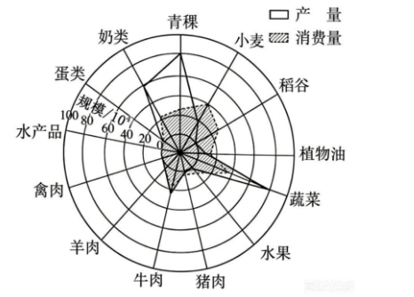

# 2026年广东高考地理真题 · 第13—14题

## 来源
- 来源文档：2026年高考地理试卷（广东）（空白卷）.docx（及 2026年高考地理试卷（广东）（解析卷）.docx）
- 题号：第13题、第14题

## 题组材料
受自然地理条件影响，一些地区的食物产量与消费量常存在差异，使得本地食物供需不平衡，需要跨区域调运。下图反映2022年西藏自治区食物产量与消费量情况。据此完成下面两题。

## 相关图片


## 第13题
question_id: `2026-广东-地理-2026年广东高考地理真题-Q13`

**题干**：

13.正确反映右图所示西藏自治区不同食物产量与消费量关系特征及其自然成因的是（   ）

A.青稞供不应求；冻土分布较广

B.蔬菜供大于求；平原面积广阔

C.小麦的自给率最高；土壤肥沃

D.稻谷需求缺口大；水热条件差

**答案**：

【答案】13. D

**解析**：

【解析】【13题详解】

雷达图中，白色框代表产量、阴影代表消费量，越向外围数值越大，结合西藏自然地理特征分析：青稞产量大于消费量，为供过于求，A错误。图中蔬菜产量大于消费量、供大于求与B项相符，但“平原面积广阔”的成因错误，B错误。青稞产量远大于消费量，自给率高于小麦，且西藏大部分区域土壤肥力较低，C错误。西藏海拔高，水热条件差，不适宜大面积种植稻谷，本地产量远小于消费量，需求缺口大，D正确。

**知识点归属**：
- **核心考点 · 权重 1.0**：人文地理 → 产业区位 → 农业区位因素
  - 依据：西藏海拔高、水热条件差，不适宜大面积种植稻谷，导致稻谷本地产量低而需求缺口大。

**具体考查**：食物产消关系判读；高原水热条件与稻谷供需

**整体置信度**：高

**待复核**：否

<!-- MANAGED-KM-START Q13
```yaml
question_id: "2026-广东-地理-2026年广东高考地理真题-Q13"
question_number: 13
knowledge_points:
  - role: core_exam_point
    weight: 1.0
    domain_id: DM-HUM
    domain: "人文地理"
    theme_id: TH-HUM-INDUSTRY
    theme: "产业区位"
    knowledge_unit_id: KU-HUM-IND-001
    knowledge_unit: "农业区位因素"
    evidence: "西藏海拔高、水热条件差，不适宜大面积种植稻谷，导致稻谷本地产量低而需求缺口大。"
extra_tags:
  - "食物产消关系判读"
  - "高原水热条件与稻谷供需"
taxonomy_version: "config-v0.2-draft"
confidence: "high"
label_status: "completed"
needs_review: false
taxonomy_review:
  needs_review: false
  issue_type: "none"
  review_note: ""
note: "解析勘误采用教师在本次对话中核定的文字；原始导出包保留不变。"
```
-->

## 第14题
question_id: `2026-广东-地理-2026年广东高考地理真题-Q14`

**题干**：

14.向西藏自治区输入的肉类食物中，猪肉的运输产生的碳排放较高，最可能的原因是猪肉（   ）

A.存在需求缺口，多采用冷链储运

B.保鲜要求较高，需采用航空运输

C.运量比较大，储存了大量的有机碳

D.运输经高寒地区，温室效应影响强

**答案**：

【答案】14. A

**解析**：

【解析】【14题详解】

运输碳排放来自运输过程的能源消耗，西藏本地猪肉产量远不能满足消费需求，需要长途调运；猪肉易变质，长途运输需要全程冷链储运，制冷环节消耗大量能源，因此运输碳排放高，A正确。航空运输运量小，价格高，猪肉运输运量较大，不会大规模采用运价高的航空运输，B错误。题干问的是运输过程产生的碳排放，与猪肉本身储存的有机碳无关，C错误。

**知识点归属**：
- **核心考点 · 权重 1.0**：资源、环境与国家安全 → 环境安全 → 全球气候变化与国家安全
  - 依据：猪肉长途运输需要冷链制冷，运输与制冷的能源消耗使运输过程碳排放较高。
- **支撑知识 · 权重 0.7**：区域发展 → 区际联系与区域协调发展 → 资源跨区域调配
  - 依据：本地猪肉产量无法满足消费需求，跨区域调运及储运保鲜需求增加运输环节能源消耗。

**具体考查**：冷链储运能源消耗；运输过程碳排放

**整体置信度**：高

**待复核**：否

<!-- MANAGED-KM-START Q14
```yaml
question_id: "2026-广东-地理-2026年广东高考地理真题-Q14"
question_number: 14
knowledge_points:
  - role: core_exam_point
    weight: 1.0
    domain_id: DM-RES
    domain: "资源、环境与国家安全"
    theme_id: TH-RES-ENV
    theme: "环境安全"
    knowledge_unit_id: KU-RES-ENV-004
    knowledge_unit: "全球气候变化与国家安全"
    evidence: "猪肉长途运输需要冷链制冷，运输与制冷的能源消耗使运输过程碳排放较高。"
  - role: supporting_knowledge
    weight: 0.7
    domain_id: DM-REG
    domain: "区域发展"
    theme_id: TH-REG-INTERREGION
    theme: "区际联系与区域协调发展"
    knowledge_unit_id: KU-REG-INTERREGION-002
    knowledge_unit: "资源跨区域调配"
    evidence: "本地猪肉产量无法满足消费需求，跨区域调运及储运保鲜需求增加运输环节能源消耗。"
extra_tags:
  - "冷链储运能源消耗"
  - "运输过程碳排放"
taxonomy_version: "config-v0.2-draft"
confidence: "high"
label_status: "completed"
needs_review: false
taxonomy_review:
  needs_review: false
  issue_type: "none"
  review_note: ""
note: "解析勘误采用教师在本次对话中核定的文字；原始导出包保留不变。"
```
-->

## 教学备注
<!-- TEACHER-NOTES-START -->
- 易错点：
- 课堂提示：
- 讲解建议：
<!-- TEACHER-NOTES-END -->
