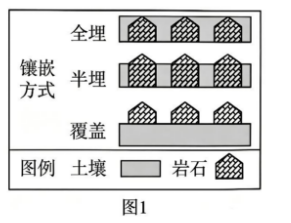
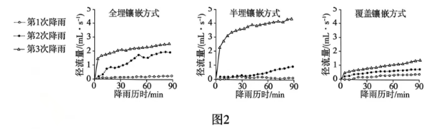

# 2026年广东高考地理真题 · 第15—16题

## 来源
- 来源文档：2026年高考地理试卷（广东）（空白卷）.docx（及 2026年高考地理试卷（广东）（解析卷）.docx）
- 题号：第15题、第16题

## 题组材料
有学者在实验室采用人工模拟降雨方法，研究了相同降雨(三场次，每场次间隔 24h)、坡度和土壤条件下，全埋、半埋和覆盖三类土岩镶嵌坡面(图1)的土壤侵蚀过程。图2示意这三场次降雨对不同类型土岩镶嵌坡面径流的影响。据此完成下面两题。

## 相关图片



## 第15题
question_id: `2026-广东-地理-2026年广东高考地理真题-Q15`

**题干**：

15.据图2分析，造成此三类坡面的坡面径流量差异的原因是，不同土岩镶嵌方式改变了土壤的（   ）

①孔隙度      ②暴露面积

③母岩性质   ④矿物质组成

A.①②  B.①④   C.②③   D.③④

**答案**：

【答案】15. A

**解析**：

【解析】

【15题详解】

不同土岩镶嵌方式会改变土壤的孔隙度。全埋、半埋和覆盖方式下，土壤的孔隙结构不同，孔隙度影响着水分的下渗和径流情况。孔隙度大，下渗多，坡面径流量可能小；孔隙度小，下渗少，坡面径流量可能大，①正确。不同镶嵌方式下土壤的暴露面积不同。暴露面积大，直接接受降雨的面积大，产生的径流可能多；暴露面积小，产生的径流可能少，②正确。三种镶嵌方式中母岩性质并未改变，不是导致坡面径流量差异的原因，③错误。三种镶嵌方式下土壤的矿物质组成也未改变，不是导致坡面径流量差异的原因，④错误。

**知识点归属**：
- **核心考点 · 权重 1.0**：自然地理 → 水文与海洋 → 水循环
  - 依据：不同土岩镶嵌方式改变孔隙与暴露面积，影响下渗和坡面径流的分配。
- **支撑知识 · 权重 0.7**：自然地理 → 植被与土壤 → 土壤的组成与观察
  - 依据：土壤孔隙结构与裸露面积差异提供判断径流差异的土壤条件。

**具体考查**：土岩镶嵌方式；孔隙度与下渗径流分配

**整体置信度**：高

**待复核**：否

<!-- MANAGED-KM-START Q15
```yaml
question_id: "2026-广东-地理-2026年广东高考地理真题-Q15"
question_number: 15
knowledge_points:
  - role: core_exam_point
    weight: 1.0
    domain_id: DM-NAT
    domain: "自然地理"
    theme_id: TH-NAT-WATER
    theme: "水文与海洋"
    knowledge_unit_id: KU-NAT-WATER-001
    knowledge_unit: "水循环"
    evidence: "不同土岩镶嵌方式改变孔隙与暴露面积，影响下渗和坡面径流的分配。"
  - role: supporting_knowledge
    weight: 0.7
    domain_id: DM-NAT
    domain: "自然地理"
    theme_id: TH-NAT-VEGETATION-SOIL
    theme: "植被与土壤"
    knowledge_unit_id: KU-NAT-VEG-SOIL-004
    knowledge_unit: "土壤的组成与观察"
    evidence: "土壤孔隙结构与裸露面积差异提供判断径流差异的土壤条件。"
extra_tags:
  - "土岩镶嵌方式"
  - "孔隙度与下渗径流分配"
taxonomy_version: "config-v0.2-draft"
confidence: "high"
label_status: "completed"
needs_review: false
taxonomy_review:
  needs_review: false
  issue_type: "none"
  review_note: ""
note: ""
```
-->

## 第16题
question_id: `2026-广东-地理-2026年广东高考地理真题-Q16`

**题干**：

16.该实验模拟的水土流失情况出现最普遍的地区是（   ）

A.黄土高原黄土冲沟区   B.东北平原黑土区

C.云贵高原喀斯特地区   D.江南丘陵红壤区

**答案**：

【答案】16. C

**解析**：

【解析】

【16题详解】

黄土高原黄土冲沟区主要是黄土，不存在土岩镶嵌的普遍情况，A错误。东北平原黑土区以黑土为主，也没有这种土岩镶嵌的典型特征，B错误。云贵高原喀斯特地区，岩石广布，土壤在岩石缝隙中分布，存在大量的土岩镶嵌情况，水土流失问题较为普遍，该实验模拟的水土流失情况在此处出现最普遍，C正确。江南丘陵红壤区主要是红壤，土岩镶嵌不是其典型特征，D错误。

**知识点归属**：
- **核心考点 · 权重 1.0**：自然地理 → 地表形态 → 喀斯特地貌
  - 依据：云贵高原喀斯特地区岩石裸露、土壤分布于岩隙，符合实验土岩镶嵌坡面的特征。

**具体考查**：土岩镶嵌坡面的区域识别

**整体置信度**：高

**待复核**：否

<!-- MANAGED-KM-START Q16
```yaml
question_id: "2026-广东-地理-2026年广东高考地理真题-Q16"
question_number: 16
knowledge_points:
  - role: core_exam_point
    weight: 1.0
    domain_id: DM-NAT
    domain: "自然地理"
    theme_id: TH-NAT-LANDFORM
    theme: "地表形态"
    knowledge_unit_id: KU-NAT-LANDFORM-001
    knowledge_unit: "喀斯特地貌"
    evidence: "云贵高原喀斯特地区岩石裸露、土壤分布于岩隙，符合实验土岩镶嵌坡面的特征。"
extra_tags:
  - "土岩镶嵌坡面的区域识别"
taxonomy_version: "config-v0.2-draft"
confidence: "high"
label_status: "completed"
needs_review: false
taxonomy_review:
  needs_review: false
  issue_type: "none"
  review_note: ""
note: ""
```
-->

## 教学备注
<!-- TEACHER-NOTES-START -->
- 易错点：
- 课堂提示：
- 讲解建议：
<!-- TEACHER-NOTES-END -->
