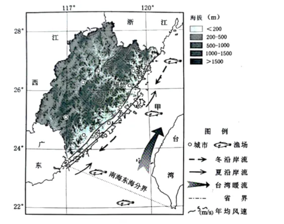

# 2025年浙江6月高考地理真题 · 综合题 G26（第26题）

## 来源
- 来源文档：精品解析：2025年浙江6月高考地理真题（解析版）.docx
- 题号：第26题（综合题，共3小问）

## 题组材料
1. 阅读图文材料，完成下列要求。

材料一：福建以山地和丘陵为主，平原只占总面积的10%，主要为河谷平原和河流下游冲积平原，是人口和产业的集中分布区，人地矛盾突出。该省是我国的多雨区，降水集中在春夏两季。该省是海洋大省，其海岸为构造下沉式海岸，岸线曲折，岛屿众多且紧靠大陆分布。福建海域属大陆架浅海，渔场面积广阔。下图为福建省略图。


材料二：福建是我国水果生产大省，主要在山地和丘陵的坡地栽种水果，易引发水土流失，故非常重视水土保持。

## 相关图片


### 第26题（1）
question_id: `2025-浙江-地理-2025年浙江6月高考地理真题-Q26-1`

**小问**：（1）福建发展风电比水电更具优势。试分析修建水库发展水电的不利条件和发展海上风电的有利条件。

**答案**：（1）修建水库发展水电的不利条件：人口和产业分布较多，修建水库淹没耕地和聚落多，移民搬迁成本高；降水集中在春夏两季，降水季节变化大，导致水库发电量不稳定；多山地丘陵，地质条件复杂，修建水库大坝难度大、成本高且存在安全隐患。

发展海上风电的有利条件：福建海岸线长且曲折，海域面积广，为海上风电建设提供充足空间；地处沿海，风力资源丰富；靠近东部经济发达地区，电力消费市场广阔；政府重视能源发展，政策支持海上风电建设。

**解析**：修建水库发展水电的不利条件从淹没问题、发电稳定性、建设难度等方面分析。淹没问题：材料一表明福建平原少且河谷平原是人口产业集中区，修建水库必然淹没大量耕地和聚落，移民搬迁成本较高。发电稳定性：福建降水季节集中，水库蓄水受降水影响大，导致发电不稳定，难以持续稳定供电。建设难度：山地丘陵地形使地质条件复杂，建设水库大坝需要处理复杂地质问题，增加建设成本和施工难度，还存在滑坡、泥石流等威胁大坝安全的隐患。

发展海上风电的有利条件从空间条件、风力资源、市场需求、政策等方面分析。空间条件：福建漫长曲折的海岸线和广阔海域，提供了充足的海上风电建设空间，可大规模安装风力发电机组。风力资源：地处沿海，风力强劲，风能资源丰富，能为风电提供稳定动力来源。市场需求：东部经济发达地区对电力需求大，福建靠近这些地区，海上风电电力输送距离近，市场广阔。政策支持：在国家大力发展清洁能源的背景下，福建政府积极推动海上风电发展，在规划、审批等方面给予政策支持。

**知识点归属**：
- **核心考点 · 权重 1.0**：资源、环境与国家安全 → 资源环境与人类社会 → 自然资源及其利用
- **支撑知识 · 权重 0.7**：区域发展 → 区域发展的条件 → 自然资源与区域发展

**整体置信度**：高

<!-- MANAGED-KM-START Q26-1
```yaml
question_id: "2025-浙江-地理-2025年浙江6月高考地理真题-Q26-1"
question_number: 26
sub_question: 1
knowledge_points:
  - role: core_exam_point
    weight: 1.0
    domain_id: DM-RES
    domain: "资源、环境与国家安全"
    theme_id: TH-RES-SOC
    theme: "资源环境与人类社会"
    knowledge_unit_id: KU-RES-SOC-002
    knowledge_unit: "自然资源及其利用"
    evidence: "比较水能和海上风能开发需综合资源条件、建设空间、成本、稳定性和市场等利用条件。"
  - role: supporting_knowledge
    weight: 0.7
    domain_id: DM-REG
    domain: "区域发展"
    theme_id: TH-REG-CONDITION
    theme: "区域发展的条件"
    knowledge_unit_id: KU-REG-CONDITION-002
    knowledge_unit: "自然资源与区域发展"
    evidence: "福建地形、降水、人口产业分布和沿海区位共同影响能源开发方式。"
extra_tags:
  - "水电与海上风电比较"
taxonomy_version: "config-v0.2-draft"
confidence: "high"
label_status: "completed"
needs_review: false
taxonomy_review:
  needs_review: false
  issue_type: "none"
  review_note: ""
note: ""
```
-->

### 第26题（2）
question_id: `2025-浙江-地理-2025年浙江6月高考地理真题-Q26-2`

**小问**：（2）甲渔场是福建的重要渔场，分析该渔场的自然优势。

**答案**：（2）甲渔场位于大陆架浅海区域，光照充足，利于浮游生物生长，为鱼类提供丰富饵料；地处寒暖流交汇，海水搅动，将海底营养物质带到表层，促进浮游生物繁殖；入海河流带来陆地上丰富的营养盐类，进一步增加了海域的饵料；海岸线曲折，岛屿众多，为鱼类提供栖息、产卵和躲避场所。

**解析**：甲渔场的自然优势从饵料、洋流、栖息环境等方面分析。饵料充足：位于大陆架浅海光照能到达海底，利于浮游植物光合作用，大量浮游生物生长为鱼类提供基础饵料；入海河流携带陆地上土壤中的营养盐类，增加海域营养成分，为鱼类提供丰富食物。洋流作用：寒暖流交汇（日本暖流和沿岸寒流）使海水扰动明显，将海底营养盐类带到表层，促进浮游生物繁殖，吸引鱼类聚集。栖息环境：曲折海岸线和众多岛屿形成多样海域环境，为鱼类提供栖息、产卵和躲避敌害的场所，利于鱼类生存繁衍。

**知识点归属**：
- **核心考点 · 权重 1.0**：资源、环境与国家安全 → 资源环境与人类社会 → 海洋生物资源与渔场形成条件
- **支撑知识 · 权重 0.7**：自然地理 → 水文与海洋 → 洋流
- **支撑知识 · 权重 0.7**：自然地理 → 自然环境的整体性与差异性 → 自然环境要素间的物质迁移和能量交换

**整体置信度**：高

<!-- MANAGED-KM-START Q26-2
```yaml
question_id: "2025-浙江-地理-2025年浙江6月高考地理真题-Q26-2"
question_number: 26
sub_question: 2
knowledge_points:
  - role: core_exam_point
    weight: 1.0
    domain_id: DM-RES
    domain: "资源、环境与国家安全"
    theme_id: TH-RES-SOC
    theme: "资源环境与人类社会"
    knowledge_unit_id: KU-RES-SOC-004
    knowledge_unit: "海洋生物资源与渔场形成条件"
    evidence: "大陆架浅海光照、营养盐与饵料、洋流扰动及岛屿海岸栖息环境共同形成渔场的自然优势。"
  - role: supporting_knowledge
    weight: 0.7
    domain_id: DM-NAT
    domain: "自然地理"
    theme_id: TH-NAT-WATER
    theme: "水文与海洋"
    knowledge_unit_id: KU-NAT-WATER-004
    knowledge_unit: "洋流"
    evidence: "寒暖流交汇通过海水扰动促进营养物质上泛和浮游生物繁殖。"
  - role: supporting_knowledge
    weight: 0.7
    domain_id: DM-NAT
    domain: "自然地理"
    theme_id: TH-NAT-INTEGRITY
    theme: "自然环境的整体性与差异性"
    knowledge_unit_id: KU-NAT-INTEGRITY-001
    knowledge_unit: "自然环境要素间的物质迁移和能量交换"
    evidence: "入海径流将陆地营养盐输送到海洋，体现河流与海洋之间的物质联系并增加渔场饵料基础。"
extra_tags:
  - "渔场形成的自然条件"
  - "大陆架渔业资源"
  - "河流与海洋相互作用"
taxonomy_version: "config-v0.2-draft"
confidence: "high"
label_status: "completed"
needs_review: false
taxonomy_review:
  needs_review: false
  issue_type: "none"
  review_note: ""
note: ""
```
-->

### 第26题（3）
question_id: `2025-浙江-地理-2025年浙江6月高考地理真题-Q26-3`

**小问**：（3）说出福建省果树栽种过程中易引发水土流失的原因。

**答案**：（3）福建省多山地丘陵，果树栽种在坡地，地形坡度大，水流速度快，侵蚀能力强；降水集中在春夏两季，且多暴雨，雨水对坡面冲刷力大；栽种果树过程中，破坏了原有植被，植被保持水土能力下降；单一作物种植破坏土壤结构，降低土壤抗侵蚀能力等。

**解析**：福建果树种植区的水土流失是自然与人为因素共同作用的结果。自然条件（如陡坡、暴雨）为水土流失提供了潜在动力，而人类活动（如毁林开垦、管理粗放）则直接触发并加剧了这一过程。自然条件：山地丘陵地形坡度大，水流速度快，对坡面土壤冲刷力强，容易带走表层土壤；集中的暴雨，短时间内大量雨水冲击坡面，加剧土壤侵蚀。人为因素：栽种果树过程中，原有植被被破坏，植被根系对土壤的固着作用减弱，地表失去植被保护，水土保持能力下降，土壤易被侵蚀；过度翻耕、单一作物种植导致土壤结构破坏，抗侵蚀能力降低；过量施肥或不当灌溉可能加速土壤酸化或板结，进一步削弱土壤稳定性。

**点睛**：本题以福建为背景，考查区域经济发展与自然环境的关系。解题关键在于从材料中提取关键信息，如地形、降水、海岸特征等，并结合地理原理进行分析。回答时注意条理清晰，分点作答，将自然因素与人为因素相结合，全面分析问题。

**知识点归属**：
- **核心考点 · 权重 1.0**：区域发展 → 生态脆弱区的发展与治理 → 土地退化及成因
- **支撑知识 · 权重 0.7**：自然地理 → 植被与土壤 → 土壤的功能与养护

**整体置信度**：高

<!-- MANAGED-KM-START Q26-3
```yaml
question_id: "2025-浙江-地理-2025年浙江6月高考地理真题-Q26-3"
question_number: 26
sub_question: 3
knowledge_points:
  - role: core_exam_point
    weight: 1.0
    domain_id: DM-REG
    domain: "区域发展"
    theme_id: TH-REG-ECOFRAGILE
    theme: "生态脆弱区的发展与治理"
    knowledge_unit_id: KU-REG-ECOFRAGILE-002
    knowledge_unit: "土地退化及成因"
    evidence: "坡地陡、春夏暴雨集中以及果树种植破坏原有植被和土壤结构，共同加剧水土流失。"
  - role: supporting_knowledge
    weight: 0.7
    domain_id: DM-NAT
    domain: "自然地理"
    theme_id: TH-NAT-VEGETATION-SOIL
    theme: "植被与土壤"
    knowledge_unit_id: KU-NAT-VEG-SOIL-006
    knowledge_unit: "土壤的功能与养护"
    evidence: "植被覆盖和土壤结构决定坡地保持水土的能力。"
extra_tags:
  - "坡地果园水土流失"
taxonomy_version: "config-v0.2-draft"
confidence: "high"
label_status: "completed"
needs_review: false
taxonomy_review:
  needs_review: false
  issue_type: "none"
  review_note: ""
note: ""
```
-->

## 教学备注
<!-- TEACHER-NOTES-START -->
- 易错点：
- 课堂提示：
- 讲解建议：
<!-- TEACHER-NOTES-END -->
