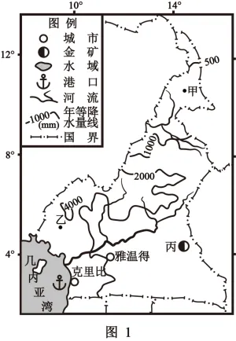
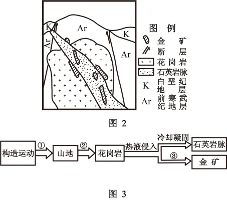

# 2025年浙江6月高考地理真题 · 综合题 G27（第27题）

## 来源
- 来源文档：精品解析：2025年浙江6月高考地理真题（解析版）.docx
- 题号：第27题（综合题，共3小问）

## 题组材料
1. 阅读材料，完成下列问题。

材料一：喀麦隆位于非洲中西部，图1为该国简图，图中甲、乙两地自然环境迥异。该国金矿主要分布于中部造山带，受断裂带控制。其中丙矿区基岩主要由花岗岩构成，金矿存在于侵入岩脉和接触带中。图2为丙矿区地质剖面示意图。图3为丙矿区金矿形成过程图。

## 相关图片




### 第27题（1）
question_id: `2025-浙江-地理-2025年浙江6月高考地理真题-Q27-1`

**小问**：（1）图中乙地自然带为\_\_\_\_\_\_\_。从降水特征角度，分析甲地地带性植被的主要特点\_\_\_\_\_\_\_。

**答案**：（1）    ①. 热带雨林带    ②. 甲地年降水量较少，降水季节分配不均，湿季多雨，干季少雨，故植被乙草类为主，湿季草类茂盛；干季草类枯黄。

**解析**：乙地自然带判断：喀麦隆地处非洲中西部，乙地位于几内亚湾沿岸的热带地区纬度低且降水丰富，图中显示年降水量4000mm左右，为热带雨林气候分布区，对应自然带为热带雨林带。

读图可知，甲地位于8°N-12°N之间，图中显示年降水量在500-1000mm之间，属于热带草原气候，总降水量难以满足森林的生长，植被以草类为主。由于降水季节分配不均，湿季多雨，水分条件较好，草类茂盛。干季少雨，水分条件较差，草木枯黄。

**知识点归属**：
- **核心考点 · 权重 1.0**：自然地理 → 自然环境的整体性与差异性 → 陆地地域分异规律
- **核心考点 · 权重 1.0**：自然地理 → 植被与土壤 → 植被与环境

**整体置信度**：高

<!-- MANAGED-KM-START Q27-1
```yaml
question_id: "2025-浙江-地理-2025年浙江6月高考地理真题-Q27-1"
question_number: 27
sub_question: 1
knowledge_points:
  - role: core_exam_point
    weight: 1.0
    domain_id: DM-NAT
    domain: "自然地理"
    theme_id: TH-NAT-INTEGRITY
    theme: "自然环境的整体性与差异性"
    knowledge_unit_id: KU-NAT-INTEGRITY-005
    knowledge_unit: "陆地地域分异规律"
    evidence: "乙地低纬且年降水丰富，对应热带雨林带；甲地降水较少且季节差异大，对应热带草原植被。"
  - role: core_exam_point
    weight: 1.0
    domain_id: DM-NAT
    domain: "自然地理"
    theme_id: TH-NAT-VEGETATION-SOIL
    theme: "植被与土壤"
    knowledge_unit_id: KU-NAT-VEG-SOIL-001
    knowledge_unit: "植被与环境"
    evidence: "甲地草类为主且湿季茂盛、干季枯黄，需用降水总量与季节分配解释植被特征。"
extra_tags:
  - "热带自然带判读"
  - "降水季节变化与植被"
taxonomy_version: "config-v0.2-draft"
confidence: "high"
label_status: "completed"
needs_review: false
taxonomy_review:
  needs_review: false
  issue_type: "none"
  review_note: ""
note: "该小问包含自然带名称判读和植被特征成因两个并列设问，因此设置两个核心考点。"
```
-->

### 第27题（2）
question_id: `2025-浙江-地理-2025年浙江6月高考地理真题-Q27-2`

**小问**：（2）写出图3中①、②、③对应的内力作用。

**答案**：（2）①地壳运动、②岩浆活动、③变质作用。

**解析**：内力作用是由地球内部能量（如放射性元素衰变）引发的地质作用。读图可知，①是构造运动形成山地，对应地壳运动；②形成了花岗岩，为岩浆侵入冷凝形成，对应岩浆活动；③热液侵入形成石英岩脉、金矿，对应变质作用。

**知识点归属**：
- **核心考点 · 权重 1.0**：自然地理 → 地表形态 → 塑造地表形态的内力与外力作用
- **支撑知识 · 权重 0.7**：自然地理 → 地表形态 → 岩石圈的物质循环

**整体置信度**：高

<!-- MANAGED-KM-START Q27-2
```yaml
question_id: "2025-浙江-地理-2025年浙江6月高考地理真题-Q27-2"
question_number: 27
sub_question: 2
knowledge_points:
  - role: core_exam_point
    weight: 1.0
    domain_id: DM-NAT
    domain: "自然地理"
    theme_id: TH-NAT-LANDFORM
    theme: "地表形态"
    knowledge_unit_id: KU-NAT-LANDFORM-006
    knowledge_unit: "塑造地表形态的内力与外力作用"
    evidence: "图示造山、花岗岩侵入和热液成矿过程分别对应地壳运动、岩浆活动和变质作用。"
  - role: supporting_knowledge
    weight: 0.7
    domain_id: DM-NAT
    domain: "自然地理"
    theme_id: TH-NAT-LANDFORM
    theme: "地表形态"
    knowledge_unit_id: KU-NAT-LANDFORM-007
    knowledge_unit: "岩石圈的物质循环"
    evidence: "花岗岩与石英岩脉的形成涉及岩浆冷凝和岩石转化过程。"
extra_tags:
  - "内力作用过程判读"
  - "热液成矿"
taxonomy_version: "config-v0.2-draft"
confidence: "high"
label_status: "completed"
needs_review: false
taxonomy_review:
  needs_review: false
  issue_type: "none"
  review_note: ""
note: ""
```
-->

### 第27题（3）
question_id: `2025-浙江-地理-2025年浙江6月高考地理真题-Q27-3`

**小问**：（3）简述克里比特殊的海岸地形对港口建设的有利和不利影响。

**答案**：（3）有利影响：瀑布入海水流较急，不利于泥沙堆积，水深，利于大型船舶靠岸；海岸线曲折，避风条件好，利于船舶安全停泊。

不利影响：“瀑布入海”形成较大落差，船舶进出港口时，需要克服水流的冲击力，增加航行难度和风险；河口与海洋之间存在水位差，建设连接河口与海洋的航道成本高，且维护难度大。

**解析**：有利影响：河口水面高于海平面，形成天然落差，入海口水流较急，不利于泥沙堆积，水较深，利于大型船舶停靠；读图可知，该地海岸线较为曲折，形成天然港湾，受海风和海浪影响小，避风条件好，利于船舶安全停泊。

不利影响：“瀑布入海” 形成较大落差，水流湍急、冲击力强，船舶进出港口需克服水流阻力，可能导致航线偏离或动力损耗，增加航行难度；河口与海洋之间的水位差需通过人工疏浚或修建船闸等设施平衡，建设成本高昂；且水流携带泥沙易淤积航道，需定期维护，增加运营负担。

**点睛**：在高山地区，随着海拔高度的变化，温度和降水发生变化，自然带也依次变化。如珠穆朗玛峰南坡从山麓到山顶的自然带变化规律是：常绿阔叶林带、针阔混交林带、针叶林带、高山草甸草原带、寒荒漠带、积雪冰川带。

**知识点归属**：
- **核心考点 · 权重 1.0**：人文地理 → 交通运输与区域发展 → 区域发展对交通运输布局的影响
- **支撑知识 · 权重 0.7**：自然地理 → 地表形态 → 海岸地貌

**整体置信度**：高

<!-- MANAGED-KM-START Q27-3
```yaml
question_id: "2025-浙江-地理-2025年浙江6月高考地理真题-Q27-3"
question_number: 27
sub_question: 3
knowledge_points:
  - role: core_exam_point
    weight: 1.0
    domain_id: DM-HUM
    domain: "人文地理"
    theme_id: TH-HUM-TRANSPORT
    theme: "交通运输与区域发展"
    knowledge_unit_id: KU-HUM-TRA-001
    knowledge_unit: "区域发展对交通运输布局的影响"
    evidence: "瀑布入海和曲折海岸影响港口水深、避风、船舶通行以及航道建设维护成本。"
  - role: supporting_knowledge
    weight: 0.7
    domain_id: DM-NAT
    domain: "自然地理"
    theme_id: TH-NAT-LANDFORM
    theme: "地表形态"
    knowledge_unit_id: KU-NAT-LANDFORM-004
    knowledge_unit: "海岸地貌"
    evidence: "海岸落差与岸线形态是评价港口建设条件的地貌基础。"
extra_tags:
  - "海岸地形与港口建设"
taxonomy_version: "config-v0.2-draft"
confidence: "high"
label_status: "completed"
needs_review: false
taxonomy_review:
  needs_review: false
  issue_type: "none"
  review_note: ""
note: ""
```
-->

## 教学备注
<!-- TEACHER-NOTES-START -->
- 易错点：
- 课堂提示：
- 讲解建议：
<!-- TEACHER-NOTES-END -->
