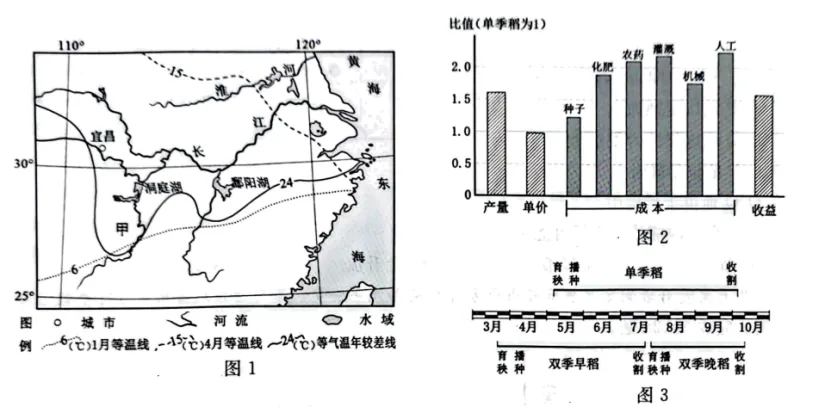

# 2025年浙江6月高考地理真题 · 综合题 G28（第28题）

## 来源
- 来源文档：精品解析：2025年浙江6月高考地理真题（解析版）.docx
- 题号：第28题（综合题，共4小问）

## 题组材料
1. 阅读材料，完成下列问题。

材料：每年春季，我国大陆仍受逐渐减弱的亚洲高压控制。4—5月，黄海北部海面常出现小型冷气流辐散中心。洞庭湖流域是水稻种植重要地区，有的年份3月就会提前受副高西侧气流影响。早稻田间育秧要求3—5日连续晴朗且气温大于10℃天气，若遇天气不好，会造成烂秧。图1为我国某区域略图。图2为单、双季稻投入产出对比图。图3为单、双季稻生长期差异图。

## 相关图片


### 第28题（1）
question_id: `2025-浙江-地理-2025年浙江6月高考地理真题-Q28-1`

**小问**：（1）简述造成洞庭湖流域早稻烂秧的天气特征，并指出相应的天气系统。

**答案**：（1）阴雨天气，气温较低（低于10℃）；冷锋

**解析**：结合材料可知，早稻田间育秧要求3-5日连续晴朗且气温大于10℃天气，如果出现烂秧现象，意味着当地可能出现阴雨天气或气温小于10℃的天气。黄海北部海面常出现小型冷气流辐散中心，辐散气流向西南方向运动至鄱阳湖地区，形成冷气团；3月提前受副高西侧气流影响，为洞庭湖流域带来从南向北的辐散气流，形成暖气团。冷暖气团在洞庭湖流域相遇，形成冷锋，带来降温、阴雨天气，导致早稻出现烂秧现象。

**知识点归属**：
- **核心考点 · 权重 1.0**：自然地理 → 大气 → 锋与天气

**整体置信度**：高

<!-- MANAGED-KM-START Q28-1
```yaml
question_id: "2025-浙江-地理-2025年浙江6月高考地理真题-Q28-1"
question_number: 28
sub_question: 1
knowledge_points:
  - role: core_exam_point
    weight: 1.0
    domain_id: DM-NAT
    domain: "自然地理"
    theme_id: TH-NAT-ATMOSPHERE
    theme: "大气"
    knowledge_unit_id: KU-NAT-ATM-CIRC-001
    knowledge_unit: "锋与天气"
    evidence: "冷暖气团在洞庭湖流域相遇形成冷锋，带来低温阴雨并导致早稻烂秧。"
extra_tags:
  - "低温阴雨与早稻烂秧"
taxonomy_version: "config-v0.2-draft"
confidence: "high"
label_status: "completed"
needs_review: false
taxonomy_review:
  needs_review: false
  issue_type: "none"
  review_note: ""
note: ""
```
-->

### 第28题（2）
question_id: `2025-浙江-地理-2025年浙江6月高考地理真题-Q28-2`

**小问**：（2）从1月到4月，图示内陆地区气温升高速度比沿海\_\_\_\_\_\_\_，从海陆位置和天气角度分析两地差异的成因\_\_\_\_\_\_\_。

**答案**：（2）    ①. 快    ②. 内陆地区距海较远、升温快，沿海地区升温慢；内陆地区降水较少、晴天多，沿海地区多阴雨、云雾天气。

**解析**：结合材料及所学知识，1月到4月，太阳直射点向北移动，图示区域气温回升。受海陆热力性质差异和天气的影响，内陆地区距离海洋较远、水汽较少，多晴朗天气，气温升高速度较快；沿海地区受海洋调节作用更加显著，水汽充足、多阴雨天气，气温升高速度较慢。

**知识点归属**：
- **核心考点 · 权重 1.0**：自然地理 → 大气 → 大气的受热过程

**整体置信度**：高

<!-- MANAGED-KM-START Q28-2
```yaml
question_id: "2025-浙江-地理-2025年浙江6月高考地理真题-Q28-2"
question_number: 28
sub_question: 2
knowledge_points:
  - role: core_exam_point
    weight: 1.0
    domain_id: DM-NAT
    domain: "自然地理"
    theme_id: TH-NAT-ATMOSPHERE
    theme: "大气"
    knowledge_unit_id: KU-NAT-ATM-HEAT-003
    knowledge_unit: "大气的受热过程"
    evidence: "内陆受海洋调节弱且晴天多，升温快；沿海海洋热容量影响强且多阴雨云雾，升温慢。"
extra_tags:
  - "海陆热力性质差异"
  - "云量对升温的影响"
taxonomy_version: "config-v0.2-draft"
confidence: "high"
label_status: "completed"
needs_review: false
taxonomy_review:
  needs_review: false
  issue_type: "none"
  review_note: ""
note: ""
```
-->

### 第28题（3）
question_id: `2025-浙江-地理-2025年浙江6月高考地理真题-Q28-3`

**小问**：（3）甲地气温年较差较相邻东西两侧大，从地形和季风角度简析其成因。

**答案**：（3）甲地地处山谷中，地势低洼、地形封闭；夏季风（东南风）下沉进入谷地，增温明显；冬季风深入谷地，且不易扩散，降温明显。

**解析**：甲地气温年较差较相邻东西两侧大，意味着甲地夏季气温更高、冬季气温更低。结合材料及所学知识，甲地位于洞庭湖南侧河谷中，地势较低且地形封闭，气流一旦进入甲地便不易扩散。夏季，洞庭湖流域受东南季风的影响，甲地河谷大致呈南北走向、与季风走向垂直，季风沿着谷地东侧山坡下沉进入山谷，增温效果明显；受封闭地形影响，加剧增温幅度。冬季，洞庭湖流域受偏北的冬季风影响，冬季风沿着河谷深入甲地，带来降温作用；受封闭地形影响，冷气流不易扩散，导致温度更低。在地形和季风的共同作用下，甲地气温年较差更大。

**知识点归属**：
- **核心考点 · 权重 1.0**：自然地理 → 大气 → 季风
- **核心考点 · 权重 1.0**：自然地理 → 大气 → 大气的受热过程

**整体置信度**：高

<!-- MANAGED-KM-START Q28-3
```yaml
question_id: "2025-浙江-地理-2025年浙江6月高考地理真题-Q28-3"
question_number: 28
sub_question: 3
knowledge_points:
  - role: core_exam_point
    weight: 1.0
    domain_id: DM-NAT
    domain: "自然地理"
    theme_id: TH-NAT-ATMOSPHERE
    theme: "大气"
    knowledge_unit_id: KU-NAT-ATM-CIRC-005
    knowledge_unit: "季风"
    evidence: "夏季风下沉入谷增温、冬季风深入谷地降温，使甲地夏冬温差扩大。"
  - role: core_exam_point
    weight: 1.0
    domain_id: DM-NAT
    domain: "自然地理"
    theme_id: TH-NAT-ATMOSPHERE
    theme: "大气"
    knowledge_unit_id: KU-NAT-ATM-HEAT-003
    knowledge_unit: "大气的受热过程"
    evidence: "封闭低洼谷地强化下沉增温并使冬季冷空气不易扩散，放大气温年较差。"
extra_tags:
  - "谷地地形与气温年较差"
taxonomy_version: "config-v0.2-draft"
confidence: "high"
label_status: "completed"
needs_review: false
taxonomy_review:
  needs_review: false
  issue_type: "none"
  review_note: ""
note: "设问明确要求从地形和季风两个角度分析，两个机制共同构成答案。"
```
-->

### 第28题（4）
question_id: `2025-浙江-地理-2025年浙江6月高考地理真题-Q28-4`

**小问**：（4）长江中下游地区存在单季稻和双季稻两种种植方式，你认为哪种方式更好？请阐述理由。

**答案**：（4）观点一：种植双季稻。理由：年产量更高；充分利用光热、水、土地等自然资源；经济效益显著。

观点二：种植单季稻。理由：生长周期较长，水稻品质较高；避免自然灾害带来的早春烂秧等影响；一年中部分时间休耕，保持土地生产力；减少化肥等投入，降低生产成本。

**解析**：本题属于开放性试题，任选观点，言之有理即可。

观点一：种植双季稻。结合图示信息可知，若种植双季稻，生产周期从3月持续至10月，可以更加充分利用当地的光热、水土等自然资源，提高资源的利用率。双季稻一年可以收获两次，可以获得更高的水稻产量，保证粮食供应。根据图2可知，种植双季稻尽管投入增加，但净收益更高（投入产出比更高）。

观点二：种植单季稻。与双季稻相比，种植单季稻生产周期明显缩短，土地休养生息的时间更长，可以更好的维持土地生产力，提升生态效益。单季稻的生产周期长于双季稻中每一茬水稻的生长周期，有机质积累的时间更长，水稻的品质更高。与双季稻相比，种植单季稻需要投入的农药、化肥等更少，节约生产成本。另外，单季稻的生产从4-5月持续到9-10月，有效避免早春寒冷天气带来的早稻烂秧等不利影响，生产风险更小。

**点睛**：本题以洞庭湖流域水稻种植为材料展开设问，涉及天气系统、海陆热力性质差异、农业区位分析、影响气温年较差的因素等地理原理，考查学生获取和解读地理信息、描述和阐释地理事物的能力和综合思维、区域认知等地理学科核心素养，体现基础性、综合性与应用性考查。

**知识点归属**：
- **核心考点 · 权重 1.0**：人文地理 → 产业区位 → 农业区位因素
- **支撑知识 · 权重 0.7**：资源、环境与国家安全 → 资源环境安全保障 → 可持续发展

**整体置信度**：高

<!-- MANAGED-KM-START Q28-4
```yaml
question_id: "2025-浙江-地理-2025年浙江6月高考地理真题-Q28-4"
question_number: 28
sub_question: 4
knowledge_points:
  - role: core_exam_point
    weight: 1.0
    domain_id: DM-HUM
    domain: "人文地理"
    theme_id: TH-HUM-INDUSTRY
    theme: "产业区位"
    knowledge_unit_id: KU-HUM-IND-001
    knowledge_unit: "农业区位因素"
    evidence: "单季稻与双季稻的选择需比较光热土地利用、产量品质、投入收益、灾害风险和休耕效应。"
  - role: supporting_knowledge
    weight: 0.7
    domain_id: DM-RES
    domain: "资源、环境与国家安全"
    theme_id: TH-RES-STRATEGY
    theme: "资源环境安全保障"
    knowledge_unit_id: KU-RES-STR-004
    knowledge_unit: "可持续发展"
    evidence: "种植制度评价同时权衡经济收益、资源利用和土地生产力维持。"
extra_tags:
  - "单季稻与双季稻权衡"
  - "种植制度评价"
taxonomy_version: "config-v0.2-draft"
confidence: "high"
label_status: "completed"
needs_review: false
taxonomy_review:
  needs_review: false
  issue_type: "none"
  review_note: ""
note: ""
```
-->

## 教学备注
<!-- TEACHER-NOTES-START -->
- 易错点：
- 课堂提示：
- 讲解建议：
<!-- TEACHER-NOTES-END -->
