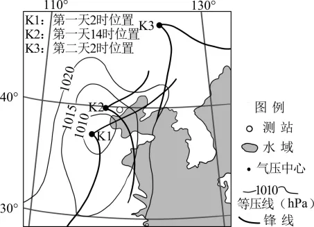
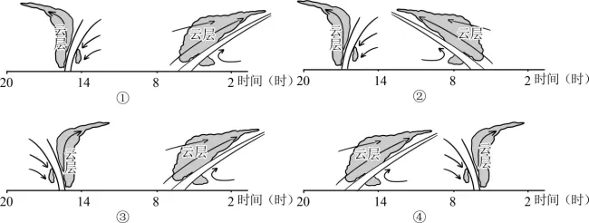

# 2025年浙江6月高考地理真题 · 选择题题组 G10（第19–20题）

## 来源
- 来源文档：精品解析：2025年浙江6月高考地理真题（解析版）.docx
- 题号：第19–20题（选择题，共2小题）

## 题组材料
下图为某年10月两日内气旋移动的路径图，图中等压线反映的是某测站附近第一天2时的海平面气压形势。该测站测得第一天7时、15时前后风向发生两次明显变化。完成下面小题。

## 相关图片


## 第19题
question_id: `2025-浙江-地理-2025年浙江6月高考地理真题-Q19`

**题干**：1. 第一天7时前后，测站的风向由（   ）

**选项**：
- A. 西南变东北
- B. 西南变西北
- C. 东北变东南
- D. 东北变西南

**答案**：C

**解析**：第一天2时的气压中心K1位于测站的西南方向，据图示等压线信息可知K1是低压中心，则由测站到K1的水平气压梯度力由东北指向西南，结合北半球地转偏向力右偏形成东北风。第一天7时的气压中心K2（低压中心）位于测站的偏西方向，则由测站到K2的水平气压梯度力由东指向西，受北半球地转偏向力右偏影响，形成东南风，因此第一天7时前后，测站的风向由东北变东南，C正确，排除ABD。故选C。

**知识点归属**：
- **核心考点 · 权重 1.0**：自然地理 → 大气 → 大气的水平运动
- **支撑知识 · 权重 0.7**：自然地理 → 大气 → 气旋与反气旋

**整体置信度**：高

<!-- MANAGED-KM-START Q19
```yaml
question_id: "2025-浙江-地理-2025年浙江6月高考地理真题-Q19"
question_number: 19
knowledge_points:
  - role: core_exam_point
    weight: 1.0
    domain_id: DM-NAT
    domain: "自然地理"
    theme_id: TH-NAT-ATMOSPHERE
    theme: "大气"
    knowledge_unit_id: KU-NAT-ATM-HEAT-006
    knowledge_unit: "大气的水平运动"
    evidence: "根据低压中心相对测站位置确定水平气压梯度力，再结合北半球地转偏向判断风向由东北转东南。"
  - role: supporting_knowledge
    weight: 0.7
    domain_id: DM-NAT
    domain: "自然地理"
    theme_id: TH-NAT-ATMOSPHERE
    theme: "大气"
    knowledge_unit_id: KU-NAT-ATM-CIRC-002
    knowledge_unit: "气旋与反气旋"
    evidence: "气旋移动改变测站相对低压中心的位置。"
extra_tags:
  - "移动气旋风向变化"
taxonomy_version: "config-v0.2-draft"
confidence: "high"
label_status: "completed"
needs_review: false
taxonomy_review:
  needs_review: false
  issue_type: "none"
  review_note: ""
note: ""
```
-->

## 第20题
question_id: `2025-浙江-地理-2025年浙江6月高考地理真题-Q20`

**题干**：1. 第一天不同时间天气系统依次经过测站次序正确的是（   ）



**选项**：
- A. ①
- B. ②
- C. ③
- D. ④

**答案**：C

**解析**：据所学知识可知，由K1的低压中心附近形成的北半球锋面气旋中，偏东侧的锋面应是暖锋，结合北半球气旋的气流方向是逆时针辐合，所以在K1时期（第一天2时）测站应位于暖锋的锋面之前，受冷气团控制，而②④在2时附近受暖气团（位于锋面之上）控制，排除BD；据图示可知在K2时期，测站在暖锋锋面之后的暖气团控制，一直到锋面气旋偏西侧的冷锋过境前一直是受暖气团控制，当此冷锋过境之后，测站将会受冷气团（位于锋面之下）控制，C正确，A错误。故选C。

**点睛**：气旋为低气压中心，周围的空气向气旋中心涌入。 ①天气：在垂直方向上，盛行上升气流，气流上升的过程中，冷凝形成降水； ②风向：在水平方向上，气流涌向气旋中心，并发生偏转（北右南左），因此表现出的旋转方向为北逆南顺。

**知识点归属**：
- **核心考点 · 权重 1.0**：自然地理 → 大气 → 气旋与反气旋
- **支撑知识 · 权重 0.7**：自然地理 → 大气 → 锋与天气

**整体置信度**：高

<!-- MANAGED-KM-START Q20
```yaml
question_id: "2025-浙江-地理-2025年浙江6月高考地理真题-Q20"
question_number: 20
knowledge_points:
  - role: core_exam_point
    weight: 1.0
    domain_id: DM-NAT
    domain: "自然地理"
    theme_id: TH-NAT-ATMOSPHERE
    theme: "大气"
    knowledge_unit_id: KU-NAT-ATM-CIRC-002
    knowledge_unit: "气旋与反气旋"
    evidence: "根据北半球锋面气旋结构及其移动路径，判断测站依次经历暖锋、暖区和冷锋。"
  - role: supporting_knowledge
    weight: 0.7
    domain_id: DM-NAT
    domain: "自然地理"
    theme_id: TH-NAT-ATMOSPHERE
    theme: "大气"
    knowledge_unit_id: KU-NAT-ATM-CIRC-001
    knowledge_unit: "锋与天气"
    evidence: "冷暖锋过境前后的气团位置是选择天气系统序列的依据。"
extra_tags:
  - "锋面气旋过境序列"
taxonomy_version: "config-v0.2-draft"
confidence: "high"
label_status: "completed"
needs_review: false
taxonomy_review:
  needs_review: false
  issue_type: "none"
  review_note: ""
note: ""
```
-->

## 教学备注
<!-- TEACHER-NOTES-START -->
- 易错点：
- 课堂提示：
- 讲解建议：
<!-- TEACHER-NOTES-END -->
