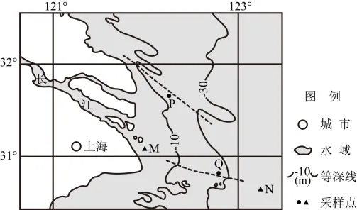

# 2025年浙江6月高考地理真题 · 选择题题组 G11（第21–23题）

## 来源
- 来源文档：精品解析：2025年浙江6月高考地理真题（解析版）.docx
- 题号：第21–23题（选择题，共3小题）

## 题组材料
下图为长江口简图，图中虚线表示沟槽或隆脊。研究人员测定M、N两点2月和8月的海面水体盐度；在P、Q两地采集海底表层沉积物并测定年代，测得P地距今约1千年，Q地为现代沉积。完成下面小题。

## 相关图片


## 第21题
question_id: `2025-浙江-地理-2025年浙江6月高考地理真题-Q21`

**题干**：1. M、N两点的海水盐度（   ）

**选项**：
- A. 同季节M大于N
- B. M夏季大于冬季
- C. N冬夏盐度差更小
- D. N受径流影响更大

**答案**：C

**解析**：根据图示信息可知，M距离长江入海口更近，受径流补给影响更大，对海水盐度的稀释作用更强，海水盐度更低，N距离入海口较远受陆地径流影响较小，海水盐度较高，同季节M海水盐度低于N，AD错误；长江夏季径流量大于冬季，夏季对入海口处海水盐度的稀释作用更强，海水盐度更低，B错误；N海域距离入海口更远，受陆地径流影响更小，冬夏季盐度差更小，C正确。故选C。

**知识点归属**：
- **核心考点 · 权重 1.0**：自然地理 → 水文与海洋 → 海水的性质
- **支撑知识 · 权重 0.7**：自然地理 → 水文与海洋 → 陆地水体及其相互关系

**整体置信度**：高

<!-- MANAGED-KM-START Q21
```yaml
question_id: "2025-浙江-地理-2025年浙江6月高考地理真题-Q21"
question_number: 21
knowledge_points:
  - role: core_exam_point
    weight: 1.0
    domain_id: DM-NAT
    domain: "自然地理"
    theme_id: TH-NAT-WATER
    theme: "水文与海洋"
    knowledge_unit_id: KU-NAT-WATER-002
    knowledge_unit: "海水的性质"
    evidence: "M更靠近长江口且夏季径流稀释更强，N受径流影响较弱，因而冬夏盐度差更小。"
  - role: supporting_knowledge
    weight: 0.7
    domain_id: DM-NAT
    domain: "自然地理"
    theme_id: TH-NAT-WATER
    theme: "水文与海洋"
    knowledge_unit_id: KU-NAT-WATER-005
    knowledge_unit: "陆地水体及其相互关系"
    evidence: "长江径流的季节变化控制河口淡水输入强弱。"
extra_tags:
  - "河口盐度季节变化"
taxonomy_version: "config-v0.2-draft"
confidence: "high"
label_status: "completed"
needs_review: false
taxonomy_review:
  needs_review: false
  issue_type: "none"
  review_note: ""
note: ""
```
-->

## 第22题
question_id: `2025-浙江-地理-2025年浙江6月高考地理真题-Q22`

**题干**：1. 关于P、Q两地的叙述，正确的是（   ）

**选项**：
- A. P地以侵蚀为主
- B. Q地以侵蚀为主
- C. P地位于隆脊上
- D. Q地位于沟槽中

**答案**：A

**解析**：根据材料信息可知，P等深线由低值凸向高值，为沟槽，水体较深，沉积物少，且缺乏现代沉积，说明以侵蚀作用为主，A正确，C错误；Q地等深线由高值凸向低值，为隆脊，堆积物较深厚，侵蚀作用弱，且以现代沉积为主，说明以堆积作用为主，BD错误。故选A。

**知识点归属**：
- **核心考点 · 权重 1.0**：自然地理 → 地表形态 → 塑造地表形态的内力与外力作用
- **支撑知识 · 权重 0.7**：自然地理 → 地表形态 → 海岸地貌

**整体置信度**：高

<!-- MANAGED-KM-START Q22
```yaml
question_id: "2025-浙江-地理-2025年浙江6月高考地理真题-Q22"
question_number: 22
knowledge_points:
  - role: core_exam_point
    weight: 1.0
    domain_id: DM-NAT
    domain: "自然地理"
    theme_id: TH-NAT-LANDFORM
    theme: "地表形态"
    knowledge_unit_id: KU-NAT-LANDFORM-006
    knowledge_unit: "塑造地表形态的内力与外力作用"
    evidence: "P处为较深沟槽且缺乏现代沉积，说明海底侵蚀占主导；Q处隆脊有现代沉积。"
  - role: supporting_knowledge
    weight: 0.7
    domain_id: DM-NAT
    domain: "自然地理"
    theme_id: TH-NAT-LANDFORM
    theme: "地表形态"
    knowledge_unit_id: KU-NAT-LANDFORM-004
    knowledge_unit: "海岸地貌"
    evidence: "沟槽和隆脊是近岸海底地貌形态。"
extra_tags:
  - "海底沟槽侵蚀判读"
taxonomy_version: "config-v0.2-draft"
confidence: "high"
label_status: "completed"
needs_review: false
taxonomy_review:
  needs_review: false
  issue_type: "none"
  review_note: ""
note: ""
```
-->

## 第23题
question_id: `2025-浙江-地理-2025年浙江6月高考地理真题-Q23`

**题干**：1. 发育水下沟槽的动力最可能来自（   ）

**选项**：
- A. 潮流
- B. 风浪
- C. 上升流
- D. 温度差

**答案**：A

**解析**：潮流会侵蚀沿岸地区的海底，促进水下沟槽的发育，A正确；风浪主要在海洋表层，不是海底沟槽形成的主要动力，B错误；上升流主要在垂直方向上，不是海底沟槽形成的主要动力，C错误；温度差不是海水运动的主要原因，D错误。故选A。

**点睛**：影响海水盐度的核心因素主要包括气候因素（降水量与蒸发量的对比关系）、洋流性质、入海径流输入、海域封闭程度以及结冰与融冰作用。其中气候因素通过降水量与蒸发量的动态平衡主导大洋表层盐度分布格局，而近岸海域则更多受入海径流影响。

**知识点归属**：
- **核心考点 · 权重 1.0**：自然地理 → 水文与海洋 → 潮汐
- **支撑知识 · 权重 0.7**：自然地理 → 地表形态 → 海岸地貌

**整体置信度**：高

<!-- MANAGED-KM-START Q23
```yaml
question_id: "2025-浙江-地理-2025年浙江6月高考地理真题-Q23"
question_number: 23
knowledge_points:
  - role: core_exam_point
    weight: 1.0
    domain_id: DM-NAT
    domain: "自然地理"
    theme_id: TH-NAT-WATER
    theme: "水文与海洋"
    knowledge_unit_id: KU-NAT-WATER-008
    knowledge_unit: "潮汐"
    evidence: "潮流能在海底产生持续水平流动和冲刷，是发育水下沟槽的主要动力。"
  - role: supporting_knowledge
    weight: 0.7
    domain_id: DM-NAT
    domain: "自然地理"
    theme_id: TH-NAT-LANDFORM
    theme: "地表形态"
    knowledge_unit_id: KU-NAT-LANDFORM-004
    knowledge_unit: "海岸地貌"
    evidence: "潮流侵蚀塑造近岸水下地貌。"
extra_tags:
  - "潮流侵蚀水下沟槽"
taxonomy_version: "config-v0.2-draft"
confidence: "high"
label_status: "completed"
needs_review: false
taxonomy_review:
  needs_review: false
  issue_type: "none"
  review_note: ""
note: ""
```
-->

## 教学备注
<!-- TEACHER-NOTES-START -->
- 易错点：
- 课堂提示：
- 讲解建议：
<!-- TEACHER-NOTES-END -->
