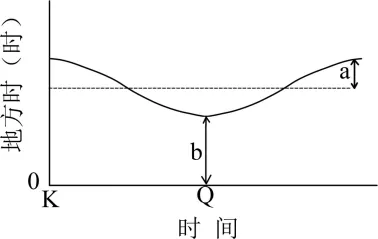
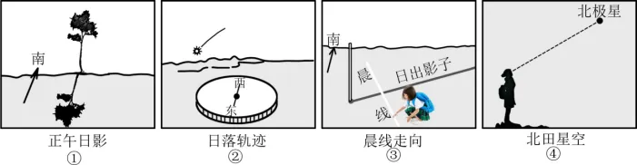

# 2025年浙江6月高考地理真题 · 选择题题组 G12（第24–25题）

## 来源
- 来源文档：精品解析：2025年浙江6月高考地理真题（解析版）.docx
- 题号：第24–25题（选择题，共2小题）

## 题组材料
某天文爱好者测定了当地日出地方时和晨昏线年变化。下图为该地日出地方时年变化曲线图。据此完成下面小题。

## 相关图片


## 第24题
question_id: `2025-浙江-地理-2025年浙江6月高考地理真题-Q24`

**题干**：1. 若测得b值正好是a值的两倍，则该地年内日出地方时差（单位：小时）最大值为（   ）

**选项**：
- A. 3
- B. 4
- C. 6
- D. 12

**答案**：B

**解析**：根据所学知识可知，某地一年中最早日出地方时和最晚日出地方时应该关于地方时6时对称，且b=2a，则（6－b）=a，可以求出来a2，b为4，即日出地方时最早为4时，最晚为8时，年内日出地方时差值最大值为4，B正确，ACD错误。故选B。

**知识点归属**：
- **核心考点 · 权重 1.0**：自然地理 → 地球的运动 → 昼夜长短的变化

**整体置信度**：高

<!-- MANAGED-KM-START Q24
```yaml
question_id: "2025-浙江-地理-2025年浙江6月高考地理真题-Q24"
question_number: 24
knowledge_points:
  - role: core_exam_point
    weight: 1.0
    domain_id: DM-NAT
    domain: "自然地理"
    theme_id: TH-NAT-EARTH-MOTION
    theme: "地球的运动"
    knowledge_unit_id: KU-NAT-EARTH-MOTION-006
    knowledge_unit: "昼夜长短的变化"
    evidence: "利用一年中最早与最晚日出地方时关于6时对称，并结合b等于2a求出最大日出时差。"
extra_tags:
  - "日出地方时年变化"
taxonomy_version: "config-v0.2-draft"
confidence: "high"
label_status: "completed"
needs_review: false
taxonomy_review:
  needs_review: false
  issue_type: "none"
  review_note: ""
note: ""
```
-->

## 第25题
question_id: `2025-浙江-地理-2025年浙江6月高考地理真题-Q25`

**题干**：1. 若K至Q期间过该地晨线作顺时针方向转动，则Q日该爱好者在当地可能观测到（   ）



**选项**：
- A. ①
- B. ②
- C. ③
- D. ④

**答案**：B

**解析**：过该地的晨线作顺时针方向转动，说明应为北半球夏至日到北半球冬至日之间，K为北半球夏至日，Q为北半球冬至日。根据“此时该地日出地方时逐渐提前”，说明该地应该位于南半球。根据上题分析可知，该地年内日出地方时差值最大值为4，应位于中纬度，正午太阳方位位于正北，日影应朝向正南，A错误；Q日太阳直射点位于南半球，全球有日落的点位，日落方位偏南，该地应西南日落，B符合；Q日太阳直射点位于南半球，当地日出东南，日出时日影应朝向西北，C错误；该地位于南半球，观测不到北极星，D错误。故选B。

**点睛**：日出日落的太阳方位主要由太阳直射点的位置决定，具体表现为：太阳直射北半球时（北半球夏半年），日出东北、日落西北；直射南半球时（北半球冬半年），日出东南、日落西南；直射赤道时（春秋分日），日出正东、日落正西。

**知识点归属**：
- **核心考点 · 权重 1.0**：自然地理 → 地球的运动 → 昼夜长短的变化
- **支撑知识 · 权重 0.7**：自然地理 → 地球的运动 → 黄赤交角与太阳直射点的回归运动

**整体置信度**：高

<!-- MANAGED-KM-START Q25
```yaml
question_id: "2025-浙江-地理-2025年浙江6月高考地理真题-Q25"
question_number: 25
knowledge_points:
  - role: core_exam_point
    weight: 1.0
    domain_id: DM-NAT
    domain: "自然地理"
    theme_id: TH-NAT-EARTH-MOTION
    theme: "地球的运动"
    knowledge_unit_id: KU-NAT-EARTH-MOTION-006
    knowledge_unit: "昼夜长短的变化"
    evidence: "由晨线转动和日出地方时变化判断半球与节气，再据昼夜变化确定日出日落方位。"
  - role: supporting_knowledge
    weight: 0.7
    domain_id: DM-NAT
    domain: "自然地理"
    theme_id: TH-NAT-EARTH-MOTION
    theme: "地球的运动"
    knowledge_unit_id: KU-NAT-EARTH-MOTION-003
    knowledge_unit: "黄赤交角与太阳直射点的回归运动"
    evidence: "太阳直射点季节移动决定日出日落方位和昼长变化。"
extra_tags:
  - "晨线转动"
  - "日出日落方位"
taxonomy_version: "config-v0.2-draft"
confidence: "high"
label_status: "completed"
needs_review: false
taxonomy_review:
  needs_review: false
  issue_type: "none"
  review_note: ""
note: ""
```
-->

## 教学备注
<!-- TEACHER-NOTES-START -->
- 易错点：
- 课堂提示：
- 讲解建议：
<!-- TEACHER-NOTES-END -->
