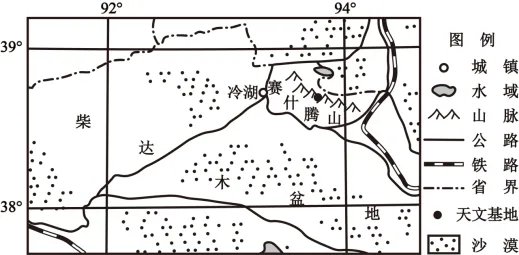

# 2025年浙江6月高考地理真题 · 选择题题组 G1（第1–2题）

## 来源
- 来源文档：精品解析：2025年浙江6月高考地理真题（解析版）.docx
- 题号：第1–2题（选择题，共2小题）

## 题组材料
冷湖曾因石油资源枯竭陷入衰落，如今因赛什腾山上世界级天文观测基地（海拔4200米）的建设而备受瞩目，主题旅游蓬勃发展。下图为柴达木盆地局部简图。据此完成下面小题。

## 相关图片


## 第1题
question_id: `2025-浙江-地理-2025年浙江6月高考地理真题-Q1`

**题干**：1. 冷湖的重新兴起得益于（   ）

**选项**：
- A. 盐类资源丰富
- B. 自然环境独特
- C. 文化底蕴深厚
- D. 人口大量集聚

**答案**：B

**解析**：冷湖重新兴起后主题是旅游，并不是进行盐类资源的开发，因此不是得益于盐类资源丰富，A错误；赛什腾山海拔高，大气稀薄，适合天文观测，建立了世界级天文观测基地，自然环境独特，促进了冷湖的重新兴起，B正确；如今因赛什腾山上世界级天文观测基地的建设而备受瞩目，与文化底蕴无关，C错误；结合材料信息可知，冷湖曾因石油资源枯竭陷入衰落，重新兴起并不是因为人口大量集聚，D错误。故选B。

**知识点归属**：
- **核心考点 · 权重 1.0**：区域发展 → 资源型区域的发展与转型 → 资源枯竭型城市的转型机制

**整体置信度**：高

<!-- MANAGED-KM-START Q1
```yaml
question_id: "2025-浙江-地理-2025年浙江6月高考地理真题-Q1"
question_number: 1
knowledge_points:
  - role: core_exam_point
    weight: 1.0
    domain_id: DM-REG
    domain: "区域发展"
    theme_id: TH-REG-RESOURCE
    theme: "资源型区域的发展与转型"
    knowledge_unit_id: KU-REG-RESOURCE-002
    knowledge_unit: "资源枯竭型城市的转型机制"
    evidence: "冷湖由石油衰落转向依托优质天文观测条件发展主题旅游，体现资源枯竭型城市寻找替代发展动力。"
extra_tags:
  - "天文观测旅游"
  - "资源型城市转型"
taxonomy_version: "config-v0.2-draft"
confidence: "high"
label_status: "completed"
needs_review: false
taxonomy_review:
  needs_review: false
  issue_type: "none"
  review_note: ""
note: ""
```
-->

## 第2题
question_id: `2025-浙江-地理-2025年浙江6月高考地理真题-Q2`

**题干**：1. 在冷湖可能被限制发展的旅游项目是（   ）

**选项**：
- A. 灯光秀
- B. 自然观光
- C. 科普研学
- D. 天文摄影

**答案**：A

**解析**：该地有世界级天文观测基地，天文观测需要暗黑环境，灯光秀亮度较大，不利于天文观测，因此可能被限制发展，A符合题意；该地有世界级天文观测基地，适合开展自然观光、天文科普研学和天文摄影，BCD不符题意。故选A。

**点睛**：世界一流天文观测台址一般要远离灯光，避免电磁干扰、晴夜数量多、视宁度（大气扰动程度）好。青海省北部冷湖镇海拔4200多米的赛什腾山区，其天文观测条件可与世界一流天文观测台相媲美。

**知识点归属**：
- **核心考点 · 权重 1.0**：自然地理 → 地球的宇宙环境 → 天文观测的自然环境条件

**整体置信度**：高

<!-- MANAGED-KM-START Q2
```yaml
question_id: "2025-浙江-地理-2025年浙江6月高考地理真题-Q2"
question_number: 2
knowledge_points:
  - role: core_exam_point
    weight: 1.0
    domain_id: DM-NAT
    domain: "自然地理"
    theme_id: TH-NAT-UNIVERSE
    theme: "地球的宇宙环境"
    knowledge_unit_id: KU-NAT-UNIVERSE-005
    knowledge_unit: "天文观测的自然环境条件"
    evidence: "天文观测需要远离灯光的暗夜环境，灯光秀造成的光污染会降低观测质量，因此应限制发展。"
extra_tags:
  - "光污染约束"
taxonomy_version: "config-v0.2-draft"
confidence: "high"
label_status: "completed"
needs_review: false
taxonomy_review:
  needs_review: false
  issue_type: "none"
  review_note: ""
note: ""
```
-->

## 教学备注
<!-- TEACHER-NOTES-START -->
- 易错点：
- 课堂提示：
- 讲解建议：
<!-- TEACHER-NOTES-END -->
