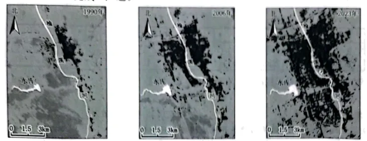

# 2025年浙江6月高考地理真题 · 选择题题组 G3（第5–6题）

## 来源
- 来源文档：精品解析：2025年浙江6月高考地理真题（解析版）.docx
- 题号：第5–6题（选择题，共2小题）

## 题组材料
榆林市位于鄂尔多斯高原毛乌素沙地南缘。下图为该城市中心城区时空演变图，图中黑色部分为建设用地。完成下面小题。

## 相关图片


## 第5题
question_id: `2025-浙江-地理-2025年浙江6月高考地理真题-Q5`

**题干**：1. 该城市中心城区扩张的主要制约因素是（   ）

**选项**：
- A. 气候
- B. 水资源
- C. 矿产资源
- D. 交通条件

**答案**：B

**解析**：榆林市位于鄂尔多斯高原毛乌素沙地南缘，水资源并不丰富。读图可知，榆林市的建设用地明显呈现沿榆溪河分布的特征，因此水资源是该城市中心城区扩张的主要制约因素，B正确；图中信息没有体现气候、矿产资源和交通条件对该城市中心城区扩张的影响，ACD错误。故选B。

**知识点归属**：
- **核心考点 · 权重 1.0**：区域发展 → 区域发展的条件 → 自然资源与区域发展

**整体置信度**：高

<!-- MANAGED-KM-START Q5
```yaml
question_id: "2025-浙江-地理-2025年浙江6月高考地理真题-Q5"
question_number: 5
knowledge_points:
  - role: core_exam_point
    weight: 1.0
    domain_id: DM-REG
    domain: "区域发展"
    theme_id: TH-REG-CONDITION
    theme: "区域发展的条件"
    knowledge_unit_id: KU-REG-CONDITION-002
    knowledge_unit: "自然资源与区域发展"
    evidence: "中心城区建设用地沿榆溪河扩展，结合毛乌素沙地南缘水资源不足，可判断水资源制约城市扩张。"
extra_tags:
  - "水资源约束城市扩张"
taxonomy_version: "config-v0.2-draft"
confidence: "high"
label_status: "completed"
needs_review: false
taxonomy_review:
  needs_review: false
  issue_type: "none"
  review_note: ""
note: ""
```
-->

## 第6题
question_id: `2025-浙江-地理-2025年浙江6月高考地理真题-Q6`

**题干**：1. 在水库管理过程中，可运用（   ）

**选项**：
- A. 全球定位系统测量水库蒸发量
- B. 遥感分析水库微生物含量
- C. 北斗卫星导航系统获取水库容量
- D. 地理信息系统评估水库水质

**答案**：D

**解析**：全球定位系统和北斗卫星导航系统主要功能是定位、导航，不能用于测量水库蒸发量，也不能用于获取水库容量，AC错误；遥感主要用于获取地理信息，不能分析水库微生物含量，B错误；地理信息系统主要用于分析、处理地理信息，可以评估水库水质，D正确。故选D。

**点睛**：3S各自功能：

RS：地理信息的获取；GIS：能对地理空间数据进行输入、管理、分析和表达；GNSS：能为各类用户提供精密的三维坐标、速度和时间。

**知识点归属**：
- **核心考点 · 权重 1.0**：人文地理 → 地理信息技术 → GIS技术原理与应用

**整体置信度**：高

<!-- MANAGED-KM-START Q6
```yaml
question_id: "2025-浙江-地理-2025年浙江6月高考地理真题-Q6"
question_number: 6
knowledge_points:
  - role: core_exam_point
    weight: 1.0
    domain_id: DM-HUM
    domain: "人文地理"
    theme_id: TH-HUM-GEOINFO
    theme: "地理信息技术"
    knowledge_unit_id: KU-HUM-GIT-002
    knowledge_unit: "GIS技术原理与应用"
    evidence: "水库水质评估需要对多源空间数据进行管理与综合分析，符合GIS的分析功能。"
extra_tags:
  - "水库水质评估"
taxonomy_version: "config-v0.2-draft"
confidence: "high"
label_status: "completed"
needs_review: false
taxonomy_review:
  needs_review: false
  issue_type: "none"
  review_note: ""
note: ""
```
-->

## 教学备注
<!-- TEACHER-NOTES-START -->
- 易错点：
- 课堂提示：
- 讲解建议：
<!-- TEACHER-NOTES-END -->
