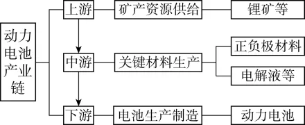

# 2025年浙江6月高考地理真题 · 选择题题组 G4（第7–8题）

## 来源
- 来源文档：精品解析：2025年浙江6月高考地理真题（解析版）.docx
- 题号：第7–8题（选择题，共2小题）

## 题组材料
由于锂等矿产资源紧缺，我国动力电池龙头企业采取与国内外企业合资等方式布局产业链，实现生产自主、可控。下图为动力电池产业链示意图。完成下面小题。

## 相关图片


## 第7题
question_id: `2025-浙江-地理-2025年浙江6月高考地理真题-Q7`

**题干**：1. 我国动力电池龙头企业产业链布局的主要目的是（   ）

**选项**：
- A. 降低矿产原料运费
- B. 推动产品多样化
- C. 扩大电池生产规模
- D. 保障供应链安全

**答案**：D

**解析**：由于锂等矿产资源紧缺，影响锂矿资源的稳定供应，为了保障供应链安全，我国动力电池龙头企业采取与国内外企业合资等方式布局产业链，实现生产自主、可控，D正确；原料运费主要与运输距离有关，我国动力电池龙头企业产业链布局并不能降低矿产原料运费，A错误；产品多样化主要与市场需求和生产技术有关，我国动力电池龙头企业产业链布局并不能直接推动产品多样化，B错误；电池生产规模与市场需求量和下游电池生产制造企业的产能有关，而产业链包含上游、中游、下游的不同环节，我国动力电池龙头企业产业链布局的主要目的不是扩大电池生产规模，C错误。故选D。

**知识点归属**：
- **核心考点 · 权重 1.0**：资源、环境与国家安全 → 资源安全 → 资源安全与国家安全的关系
- **支撑知识 · 权重 0.7**：区域发展 → 区际联系与区域协调发展 → 经济全球化与国际合作

**整体置信度**：高

<!-- MANAGED-KM-START Q7
```yaml
question_id: "2025-浙江-地理-2025年浙江6月高考地理真题-Q7"
question_number: 7
knowledge_points:
  - role: core_exam_point
    weight: 1.0
    domain_id: DM-RES
    domain: "资源、环境与国家安全"
    theme_id: TH-RES-RES
    theme: "资源安全"
    knowledge_unit_id: KU-RES-RES-001
    knowledge_unit: "资源安全与国家安全的关系"
    evidence: "锂资源紧缺背景下向产业链上下游布局并实现自主可控，直接服务于关键矿产供应链安全。"
  - role: supporting_knowledge
    weight: 0.7
    domain_id: DM-REG
    domain: "区域发展"
    theme_id: TH-REG-INTERREGION
    theme: "区际联系与区域协调发展"
    knowledge_unit_id: KU-REG-INTERREGION-004
    knowledge_unit: "经济全球化与国际合作"
    evidence: "与国内外企业合资是通过跨区域和国际合作稳定产业链的实现方式。"
extra_tags:
  - "关键矿产供应链安全"
  - "动力电池产业链"
taxonomy_version: "config-v0.2-draft"
confidence: "high"
label_status: "completed"
needs_review: false
taxonomy_review:
  needs_review: false
  issue_type: "none"
  review_note: ""
note: ""
```
-->

## 第8题
question_id: `2025-浙江-地理-2025年浙江6月高考地理真题-Q8`

**题干**：1. 针对矿产资源供给问题，还可采取的措施有（   ）

①加强国内锂矿勘探         ②加大关键材料生产

③研发新的替代材料         ④鼓励废旧电池进口

**选项**：
- A. ①④
- B. ②④
- C. ①③
- D. ②③

**答案**：C

**解析**：加强国内锂矿勘探可以增加国内锂矿资源的供应，①正确；加大关键材料生产会加大对锂矿资源的消耗，并不能缓解矿产资源的供给问题，②错误；研发新的替代材料可以减少对矿产资源的消耗，缓解矿产资源供应紧张的局面，③正确；废旧电池回收利用过程中对环境的污染很大，鼓励废旧电池进口会加剧环境污染，④错误。综上所述，C正确，ABD错误，故选C。

**点睛**：国家矿产资源保障措施：矿产资源管理法规、矿产勘查开发规划、矿产勘查技术进步、矿产资源节约利用、矿产资源国际合作

**知识点归属**：
- **核心考点 · 权重 1.0**：资源、环境与国家安全 → 资源环境与人类社会 → 自然资源及其利用
- **支撑知识 · 权重 0.7**：资源、环境与国家安全 → 资源安全 → 资源安全与国家安全的关系

**整体置信度**：高

<!-- MANAGED-KM-START Q8
```yaml
question_id: "2025-浙江-地理-2025年浙江6月高考地理真题-Q8"
question_number: 8
knowledge_points:
  - role: core_exam_point
    weight: 1.0
    domain_id: DM-RES
    domain: "资源、环境与国家安全"
    theme_id: TH-RES-SOC
    theme: "资源环境与人类社会"
    knowledge_unit_id: KU-RES-SOC-002
    knowledge_unit: "自然资源及其利用"
    evidence: "加强勘探可增加锂矿供给，研发替代材料可降低消耗，均属于提高矿产资源保障能力的措施。"
  - role: supporting_knowledge
    weight: 0.7
    domain_id: DM-RES
    domain: "资源、环境与国家安全"
    theme_id: TH-RES-RES
    theme: "资源安全"
    knowledge_unit_id: KU-RES-RES-001
    knowledge_unit: "资源安全与国家安全的关系"
    evidence: "增源与替代共同缓解关键矿产供给风险。"
extra_tags:
  - "矿产资源增源与替代"
taxonomy_version: "config-v0.2-draft"
confidence: "high"
label_status: "completed"
needs_review: false
taxonomy_review:
  needs_review: false
  issue_type: "none"
  review_note: ""
note: ""
```
-->

## 教学备注
<!-- TEACHER-NOTES-START -->
- 易错点：
- 课堂提示：
- 讲解建议：
<!-- TEACHER-NOTES-END -->
