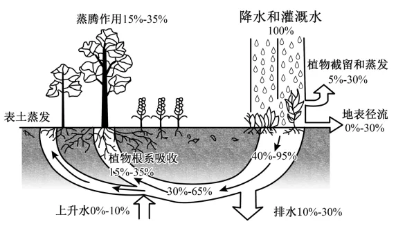

# 2025年浙江6月高考地理真题 · 选择题题组 G5（第9–11题）

## 来源
- 来源文档：精品解析：2025年浙江6月高考地理真题（解析版）.docx
- 题号：第9–11题（选择题，共3小题）

## 题组材料
土壤水是土壤的重要组成部分。墒指土壤适合种子发芽和作物生长的湿度。下图为土壤-植被-大气的水分运移过程模式图。完成下面小题。

## 相关图片


## 第9题
question_id: `2025-浙江-地理-2025年浙江6月高考地理真题-Q9`

**题干**：1. 与图中排水环节相关度最大的因素为（   ）

**选项**：
- A. 土壤矿物质含量
- B. 土壤质地
- C. 土壤有机质含量
- D. 土壤温度

**答案**：B

**解析**：读图可知，图中排水环节应是下渗后但未被表土蒸发和蒸腾作用消耗的水体，应是通过进一步下渗和地下径流来实现的，而土壤的质地会影响土壤的透水性，进而影响地下水的运动，因此土壤质地是与图中排水环节相关度最大的因素，B正确；土壤矿物质含量、土壤有机质含量主要影响土壤的肥力，不是与图中排水环节相关度最大的因素，AC错误；图中水体在地下运移，说明没有冻土分布，因此土壤温度对水体运动的影响较小，D错误。故选B。

**知识点归属**：
- **核心考点 · 权重 1.0**：自然地理 → 植被与土壤 → 土壤的组成与观察
- **支撑知识 · 权重 0.7**：自然地理 → 水文与海洋 → 水循环

**整体置信度**：高

<!-- MANAGED-KM-START Q9
```yaml
question_id: "2025-浙江-地理-2025年浙江6月高考地理真题-Q9"
question_number: 9
knowledge_points:
  - role: core_exam_point
    weight: 1.0
    domain_id: DM-NAT
    domain: "自然地理"
    theme_id: TH-NAT-VEGETATION-SOIL
    theme: "植被与土壤"
    knowledge_unit_id: KU-NAT-VEG-SOIL-004
    knowledge_unit: "土壤的组成与观察"
    evidence: "土壤颗粒组成决定孔隙与透水性，因此土壤质地对下渗后排水过程影响最大。"
  - role: supporting_knowledge
    weight: 0.7
    domain_id: DM-NAT
    domain: "自然地理"
    theme_id: TH-NAT-WATER
    theme: "水文与海洋"
    knowledge_unit_id: KU-NAT-WATER-001
    knowledge_unit: "水循环"
    evidence: "排水属于降水进入土壤后的下渗与地下径流环节。"
extra_tags:
  - "土壤质地与透水性"
taxonomy_version: "config-v0.2-draft"
confidence: "high"
label_status: "completed"
needs_review: false
taxonomy_review:
  needs_review: false
  issue_type: "none"
  review_note: ""
note: ""
```
-->

## 第10题
question_id: `2025-浙江-地理-2025年浙江6月高考地理真题-Q10`

**题干**：1. 图中表土蒸发份额为（   ）

**选项**：
- A. 10%-30%
- B. 15%-30%
- C. 15%-40%
- D. 25%-60%

**答案**：C

**解析**：读图可知，表土蒸发份额=（30%-65%）＋（0%-10%）－（15%-35%）=15%-40%，C正确，ABD错误，故选C。

**知识点归属**：
- **核心考点 · 权重 1.0**：自然地理 → 水文与海洋 → 水循环

**整体置信度**：高

<!-- MANAGED-KM-START Q10
```yaml
question_id: "2025-浙江-地理-2025年浙江6月高考地理真题-Q10"
question_number: 10
knowledge_points:
  - role: core_exam_point
    weight: 1.0
    domain_id: DM-NAT
    domain: "自然地理"
    theme_id: TH-NAT-WATER
    theme: "水文与海洋"
    knowledge_unit_id: KU-NAT-WATER-001
    knowledge_unit: "水循环"
    evidence: "依据水量收支关系，用降水和灌溉输入扣除蒸腾、根系吸收等输出，求得表土蒸发份额。"
extra_tags:
  - "水量平衡计算"
taxonomy_version: "config-v0.2-draft"
confidence: "high"
label_status: "completed"
needs_review: false
taxonomy_review:
  needs_review: false
  issue_type: "none"
  review_note: ""
note: ""
```
-->

## 第11题
question_id: `2025-浙江-地理-2025年浙江6月高考地理真题-Q11`

**题干**：1. 当墒情过低时，可采取的保墒措施是（   ）

**选项**：
- A. 地膜覆盖
- B. 作物密植
- C. 开沟排水
- D. 土地翻耕

**答案**：A

**解析**：当墒情过低时，说明种子发芽和作物生长的适度过低，土壤水分不足。地膜覆盖可以减少土壤水分蒸发，起到保墒的作用，A正确；作物密植会加大土壤水分的需求，使墒情更低，B错误；开沟排水会使土壤水分流失更快，使墒情更低，C错误；土地翻耕并不能增加土壤的水分含量，反而会使土质更疏松，土壤水分蒸发更快，无法起到保墒的作用，D错误。故选A。

**点睛**：土壤质地是土壤颗粒的组合特征，按不同粒级的矿物质在土壤中所占的相对比例，一般将土壤分为砂土、壤土和黏土等。

**知识点归属**：
- **核心考点 · 权重 1.0**：自然地理 → 植被与土壤 → 土壤的功能与养护

**整体置信度**：高

<!-- MANAGED-KM-START Q11
```yaml
question_id: "2025-浙江-地理-2025年浙江6月高考地理真题-Q11"
question_number: 11
knowledge_points:
  - role: core_exam_point
    weight: 1.0
    domain_id: DM-NAT
    domain: "自然地理"
    theme_id: TH-NAT-VEGETATION-SOIL
    theme: "植被与土壤"
    knowledge_unit_id: KU-NAT-VEG-SOIL-006
    knowledge_unit: "土壤的功能与养护"
    evidence: "墒情过低时地膜覆盖可抑制土壤蒸发并保持作物生长所需水分。"
extra_tags:
  - "地膜覆盖保墒"
taxonomy_version: "config-v0.2-draft"
confidence: "high"
label_status: "completed"
needs_review: false
taxonomy_review:
  needs_review: false
  issue_type: "none"
  review_note: ""
note: ""
```
-->

## 教学备注
<!-- TEACHER-NOTES-START -->
- 易错点：
- 课堂提示：
- 讲解建议：
<!-- TEACHER-NOTES-END -->
