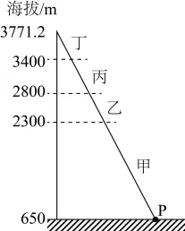
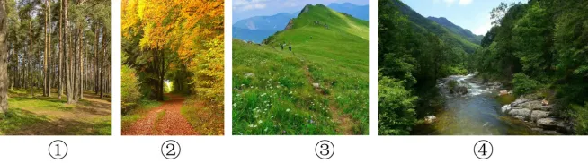

# 2025年浙江6月高考地理真题 · 选择题题组 G7（第13–14题）

## 来源
- 来源文档：精品解析：2025年浙江6月高考地理真题（解析版）.docx
- 题号：第13–14题（选择题，共2小题）

## 题组材料
坐落于地堑谷地一侧的某山脉是开展地理研学活动的理想场所。某学校组织学生从山脚下的P地（34°8'20"N，107°52'53"E）登山开展考察。下图为学生绘制的山地垂直自然带简图。完成下面小题。

## 相关图片


## 第13题
question_id: `2025-浙江-地理-2025年浙江6月高考地理真题-Q13`

**题干**：1. P地有著名天然温泉，与其直接相关的是（   ）

**选项**：
- A. 褶皱
- B. 沉积作用
- C. 断层
- D. 火山喷发

**答案**：C

**解析**：该山脉是坐落于地堑谷地，地堑为两侧岩层相对上升，中间岩层相对下降的断块构造，属于断层地貌，当地下水沿断层或裂隙上升到地表，进而形成温泉，C正确；温泉水来自于地下水，地下水必须有断层或裂隙成为向上的通道，而褶皱和沉积作用不会形成断层或岩层裂隙，AB错误；当地位于34°8'20"N，107°52'53"E，据所学知识可知该地位于秦岭附近，秦岭不是火山地貌，没有火山喷发，D错误。故选C。

**知识点归属**：
- **核心考点 · 权重 1.0**：自然地理 → 地表形态 → 地质构造与地貌

**整体置信度**：高

<!-- MANAGED-KM-START Q13
```yaml
question_id: "2025-浙江-地理-2025年浙江6月高考地理真题-Q13"
question_number: 13
knowledge_points:
  - role: core_exam_point
    weight: 1.0
    domain_id: DM-NAT
    domain: "自然地理"
    theme_id: TH-NAT-LANDFORM
    theme: "地表形态"
    knowledge_unit_id: KU-NAT-LANDFORM-008
    knowledge_unit: "地质构造与地貌"
    evidence: "地堑由断层活动形成，地下水可沿断层裂隙上升出露为天然温泉。"
extra_tags:
  - "断层温泉"
taxonomy_version: "config-v0.2-draft"
confidence: "high"
label_status: "completed"
needs_review: false
taxonomy_review:
  needs_review: false
  issue_type: "none"
  review_note: ""
note: ""
```
-->

## 第14题
question_id: `2025-浙江-地理-2025年浙江6月高考地理真题-Q14`

**题干**：1. 学生在考察过程中拍摄的植被景观照片与垂直自然带对应正确的是（   ）



**选项**：
- A. 甲①      乙②      丙③      丁④
- B. 甲④      乙①      丙②      丁③
- C. 甲④      乙③      丙②      丁①
- D. 甲④      乙②      丙①      丁③

**答案**：D

**解析**：据上题分析得知该山脉为秦岭山脉，山脚下的P地是在地堑谷地附近，对应④（谷地）附近，据图片信息所示②应为落叶阔叶林，①应为针叶林，③应为高山灌丛草甸带，相对而言②落叶阔叶林对应的水热条件优于③针叶林，而针叶林的水热条件优于高山灌丛草甸，依据山地垂直地带分异规律，随海拔高度上升，水热条件递减，所以乙对应②，丙对应①，丁对应③。综上分析，D正确，ABC错误。故选D。

**点睛**：在高山地区，随着海拔高度的变化，温度和降水发生变化，自然带也依次变化。如珠穆朗玛峰南坡从山麓到山顶的自然带变化规律是：常绿阔叶林带、针阔混交林带、针叶林带、高山草甸草原带、寒荒漠带、积雪冰川带。

**知识点归属**：
- **核心考点 · 权重 1.0**：自然地理 → 自然环境的整体性与差异性 → 垂直地域分异规律

**整体置信度**：高

<!-- MANAGED-KM-START Q14
```yaml
question_id: "2025-浙江-地理-2025年浙江6月高考地理真题-Q14"
question_number: 14
knowledge_points:
  - role: core_exam_point
    weight: 1.0
    domain_id: DM-NAT
    domain: "自然地理"
    theme_id: TH-NAT-INTEGRITY
    theme: "自然环境的整体性与差异性"
    knowledge_unit_id: KU-NAT-INTEGRITY-006
    knowledge_unit: "垂直地域分异规律"
    evidence: "依据秦岭山地随海拔升高水热条件变化，将落叶阔叶林、针叶林和高山灌丛草甸按垂直顺序对应。"
extra_tags:
  - "山地垂直自然带判读"
taxonomy_version: "config-v0.2-draft"
confidence: "high"
label_status: "completed"
needs_review: false
taxonomy_review:
  needs_review: false
  issue_type: "none"
  review_note: ""
note: ""
```
-->

## 教学备注
<!-- TEACHER-NOTES-START -->
- 易错点：
- 课堂提示：
- 讲解建议：
<!-- TEACHER-NOTES-END -->
