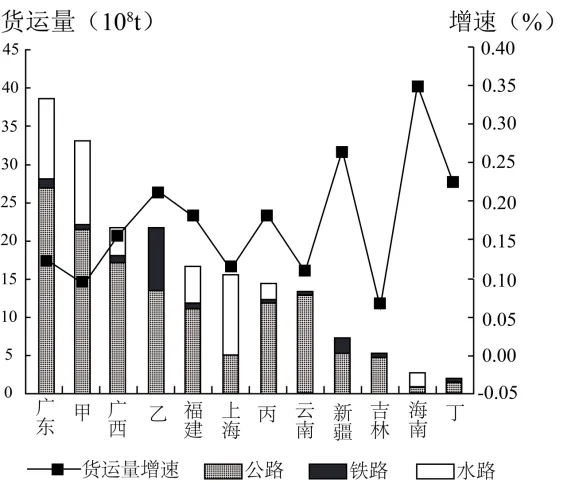

# 2025年浙江6月高考地理真题 · 选择题题组 G8（第15–16题）

## 来源
- 来源文档：精品解析：2025年浙江6月高考地理真题（解析版）.docx
- 题号：第15–16题（选择题，共2小题）

## 题组材料
下图为2021年我国部分省（区、市）不同运输方式货运量及增速状况图（图中水路包括河运和海运）。完成下面小题。

## 相关图片


## 第15题
question_id: `2025-浙江-地理-2025年浙江6月高考地理真题-Q15`

**题干**：1. 甲、乙、丙、丁对应正确的是（   ）

**选项**：
- A. 甲—重庆市
- B. 乙—内蒙古
- C. 丙—青海省
- D. 丁—浙江省

**答案**：B

**解析**：重庆市的经济发展水平低于上海市，而上海市是全国交通枢纽，交通比重庆更便利，所以重庆市的货运量不可能比上海高，A错误；内蒙古矿产资源丰富，有丰富的煤炭和稀土资源，大量供给我国其他地区，其货运量较大。而铁路适宜大宗矿物运输，所以内蒙古铁路货运占比相对其他省份较高，由于内蒙古气候较干旱，河流径流量较小，水路运输不发达，乙省份符合内蒙古，B正确；青海省经济欠发达，经济发展水平应比新疆低，货运量应小于新疆，另外青海省位于我国大江大河的源头处，水运并不便利，水运占比应很小，C错误；浙江省经济较发达，且地处沿海地区，货运量应较大，丁地区货运量极小，不符合浙江省经济发展现状，D错误。故选B。

**知识点归属**：
- **核心考点 · 权重 1.0**：人文地理 → 交通运输与区域发展 → 区域发展对交通运输布局的影响

**整体置信度**：高

<!-- MANAGED-KM-START Q15
```yaml
question_id: "2025-浙江-地理-2025年浙江6月高考地理真题-Q15"
question_number: 15
knowledge_points:
  - role: core_exam_point
    weight: 1.0
    domain_id: DM-HUM
    domain: "人文地理"
    theme_id: TH-HUM-TRANSPORT
    theme: "交通运输与区域发展"
    knowledge_unit_id: KU-HUM-TRA-001
    knowledge_unit: "区域发展对交通运输布局的影响"
    evidence: "内蒙古矿产外运规模大且铁路占比高、水运弱，区域资源与自然条件塑造其货运结构。"
extra_tags:
  - "货运方式结构判读"
taxonomy_version: "config-v0.2-draft"
confidence: "high"
label_status: "completed"
needs_review: false
taxonomy_review:
  needs_review: false
  issue_type: "none"
  review_note: ""
note: ""
```
-->

## 第16题
question_id: `2025-浙江-地理-2025年浙江6月高考地理真题-Q16`

**题干**：1. 关于省（区、市）货运状况及其主要成因的叙述，正确的是（   ）

**选项**：
- A. 广东货运量大，因经济发达
- B. 云南货运量小，因地形崎岖
- C. 吉林货运量负增长，因产业外迁多
- D. 海南货运增量最大，因人口增长快

**答案**：A

**解析**：广东省经济发达，对外开放程度高，产业活动发达，产品数量和类型都较多，因此货运量大，A正确；货运量较小的根本原因是因为经济欠发达，若经济发达，即使地形崎岖也会修建现代交通方式以满足交通需求，B错误；吉林货运量增速在0.05%以上，增速为正值，并未负增长，C错误；我国的人口政策是统一的，在2021年全国各地的人口增长速度保持相对稳定，海南省并未出现人口增长快的现象。海南货运增量最大，是因为其货运量基数很低，实际增长量并不大，D错误。故选A。

**点睛**：一个地区人口数量的变化由人口自然增长和人口迁移共同决定。经济发展水平高的地区往往人口自然增长率低，但就业机会多，吸引大量的青壮年劳动力迁入。

**知识点归属**：
- **核心考点 · 权重 1.0**：人文地理 → 交通运输与区域发展 → 区域发展对交通运输布局的影响

**整体置信度**：高

<!-- MANAGED-KM-START Q16
```yaml
question_id: "2025-浙江-地理-2025年浙江6月高考地理真题-Q16"
question_number: 16
knowledge_points:
  - role: core_exam_point
    weight: 1.0
    domain_id: DM-HUM
    domain: "人文地理"
    theme_id: TH-HUM-TRANSPORT
    theme: "交通运输与区域发展"
    knowledge_unit_id: KU-HUM-TRA-001
    knowledge_unit: "区域发展对交通运输布局的影响"
    evidence: "广东经济与产业活动发达，产生大量货物流动需求，因此货运量大。"
extra_tags:
  - "经济发展与货运量"
taxonomy_version: "config-v0.2-draft"
confidence: "high"
label_status: "completed"
needs_review: false
taxonomy_review:
  needs_review: false
  issue_type: "none"
  review_note: ""
note: ""
```
-->

## 教学备注
<!-- TEACHER-NOTES-START -->
- 易错点：
- 课堂提示：
- 讲解建议：
<!-- TEACHER-NOTES-END -->
