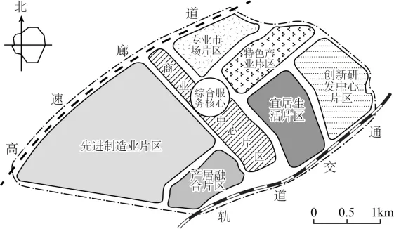

# 2025年浙江6月高考地理真题 · 选择题题组 G9（第17–18题）

## 来源
- 来源文档：精品解析：2025年浙江6月高考地理真题（解析版）.docx
- 题号：第17–18题（选择题，共2小题）

## 题组材料
产城融合是指产业与城市融合发展。下图为某城市新工业园区空间结构规划图，该园区致力于打造创新服务、低碳宜居的产城融合新区。完成下面小题。

## 相关图片


## 第17题
question_id: `2025-浙江-地理-2025年浙江6月高考地理真题-Q17`

**题干**：1. 宜居生活片区布局的合理性表现在（   ）

①在园区内位置适宜，通勤便捷           ②位于盛行风下风向，空气清新

③公共绿地面积广阔，环境优美           ④距离商业中心较近，购物便利

**选项**：
- A. ①②
- B. ②③
- C. ③④
- D. ①④

**答案**：D

**解析**：图中宜居生活片区在园区的中心位置附近，相对位置适宜，且宜居生活片区偏南侧有轨道交通线，通勤便捷，①正确；据图中风频玫瑰图可知，当地主要的盛行风为偏东风，而宜居生活片区分布在园区的偏东侧，分布在盛行风的上风向附近，②错误；图中没有公共绿地面积分布地区显示，无法判断公共绿地面积是否广阔，排除③；宜居生活片区靠近商业中心片区，方便购物，人居环境好，④正确。D正确，ABC错误。故选D。

**知识点归属**：
- **核心考点 · 权重 1.0**：人文地理 → 乡村与城镇 → 合理利用城乡空间
- **支撑知识 · 权重 0.7**：人文地理 → 乡村与城镇 → 城镇内部空间结构

**整体置信度**：高

<!-- MANAGED-KM-START Q17
```yaml
question_id: "2025-浙江-地理-2025年浙江6月高考地理真题-Q17"
question_number: 17
knowledge_points:
  - role: core_exam_point
    weight: 1.0
    domain_id: DM-HUM
    domain: "人文地理"
    theme_id: TH-HUM-SETTLEMENT
    theme: "乡村与城镇"
    knowledge_unit_id: KU-HUM-SET-004
    knowledge_unit: "合理利用城乡空间"
    evidence: "生活片区居园区中部、邻近轨道交通和商业中心，可缩短通勤并提升购物便利性。"
  - role: supporting_knowledge
    weight: 0.7
    domain_id: DM-HUM
    domain: "人文地理"
    theme_id: TH-HUM-SETTLEMENT
    theme: "乡村与城镇"
    knowledge_unit_id: KU-HUM-SET-002
    knowledge_unit: "城镇内部空间结构"
    evidence: "判断需要结合居住、商业、交通等功能用地的空间关系。"
extra_tags:
  - "产城融合园区布局"
taxonomy_version: "config-v0.2-draft"
confidence: "high"
label_status: "completed"
needs_review: false
taxonomy_review:
  needs_review: false
  issue_type: "none"
  review_note: ""
note: ""
```
-->

## 第18题
question_id: `2025-浙江-地理-2025年浙江6月高考地理真题-Q18`

**题干**：1. 先进制造业片区适合发展的产业是（   ）

**选项**：
- A. 纺织服装
- B. 有色冶金
- C. 生物医药
- D. 食品加工

**答案**：C

**解析**：纺织服装和食品加工一般属于传统的劳动密集型产业，有色冶金属于动力指向型工业，而先进制造业一般需要产品科技含量高，产品科研成本投入大，生物医药产品对科技要求极高，研发周期普遍较长，所以先进制造业片区适合发展的产业是生物医药，C正确，ABD错误。故选C。

**点睛**：城镇用地包括居住用地、商业用地、工业用地、行政用地、文化用地，交通用地，旅游休闲用地、生态用地等。

**知识点归属**：
- **核心考点 · 权重 1.0**：人文地理 → 产业区位 → 工业区位因素

**整体置信度**：高

<!-- MANAGED-KM-START Q18
```yaml
question_id: "2025-浙江-地理-2025年浙江6月高考地理真题-Q18"
question_number: 18
knowledge_points:
  - role: core_exam_point
    weight: 1.0
    domain_id: DM-HUM
    domain: "人文地理"
    theme_id: TH-HUM-INDUSTRY
    theme: "产业区位"
    knowledge_unit_id: KU-HUM-IND-002
    knowledge_unit: "工业区位因素"
    evidence: "先进制造业要求较高技术投入，生物医药相较传统劳动密集型或动力指向型产业更符合其区位与产业属性。"
extra_tags:
  - "先进制造业类型判别"
taxonomy_version: "config-v0.2-draft"
confidence: "high"
label_status: "completed"
needs_review: false
taxonomy_review:
  needs_review: false
  issue_type: "none"
  review_note: ""
note: ""
```
-->

## 教学备注
<!-- TEACHER-NOTES-START -->
- 易错点：
- 课堂提示：
- 讲解建议：
<!-- TEACHER-NOTES-END -->
