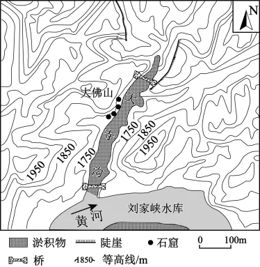

# 2025年海南高考地理真题 · 综合题 G17（第17题）

## 来源
- 来源文档：精品解析：2025年海南高考地理真题（解析版）.docx
- 题号：第17题（共2小问）

## 题组材料
阅读图文材料，完成下列要求。

刘家峡水库地处黄河上游的甘肃永靖县境内，于1968年建成蓄水，正常年份水位可高达1735米。在其库尾的黄河岸边有著名的世界文化遗产炳灵寺石窟，石窟主要分布在大寺沟崖壁上（下图），由于泥沙淤积，大寺沟由最初的“V”形沟逐渐淤积成平地。

## 相关图片


### 第17题（1）
question_id: `2025-海南-地理-2025年海南高考地理真题-Q17-1`

**题干**：指出大寺沟泥沙来源，并描述其淤积成平地的过程。

**答案**：泥沙来源：山体碎屑物、黄河泥沙。过程：在重力和降水作用下，山体碎屑物被搬运（冲刷）并在沟谷底部堆积；黄河的顶托作用下，沟底径流变慢，携带泥沙能力降低，泥沙逐渐堆积；黄河水倒灌大寺沟，携带泥沙沉积。

**解析**：最初大寺沟以“V”形沟形态为主，结合该地周边等高线分布密集可知，大寺沟周边地区地势起伏大，两侧山地经过长期的外力风化侵蚀作用下形成了大量的碎屑物，受重力和降水作用，山体较高处的碎屑物逐渐被搬运并在沟谷底部堆积；流经大寺沟河流受黄河干流径流的顶托，流速变慢，沿途携带的泥沙搬运能力下降，泥沙逐渐堆积；部分黄河水倒灌大寺沟，将黄河携带的泥沙沉积在大寺沟处。所以大寺沟泥沙来源是山体碎屑物和黄河泥沙。


**知识点归属**：
- **核心考点 · 权重 1.0**：自然地理 → 地表形态 → 塑造地表形态的内力与外力作用
- **支撑知识 · 权重 0.7**：自然地理 → 水文与海洋 → 陆地水体及其相互关系

**整体置信度**：高

<!-- MANAGED-KM-START Q17-1
```yaml
question_id: "2025-海南-地理-2025年海南高考地理真题-Q17-1"
question_number: 17
sub_question: 1
knowledge_points:
  - role: core_exam_point
    weight: 1.0
    domain_id: DM-NAT
    domain: "自然地理"
    theme_id: TH-NAT-LANDFORM
    theme: "地表形态"
    knowledge_unit_id: KU-NAT-LANDFORM-006
    knowledge_unit: "塑造地表形态的内力与外力作用"
    evidence: "山体碎屑经风化、侵蚀、搬运后堆积，黄河泥沙又在顶托和倒灌条件下沉积。"
  - role: supporting_knowledge
    weight: 0.7
    domain_id: DM-NAT
    domain: "自然地理"
    theme_id: TH-NAT-WATER
    theme: "水文与海洋"
    knowledge_unit_id: KU-NAT-WATER-005
    knowledge_unit: "陆地水体及其相互关系"
    evidence: "支流沟谷与黄河干流水位和流速相互作用控制泥沙沉积。"
extra_tags:
  - "沟谷淤积"
  - "干支流水体关系"
taxonomy_version: "config-v0.2-draft"
confidence: "high"
label_status: "completed"
needs_review: false
taxonomy_review:
  needs_review: false
  issue_type: "none"
  review_note: ""
note: ""
```
-->

### 第17题（2）
question_id: `2025-海南-地理-2025年海南高考地理真题-Q17-2`

**题干**：分析刘家峡水库对炳灵寺石窟文化遗产的影响。

**答案**：有利影响：知名度提高，游客增多。不利影响：库区改变局地微气候，湿度上升，佛像壁画受损；汛期库区蓄水，增加底层石窟淹没风险；库区蓄水、水位上升，石窟岩体风化作用增强，增加岩体破裂风险。

**解析**：影响从有利影响和不利影响两方面进行分析，有利影响：刘家峡水库对外也是著名的旅游景观，刘家峡水库和炳灵寺石窟文化遗产的景观组合丰富了当地旅游产品种类，使炳灵寺石窟文化遗产景观知名度提高，从而提升了旅游市场影响力，使游客增多。不利影响：刘家峡水库水域面积大，蒸发的水汽多，会使当地的空气湿度变大，不利于佛像壁画的保存；水库需要一定的蓄水区域，库区水位抬升会增加底层石窟淹没风险；库区蓄水之后水位上升，石窟岩体中的水分增加，风化作用会有所增强，增加岩体破裂风险，直接影响到石窟的稳定。


**知识点归属**：
- **核心考点 · 权重 1.0**：自然地理 → 自然环境的整体性与差异性 → 自然环境对干扰的整体响应

**整体置信度**：高

<!-- MANAGED-KM-START Q17-2
```yaml
question_id: "2025-海南-地理-2025年海南高考地理真题-Q17-2"
question_number: 17
sub_question: 2
knowledge_points:
  - role: core_exam_point
    weight: 1.0
    domain_id: DM-NAT
    domain: "自然地理"
    theme_id: TH-NAT-INTEGRITY
    theme: "自然环境的整体性与差异性"
    knowledge_unit_id: KU-NAT-INTEGRITY-004
    knowledge_unit: "自然环境对干扰的整体响应"
    evidence: "水库建设这一人类干扰改变水位、湿度和岩体风化条件，并连锁影响石窟保存与旅游价值。"
extra_tags:
  - "人类活动对地理环境的影响"
taxonomy_version: "config-v0.2-draft"
confidence: "high"
label_status: "completed"
needs_review: false
taxonomy_review:
  needs_review: false
  issue_type: "none"
  review_note: ""
note: ""
```
-->

## 教学备注
<!-- TEACHER-NOTES-START -->
- 易错点：
- 课堂提示：
- 讲解建议：
<!-- TEACHER-NOTES-END -->
