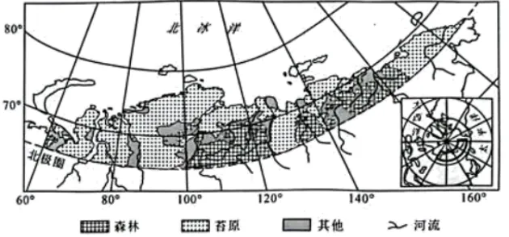

# 2025年海南高考地理真题 · 综合题 G19（第19题）

## 来源
- 来源文档：精品解析：2025年海南高考地理真题（解析版）.docx
- 题号：第19题（共3小问）

## 题组材料
阅读图文材料，完成下列要求。

多年冻土分为上下两层，上层为夏融冬冻的活动层，下层为多年冻结层。随着全球变暖，多年冻土退化，表现为冻土温度升高、面积减小、冻土活动层厚度增加，以及季节性冻土融化期延长且冻结期缩短。下图所示为北极圈以北亚欧大陆的部分区域，区域内年降水量200—600毫米，多年冻土广布，冻土厚度西部大于东部。研究发现，近年来该区域冻土融水量增加，且东西部存在差异，冻土退化区植被生物量总体增加。

## 相关图片


### 第19题（1）
question_id: `2025-海南-地理-2025年海南高考地理真题-Q19-1`

**题干**：描述图中区域森林和苔原的空间分布特征。

**答案**：苔原分布较广，呈东西向带状分布；森林呈块状分布于区域南部。

**解析**：地理事物的空间分布特征从整体和局部两方面进行描述，整体方面：森林和苔原的空间分布不均，大致沿北极圈以北附近分布。局部方面：苔原分布区域较大，呈东西向带状分布；森林分布区域较小，呈斑块状分布，多分布于区域的南部。


**知识点归属**：
- **核心考点 · 权重 1.0**：自然地理 → 自然环境的整体性与差异性 → 陆地地域分异规律

**整体置信度**：高

<!-- MANAGED-KM-START Q19-1
```yaml
question_id: "2025-海南-地理-2025年海南高考地理真题-Q19-1"
question_number: 19
sub_question: 1
knowledge_points:
  - role: core_exam_point
    weight: 1.0
    domain_id: DM-NAT
    domain: "自然地理"
    theme_id: TH-NAT-INTEGRITY
    theme: "自然环境的整体性与差异性"
    knowledge_unit_id: KU-NAT-INTEGRITY-005
    knowledge_unit: "陆地地域分异规律"
    evidence: "苔原呈东西向带状、森林位于南部，体现高纬地区植被随纬度和热量的地域分异。"
extra_tags:
  - "森林苔原分布判读"
taxonomy_version: "config-v0.2-draft"
confidence: "high"
label_status: "completed"
needs_review: false
taxonomy_review:
  needs_review: false
  issue_type: "none"
  review_note: ""
note: ""
```
-->

### 第19题（2）
question_id: `2025-海南-地理-2025年海南高考地理真题-Q19-2`

**题干**：说明材料所述冻土退化区植被生物量总体增加的原因。

**答案**：全球变暖，延长生长期，有利于光合作用，生物量积累；气温升高，加速土壤有机质分解，为植物生长提供更多养分；土壤温度升高、冻土融化、土壤疏松，有利于植物根系生长；水热条件改变，使得植物群落发生演替。

**解析**：全球气候变暖改善了当地的热量条件，有助于延长冻土退化区植被的生长期，光合作用的改善有利于植物体内有机质的积累，促使生物量增加；全球变暖也使土壤中的微生物活动更加活跃，加速微生物对土壤有机质分解，为植物生长提供更多养分，有助于植物的生长；全球变暖导致土壤温度升高，加速冻土层的融化，土壤疏松度增加，有利于植物根系生长，利于植物着生；全球变暖导致冻土融化加速，土壤中的水分条件得以改善，水热条件的改善，使得植物群落发生演替。


**知识点归属**：
- **核心考点 · 权重 1.0**：自然地理 → 植被与土壤 → 植被与环境
- **支撑知识 · 权重 0.7**：资源、环境与国家安全 → 环境安全 → 全球气候变化与国家安全
- **材料线索 · 权重 0.4**：自然地理 → 自然环境的整体性与差异性 → 自然环境的统一演化和要素组合

**整体置信度**：高

<!-- MANAGED-KM-START Q19-2
```yaml
question_id: "2025-海南-地理-2025年海南高考地理真题-Q19-2"
question_number: 19
sub_question: 2
knowledge_points:
  - role: core_exam_point
    weight: 1.0
    domain_id: DM-NAT
    domain: "自然地理"
    theme_id: TH-NAT-VEGETATION-SOIL
    theme: "植被与土壤"
    knowledge_unit_id: KU-NAT-VEG-SOIL-001
    knowledge_unit: "植被与环境"
    evidence: "增温通过延长生长期、改善根系环境和促进养分供应提高植被生物量。"
  - role: supporting_knowledge
    weight: 0.7
    domain_id: DM-RES
    domain: "资源、环境与国家安全"
    theme_id: TH-RES-ENV
    theme: "环境安全"
    knowledge_unit_id: KU-RES-ENV-004
    knowledge_unit: "全球气候变化与国家安全"
    evidence: "多年冻土退化和植被响应是全球气候变暖的区域影响。"
  - role: material_clue
    weight: 0.4
    domain_id: DM-NAT
    domain: "自然地理"
    theme_id: TH-NAT-INTEGRITY
    theme: "自然环境的整体性与差异性"
    knowledge_unit_id: KU-NAT-INTEGRITY-003
    knowledge_unit: "自然环境的统一演化和要素组合"
    evidence: "气温、冻土、土壤水分养分与植物群落共同变化体现自然要素统一演化。"
extra_tags:
  - "冻土退化"
  - "植被生物量"
taxonomy_version: "config-v0.2-draft"
confidence: "high"
label_status: "completed"
needs_review: false
taxonomy_review:
  needs_review: false
  issue_type: "none"
  review_note: ""
note: ""
```
-->

### 第19题（3）
question_id: `2025-海南-地理-2025年海南高考地理真题-Q19-3`

**题干**：判断图中区域西部、东部苔原分布区冻土融水量的差异，并分析其原因。

**答案**：差异：西多东少。原因：西部受西风带、北大西洋暖流影响，气温高、降水较多，有助于冻土融化；冻土中水分含量高，融水量更大；东部气温低、降水少，冻土融水量较小；冻土中水分含量小，融水量更小。

**解析**：图中区域西部地区临近大西洋东岸，受温暖湿润的西风影响更大，且受北大西洋暖流的增温增湿影响，气温更高，更有利于冻土的融化；降水更多，冻土中的水分含量更高，融水量更大；而东部地区受温暖湿润的西风影响小，气温更低，冻土融水量较小；降水更少，冻土中水分含量小，融水量更小。因此图中区域西部、东部苔原分布区冻土融水量西多东少。


**知识点归属**：
- **核心考点 · 权重 1.0**：自然地理 → 大气 → 气压带和风带对气候的影响
- **支撑知识 · 权重 0.7**：自然地理 → 水文与海洋 → 洋流
- **材料线索 · 权重 0.4**：自然地理 → 水文与海洋 → 陆地水体及其相互关系

**整体置信度**：高

<!-- MANAGED-KM-START Q19-3
```yaml
question_id: "2025-海南-地理-2025年海南高考地理真题-Q19-3"
question_number: 19
sub_question: 3
knowledge_points:
  - role: core_exam_point
    weight: 1.0
    domain_id: DM-NAT
    domain: "自然地理"
    theme_id: TH-NAT-ATMOSPHERE
    theme: "大气"
    knowledge_unit_id: KU-NAT-ATM-CIRC-006
    knowledge_unit: "气压带和风带对气候的影响"
    evidence: "西部受西风影响更强，气温和降水条件更利于冻土融化。"
  - role: supporting_knowledge
    weight: 0.7
    domain_id: DM-NAT
    domain: "自然地理"
    theme_id: TH-NAT-WATER
    theme: "水文与海洋"
    knowledge_unit_id: KU-NAT-WATER-004
    knowledge_unit: "洋流"
    evidence: "北大西洋暖流对西部增温增湿，扩大东西部融水差异。"
  - role: material_clue
    weight: 0.4
    domain_id: DM-NAT
    domain: "自然地理"
    theme_id: TH-NAT-WATER
    theme: "水文与海洋"
    knowledge_unit_id: KU-NAT-WATER-005
    knowledge_unit: "陆地水体及其相互关系"
    evidence: "降水和冻土含水量共同决定融水供给量。"
extra_tags:
  - "冻土融水东西差异"
taxonomy_version: "config-v0.2-draft"
confidence: "high"
label_status: "completed"
needs_review: false
taxonomy_review:
  needs_review: false
  issue_type: "none"
  review_note: ""
note: ""
```
-->

## 教学备注
<!-- TEACHER-NOTES-START -->
- 易错点：
- 课堂提示：
- 讲解建议：
<!-- TEACHER-NOTES-END -->
