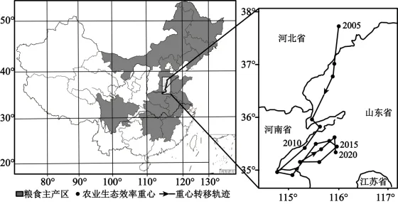

# 2025年海南高考地理真题 · 选择题题组 G2（第3–4题）

## 来源
- 来源文档：精品解析：2025年海南高考地理真题（解析版）.docx
- 题号：第3–4题（选择题，共2小题）

## 题组材料
农业生态效率反映农业生态系统的资源利用效率、持续性和稳定程度。人们通过调整农业生产要素投入比例，降低污染排放和资源消耗，以提高农业生态效率。下图为2005-2020年我国粮食主产区分布及其农业生态效率重心转移轨迹。据此完成下面小题。

## 相关图片


## 第3题
question_id: `2025-海南-地理-2025年海南高考地理真题-Q3`

**题干**：3. 图中农业生态效率重心转移轨迹表明（   ）

**选项**：
- A. 2015-2020年重心位置明显南移
- B. 2010-2015年重心转移速度加快
- C. 2005-2010年东北地区农业生态效率增长较慢
- D. 2005-2020年粮食主产区的分布不断发生变化

**答案**：C

**解析**：农业生态效率重心转移轨迹反映效率增长较快的区域。2005—2010年重心整体向河南、山东方向移动，未向东北移动，说明东北地区效率增长较慢，C正确。2015—2020年重心未明显南移，A错误；重心转移速度取决于相邻时段轨迹的距离长短，距离越短速度越慢。2010—2015年重心移动较2005—2010年距离短，则转移速度减慢，B错误。粮食主产区分布稳定，未发生显著变化，D错误。故选C。


**知识点归属**：
- **核心考点 · 权重 1.0**：区域发展 → 区域与区域发展 → 区域差异与关联性

**整体置信度**：高

<!-- MANAGED-KM-START Q3
```yaml
question_id: "2025-海南-地理-2025年海南高考地理真题-Q3"
question_number: 3
knowledge_points:
  - role: core_exam_point
    weight: 1.0
    domain_id: DM-REG
    domain: "区域发展"
    theme_id: TH-REG-REGION
    theme: "区域与区域发展"
    knowledge_unit_id: KU-REG-REGION-004
    knowledge_unit: "区域差异与关联性"
    evidence: "图示比较不同地区农业生态效率重心的经纬度迁移，考查空间差异及其变化。"
extra_tags:
  - "重心迁移判读"
taxonomy_version: "config-v0.2-draft"
confidence: "high"
label_status: "completed"
needs_review: false
taxonomy_review:
  needs_review: false
  issue_type: "none"
  review_note: ""
note: ""
```
-->

## 第4题
question_id: `2025-海南-地理-2025年海南高考地理真题-Q4`

**题干**：4. 为提高农业生态效率，下列措施可采用的是（   ）

**选项**：
- A. 大量施用化肥，提升作物产量
- B. 大力兴修深机井，增加农业灌溉用水量
- C. 实施家庭经营，增加种植面积
- D. 提高智能管理水平，实施耕地集约经营

**答案**：D

**解析**：提高农业生态效率需节约资源、减少污染。大量施用化肥会污染环境，增加资源消耗，不仅未提高生态效率，反而破坏农业生态系统稳定性，A错误。大力兴修深机井，增加农业灌溉用水量会过度开采地下水，导致地下水位下降、地面沉降，不可持续，B错误。家庭经营规模小、效率低，不符合提高生态效率，C错误。提高智能管理水平可实现化肥、农药、水资源的精准投放，减少浪费和污染；实施耕地集约经营能提升耕地质量和资源利用效率，符合提高农业生态效率的要求，D正确。故选D。

**点睛**：农业生态效率是衡量农业生产系统可持续性的关键指标，核心是在实现农业经济产出（如粮食产量、农产品价值）的同时，最大限度降低对生态环境的负面影响（如资源消耗、污染排放），本质是“经济产出”与“生态投入/损耗”的优化平衡，体现了农业“绿色发展”与“高效生产”的协同统一。


**知识点归属**：
- **核心考点 · 权重 1.0**：资源、环境与国家安全 → 资源环境安全保障 → 可持续发展
- **支撑知识 · 权重 0.7**：人文地理 → 产业区位 → 农业区位因素

**整体置信度**：高

<!-- MANAGED-KM-START Q4
```yaml
question_id: "2025-海南-地理-2025年海南高考地理真题-Q4"
question_number: 4
knowledge_points:
  - role: core_exam_point
    weight: 1.0
    domain_id: DM-RES
    domain: "资源、环境与国家安全"
    theme_id: TH-RES-STRATEGY
    theme: "资源环境安全保障"
    knowledge_unit_id: KU-RES-STR-004
    knowledge_unit: "可持续发展"
    evidence: "减少化肥农药投入、推广节水技术和循环农业直接服务于农业绿色可持续发展。"
  - role: supporting_knowledge
    weight: 0.7
    domain_id: DM-HUM
    domain: "人文地理"
    theme_id: TH-HUM-INDUSTRY
    theme: "产业区位"
    knowledge_unit_id: KU-HUM-IND-001
    knowledge_unit: "农业区位因素"
    evidence: "技术、投入和经营方式是影响农业生态效率的重要区位与生产条件。"
extra_tags:
  - "农业生态效率"
taxonomy_version: "config-v0.2-draft"
confidence: "high"
label_status: "completed"
needs_review: false
taxonomy_review:
  needs_review: false
  issue_type: "none"
  review_note: ""
note: ""
```
-->

## 教学备注
<!-- TEACHER-NOTES-START -->
- 易错点：
- 课堂提示：
- 讲解建议：
<!-- TEACHER-NOTES-END -->

