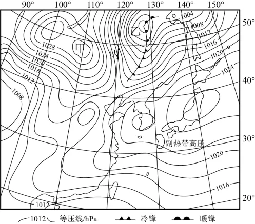

# 2025年海南高考地理真题 · 选择题题组 G4（第7–8题）

## 来源
- 来源文档：精品解析：2025年海南高考地理真题（解析版）.docx
- 题号：第7–8题（选择题，共2小题）

## 题组材料
天气图是气象部门分析和预报天气的重要工具。下图为亚洲东部地区10月某日地面天气示意图。据此完成下面小题。

## 相关图片


## 第7题
question_id: `2025-海南-地理-2025年海南高考地理真题-Q7`

**题干**：7. 图中乙区域温带气旋后续最有可能的移动方向是（   ）

**选项**：
- A. 东南
- B. 东北
- C. 西南
- D. 西北

**答案**：B

**解析**：根据所学知识可知，北半球的温带气旋受盛行西风带的影响，通常自西向东移动，往往呈偏北或偏南的东北—西南走向；图中乙气旋位于我国东北地区附近，高压位于其西侧（甲区域为高压），温带气旋向东移动；同时北半球中纬度西风带盛行西北风，受西风带影响，乙区域温带气旋向东北方向移动，B正确，ACD错误。故选B。


**知识点归属**：
- **核心考点 · 权重 1.0**：自然地理 → 大气 → 气旋与反气旋
- **支撑知识 · 权重 0.7**：自然地理 → 大气 → 大气的水平运动

**整体置信度**：高

<!-- MANAGED-KM-START Q7
```yaml
question_id: "2025-海南-地理-2025年海南高考地理真题-Q7"
question_number: 7
knowledge_points:
  - role: core_exam_point
    weight: 1.0
    domain_id: DM-NAT
    domain: "自然地理"
    theme_id: TH-NAT-ATMOSPHERE
    theme: "大气"
    knowledge_unit_id: KU-NAT-ATM-CIRC-002
    knowledge_unit: "气旋与反气旋"
    evidence: "依据等压线闭合和气压梯度判断温带气旋的低压中心与天气系统结构。"
  - role: supporting_knowledge
    weight: 0.7
    domain_id: DM-NAT
    domain: "自然地理"
    theme_id: TH-NAT-ATMOSPHERE
    theme: "大气"
    knowledge_unit_id: KU-NAT-ATM-HEAT-006
    knowledge_unit: "大气的水平运动"
    evidence: "等压线疏密决定水平气压梯度大小，并影响风力。"
extra_tags:
  - "温带气旋天气图"
taxonomy_version: "config-v0.2-draft"
confidence: "high"
label_status: "completed"
needs_review: false
taxonomy_review:
  needs_review: false
  issue_type: "none"
  review_note: ""
note: ""
```
-->

## 第8题
question_id: `2025-海南-地理-2025年海南高考地理真题-Q8`

**题干**：8. 当甲区域高压、乙区域低压进一步加强，丙区域会出现（   ）

**选项**：
- A. 西北风加强，气压梯度变小
- B. 西南风加强，形成强降水过程
- C. 西南风加强，温度变幅平缓
- D. 西北风加强，气温进一步降低

**答案**：D

**解析**：根据图上信息可知，甲区域是蒙古—西伯利亚一带高压（冷高压），乙区域是温带气旋（低压）。丙区域位于甲高压东部、乙低压西南部，气压梯度加大时，丙地风由高压吹向低压，在地转偏向力作用下应为西北风，西北风加强；同时冷空气从高纬南下，气温进一步降低，D正确，ABC错误。故选D。

**点睛**：温带气旋是活跃在温带中高纬度地区的一种近似椭圆形的斜压性气旋。温带气旋活动时常伴有冷空气的侵袭，降温、风沙、雪、霜冻、大风和暴雨等天气现象随之而来。从结构上讲，温带气旋是一种冷心系统，即温带气旋的中心气压低于四周，且具有冷中心性质。从尺度上讲，温带气旋的尺度一般较热带气旋大，直径从几百公里到3000公里不等，平均直径为1000公里。


**知识点归属**：
- **核心考点 · 权重 1.0**：自然地理 → 大气 → 大气的水平运动
- **支撑知识 · 权重 0.7**：自然地理 → 大气 → 气旋与反气旋

**整体置信度**：高

<!-- MANAGED-KM-START Q8
```yaml
question_id: "2025-海南-地理-2025年海南高考地理真题-Q8"
question_number: 8
knowledge_points:
  - role: core_exam_point
    weight: 1.0
    domain_id: DM-NAT
    domain: "自然地理"
    theme_id: TH-NAT-ATMOSPHERE
    theme: "大气"
    knowledge_unit_id: KU-NAT-ATM-HEAT-006
    knowledge_unit: "大气的水平运动"
    evidence: "由等压线配置和北半球近地面风向规律判断乙地风向。"
  - role: supporting_knowledge
    weight: 0.7
    domain_id: DM-NAT
    domain: "自然地理"
    theme_id: TH-NAT-ATMOSPHERE
    theme: "大气"
    knowledge_unit_id: KU-NAT-ATM-CIRC-002
    knowledge_unit: "气旋与反气旋"
    evidence: "乙地处于气旋环流背景，气流绕低压中心逆时针辐合。"
extra_tags:
  - "等压线风向判读"
taxonomy_version: "config-v0.2-draft"
confidence: "high"
label_status: "completed"
needs_review: false
taxonomy_review:
  needs_review: false
  issue_type: "none"
  review_note: ""
note: ""
```
-->

## 教学备注
<!-- TEACHER-NOTES-START -->
- 易错点：
- 课堂提示：
- 讲解建议：
<!-- TEACHER-NOTES-END -->

