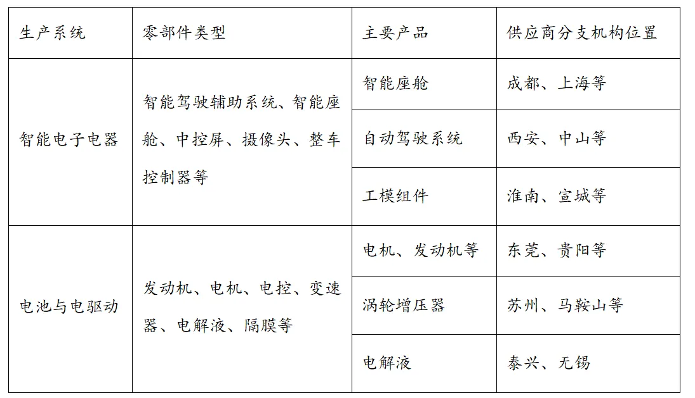

# 2025年海南高考地理真题 · 选择题题组 G5（第9–10题）

## 来源
- 来源文档：精品解析：2025年海南高考地理真题（解析版）.docx
- 题号：第9–10题（选择题，共2小题）

## 题组材料
随着新能源汽车技术的进步，中国汽车产业不断开启新的发展空间，已形成研发—生产—服务为一体的产业链，并在全国多个城市进行了布局。下表是某知名新能源汽车部分供应链分类及零部件组成。据此完成下面小题。

## 相关图片


## 第9题
question_id: `2025-海南-地理-2025年海南高考地理真题-Q9`

**题干**：9. 表中分支机构在该新能源汽车产业链中处于（   ）

**选项**：
- A. 研发环节
- B. 生产环节
- C. 服务环节
- D. 销售环节

**答案**：B

**解析**：研发环节通常集中在技术密集区域或总部，表中分支机构为供应商，提供智能座舱、电机等零部件，处于生产环节，A错误，B正确；服务环节包括售后、维护等，表中未体现，C错误；销售环节为终端市场布局，与零部件供应无关，D错误。故选B。


**知识点归属**：
- **核心考点 · 权重 1.0**：人文地理 → 产业区位 → 工业区位因素

**整体置信度**：高

<!-- MANAGED-KM-START Q9
```yaml
question_id: "2025-海南-地理-2025年海南高考地理真题-Q9"
question_number: 9
knowledge_points:
  - role: core_exam_point
    weight: 1.0
    domain_id: DM-HUM
    domain: "人文地理"
    theme_id: TH-HUM-INDUSTRY
    theme: "产业区位"
    knowledge_unit_id: KU-HUM-IND-002
    knowledge_unit: "工业区位因素"
    evidence: "根据供应商产品在整车制造中的用途，识别新能源汽车产业链的生产环节。"
extra_tags:
  - "新能源汽车产业链"
taxonomy_version: "config-v0.2-draft"
confidence: "high"
label_status: "completed"
needs_review: false
taxonomy_review:
  needs_review: false
  issue_type: "none"
  review_note: ""
note: ""
```
-->

## 第10题
question_id: `2025-海南-地理-2025年海南高考地理真题-Q10`

**题干**：10. 表中各分支机构所在城市具有的共同特点是（   ）

**选项**：
- A. 产业基础良好
- B. 原材料较充足
- C. 科研机构云集
- D. 能源资源丰富

**答案**：A

**解析**：成都、上海、东莞等城市工业基础完善，利于零部件生产协作，A正确；不同零部件原材料差异大，难以统一具备原材料充足的特点，且上海等城市资源并不丰富，原材料不一定充足，B错误；科研机构云集更符合研发环节，表中各分支机构主要处于零部件的生产环节，科研机构云集不是共同特点，C错误；仅部分城市（如淮南）能源资源丰富，非共同特点，D错误。故选A。

**点睛**：工业的区位因素有地理位置、土地、水源、原料、燃料、市场、交通、劳动力、农业基础、技术、政策、个人偏好、工业惯性、社会协作条件、国防安全需要、社会需要、历史条件等。


**知识点归属**：
- **核心考点 · 权重 1.0**：人文地理 → 产业区位 → 工业区位因素

**整体置信度**：高

<!-- MANAGED-KM-START Q10
```yaml
question_id: "2025-海南-地理-2025年海南高考地理真题-Q10"
question_number: 10
knowledge_points:
  - role: core_exam_point
    weight: 1.0
    domain_id: DM-HUM
    domain: "人文地理"
    theme_id: TH-HUM-INDUSTRY
    theme: "产业区位"
    knowledge_unit_id: KU-HUM-IND-002
    knowledge_unit: "工业区位因素"
    evidence: "降低供应链成本需从零部件运输距离、协作效率和产业集聚条件分析工业布局。"
extra_tags:
  - "供应链成本"
  - "产业集聚"
taxonomy_version: "config-v0.2-draft"
confidence: "high"
label_status: "completed"
needs_review: false
taxonomy_review:
  needs_review: false
  issue_type: "none"
  review_note: ""
note: ""
```
-->

## 教学备注
<!-- TEACHER-NOTES-START -->
- 易错点：
- 课堂提示：
- 讲解建议：
<!-- TEACHER-NOTES-END -->

