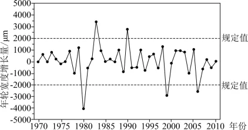

# 2025年海南高考地理真题 · 选择题题组 G6（第11–12题）

## 来源
- 来源文档：精品解析：2025年海南高考地理真题（解析版）.docx
- 题号：第11–12题（选择题，共2小题）

## 题组材料
有学者长期研究滑坡体上植物的生长状况，发现滑坡引起的滑坡体上树木生长所需营养再分配，会引发树木年轮的生长反应，导致树轮宽度的突变（增长量超过规定值），即为生长释放和生长抑制。下图示意某地滑坡体上某棵典型树木的年轮宽度逐年增长量（排除滑坡体外的其他因素影响）。据此完成下面小题。

## 相关图片


## 第11题
question_id: `2025-海南-地理-2025年海南高考地理真题-Q11`

**题干**：11. 图中所示期间，该树木出现生长释放的次数是（   ）

**选项**：
- A. 2
- B. 3
- C. 4
- D. 5

**答案**：A

**解析**：读图可知，图中所示期间，树木的年轮宽度逐年增长量有5次超过规定值，其中两次超过正值的规定值，3次超过负值的规定值，即出现2次生长释放，3次生长抑制，A正确，BCD错误，故选A。


**知识点归属**：
- **核心考点 · 权重 1.0**：自然地理 → 植被与土壤 → 树木年轮宽度的判读

**整体置信度**：高

<!-- MANAGED-KM-START Q11
```yaml
question_id: "2025-海南-地理-2025年海南高考地理真题-Q11"
question_number: 11
knowledge_points:
  - role: core_exam_point
    weight: 1.0
    domain_id: DM-NAT
    domain: "自然地理"
    theme_id: TH-NAT-VEGETATION-SOIL
    theme: "植被与土壤"
    knowledge_unit_id: KU-NAT-VEG-SOIL-007
    knowledge_unit: "树木年轮宽度的判读"
    evidence: "图中逐年增长量两次超过正阈值，需据此识别并计数两次生长释放。"
extra_tags:
  - "生长释放与生长抑制的识别"
taxonomy_version: "config-v0.2-draft"
confidence: "high"
label_status: "completed"
needs_review: false
taxonomy_review:
  needs_review: false
  issue_type: "none"
  review_note: ""
note: ""
```
-->

## 第12题
question_id: `2025-海南-地理-2025年海南高考地理真题-Q12`

**题干**：12. 在滑坡运动后，该地树木出现了显著生长抑制，可能是因为滑坡体（   ）

**选项**：
- A. 大致保持原有的结构
- B. 下滑速度缓慢
- C. 土壤被挤压得更紧实
- D. 土壤养分增加

**答案**：C

**解析**：在滑坡运动后，该地树木出现了显著生长抑制，说明植被生长速度减慢，生长速度低于正常值。如果滑坡体大致保持原有的结构，则树木生长环境并没有发生明显变化，树木不会出现显著的生长抑制，A错误；下滑速度慢，则滑坡对树木生长的影响也会比较小，不会使树木出现显著的生长抑制，B错误；受滑坡体的影响，土壤被挤压得更紧实，影响树木的根系发育，导致树木生长受限，出现显著的生长抑制，C正确；土壤养分增加有利于植被生长，不会使树木出现显著的生长抑制，D错误。故选C。

**点睛**：影响植物生长的主要因素有热量、水分、光照、风力、土壤等。植被是自然环境的一面镜子，由于植物生长对周围环境的依赖性很大，因此它对其生长的环境往往有明显的指示作用。


**知识点归属**：
- **核心考点 · 权重 1.0**：自然地理 → 植被与土壤 → 植被与环境
- **支撑知识 · 权重 0.7**：自然地理 → 植被与土壤 → 土壤的主要形成因素

**整体置信度**：高

<!-- MANAGED-KM-START Q12
```yaml
question_id: "2025-海南-地理-2025年海南高考地理真题-Q12"
question_number: 12
knowledge_points:
  - role: core_exam_point
    weight: 1.0
    domain_id: DM-NAT
    domain: "自然地理"
    theme_id: TH-NAT-VEGETATION-SOIL
    theme: "植被与土壤"
    knowledge_unit_id: KU-NAT-VEG-SOIL-001
    knowledge_unit: "植被与环境"
    evidence: "滑坡堆积物改变根系生境并造成树木偏心生长，体现植被对环境扰动的响应。"
  - role: supporting_knowledge
    weight: 0.7
    domain_id: DM-NAT
    domain: "自然地理"
    theme_id: TH-NAT-VEGETATION-SOIL
    theme: "植被与土壤"
    knowledge_unit_id: KU-NAT-VEG-SOIL-005
    knowledge_unit: "土壤的主要形成因素"
    evidence: "土壤紧实度、含水状况等土壤条件影响根系吸收和树木生长。"
extra_tags:
  - "滑坡扰动与树木生长"
taxonomy_version: "config-v0.2-draft"
confidence: "high"
label_status: "completed"
needs_review: false
taxonomy_review:
  needs_review: false
  issue_type: "none"
  review_note: ""
note: ""
```
-->

## 教学备注
<!-- TEACHER-NOTES-START -->
- 易错点：
- 课堂提示：
- 讲解建议：
<!-- TEACHER-NOTES-END -->

