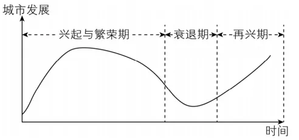

# 2024年湖南高考地理真题 · 综合题第17题（小问1–3）

## 来源
- 来源文档：精品解析：2024年湖南省高考地理真题（解析版）.docx
- 题号：第17题（非选择题，共3小问）

## 题组材料
17\. 阅读图文材料，完成下列要求。

印度尼西亚的沙哇伦多是十九世纪末因荷兰人开采煤炭而兴起的一座城市，吸引了印度尼西亚不同地区、不同民族的人口迁入。随着该地区煤炭资源枯竭，城市发展陷入困境。为摆脱困境，该城市依托煤炭开采的遗产发展旅游业，逐渐成为印度尼西亚著名的采矿文化旅游城市。如图示意沙哇伦多城市发展生命周期。

## 相关图片


### 第17题（1）
question_id: `2024-湖南-地理-2024年湖南高考地理真题-Q17-1`

**题干**：（1）说明"煤炭开采"在该城市不同发展阶段的作用。

**答案**：（1）兴起与繁荣时期：煤炭资源开采，促使煤炭产业成为城市主导产业；吸引人口流入，促进经济增长，城市用地规模不断扩大，促进城市的兴起与繁荣。衰退时期：煤炭资源枯竭，煤炭产业衰落；人口流失，经济衰退，环境破坏，城市逐渐衰落。再兴时期：利用煤炭开采的遗产，发展文化旅游产业，旅游业成为城市主导产业；人口回流，经济增长，生态环境改善，促进城市复兴。

**解析**：【小问1详解】

读图可知，该城市发展经历了兴起与繁荣期、衰退期、再兴期三个阶段。在兴起与繁荣期：该城市是因为开采煤炭而兴起的，煤炭开采吸引了印度尼西亚不同地区、不同民族的人口迁入，加快区域城镇化进程，带动矿产加工等相关产业发展，促进城市的兴起与繁荣。衰退期：煤炭属于非可再生资源，随着煤炭不断开采，导致资源逐渐枯竭，且长期以来经济发展过度依赖煤炭开采，形成了以重工业为主的产业结构，产业结构单一，转型困难，导致人口流失，经济出现衰退。再兴期：为摆脱困境，该城市依托煤炭开采的遗址发展旅游业，煤炭开采遗留的工业遗产成为特色旅游的资源禀赋，使该城市逐渐成为印度尼西亚著名的采矿文化旅游城市，促进了人口回流与经济转型，同时也促进了生态环境改善和城市复兴。

**知识点归属**：
- **核心考点 · 权重 1.0**：区域发展 → 资源型区域的发展与转型 → 资源型城市的发展阶段
- **支撑知识 · 权重 0.7**：区域发展 → 资源型区域的发展与转型 → 资源枯竭型城市的转型机制

**整体置信度**：高
<!-- MANAGED-KM-START Q17-1
```yaml
question_id: "2024-湖南-地理-2024年湖南高考地理真题-Q17-1"
question_number: 17
sub_question: 1
knowledge_points:
  - role: core_exam_point
    weight: 1.0
    domain_id: DM-REG
    domain: "区域发展"
    theme_id: TH-REG-RESOURCE
    theme: "资源型区域的发展与转型"
    knowledge_unit_id: KU-REG-RESOURCE-001
    knowledge_unit: "资源型城市的发展阶段"
    evidence: "煤炭开采分别驱动城市兴起繁荣、因资源枯竭导致衰退，并以矿业遗产支撑再兴。"
  - role: supporting_knowledge
    weight: 0.7
    domain_id: DM-REG
    domain: "区域发展"
    theme_id: TH-REG-RESOURCE
    theme: "资源型区域的发展与转型"
    knowledge_unit_id: KU-REG-RESOURCE-002
    knowledge_unit: "资源枯竭型城市的转型机制"
    evidence: "再兴阶段把煤炭开采遗产转化为文化旅游资源。"
extra_tags:
  - "资源型城市生命周期"
taxonomy_version: "config-v0.2-draft"
confidence: "high"
label_status: "completed"
needs_review: false
taxonomy_review:
  needs_review: false
  issue_type: "none"
  review_note: ""
note: ""
```
-->

### 第17题（2）
question_id: `2024-湖南-地理-2024年湖南高考地理真题-Q17-2`

**题干**：（2）该城市选择采矿文化旅游作为城市转型发展方向，试分析其独特条件。

**答案**：（2）煤炭资源开采吸引不同地区、不同民族的人口迁入，促进了多文化交融，形成了独特的地域文化；采矿活动留下的多种遗迹，形成了采矿遗产文化。

**解析**：【小问2详解】

沙哇伦多是十九世纪末因荷兰人开采煤炭而兴起的一座城市，吸引了印度尼西亚不同地区、不同民族的人口迁入，促进了多文化交融，形成了独特的地域文化；该城市是一座因煤而兴的城市，历史上的大型煤矿遗留了很多工业遗迹，形成了采矿遗产文化。

**知识点归属**：
- **核心考点 · 权重 1.0**：人文地理 → 产业区位 → 服务业区位因素
- **支撑知识 · 权重 0.7**：人文地理 → 乡村与城镇 → 地域文化与城乡景观

**整体置信度**：高
<!-- MANAGED-KM-START Q17-2
```yaml
question_id: "2024-湖南-地理-2024年湖南高考地理真题-Q17-2"
question_number: 17
sub_question: 2
knowledge_points:
  - role: core_exam_point
    weight: 1.0
    domain_id: DM-HUM
    domain: "人文地理"
    theme_id: TH-HUM-INDUSTRY
    theme: "产业区位"
    knowledge_unit_id: KU-HUM-IND-003
    knowledge_unit: "服务业区位因素"
    evidence: "采矿遗迹和多民族文化交融构成采矿文化旅游的独特资源与吸引物。"
  - role: supporting_knowledge
    weight: 0.7
    domain_id: DM-HUM
    domain: "人文地理"
    theme_id: TH-HUM-SETTLEMENT
    theme: "乡村与城镇"
    knowledge_unit_id: KU-HUM-SET-008
    knowledge_unit: "地域文化与城乡景观"
    evidence: "不同地区和民族人口迁入形成的地域文化是旅游转型的重要条件。"
extra_tags:
  - "工业遗产旅游资源条件"
taxonomy_version: "config-v0.2-draft"
confidence: "high"
label_status: "completed"
needs_review: false
taxonomy_review:
  needs_review: false
  issue_type: "none"
  review_note: ""
note: ""
```
-->

### 第17题（3）
question_id: `2024-湖南-地理-2024年湖南高考地理真题-Q17-3`

**题干**：（3）指出该城市成功转型为采矿文化旅游城市所带来的好处。

**答案**：（3）可以促进当地经济发展，增加就业；有利于生态环境改善；有利于历史文化保护与传承。

**解析**：【小问3详解】

采矿文化旅游为第三产业，附加值较高，可以促进当地经济发展，吸引了人口回流与增长，带动就业，促进区域活力提升；旅游业对环境的破坏小，可以减轻对自然环境的破坏，保护城市生态环境，有利于历史文化保护与传承。

**知识点归属**：
- **核心考点 · 权重 1.0**：区域发展 → 资源型区域的发展与转型 → 资源枯竭型城市的转型机制

**整体置信度**：高
<!-- MANAGED-KM-START Q17-3
```yaml
question_id: "2024-湖南-地理-2024年湖南高考地理真题-Q17-3"
question_number: 17
sub_question: 3
knowledge_points:
  - role: core_exam_point
    weight: 1.0
    domain_id: DM-REG
    domain: "区域发展"
    theme_id: TH-REG-RESOURCE
    theme: "资源型区域的发展与转型"
    knowledge_unit_id: KU-REG-RESOURCE-002
    knowledge_unit: "资源枯竭型城市的转型机制"
    evidence: "发展采矿文化旅游实现产业替代，带来就业、生态修复与历史文化保护等转型效益。"
extra_tags:
  - "资源枯竭型城市旅游转型效益"
taxonomy_version: "config-v0.2-draft"
confidence: "high"
label_status: "completed"
needs_review: false
taxonomy_review:
  needs_review: false
  issue_type: "none"
  review_note: ""
note: ""
```
-->

## 教学备注
<!-- TEACHER-NOTES-START -->
- 易错点：
- 课堂提示：
- 讲解建议：
<!-- TEACHER-NOTES-END -->
