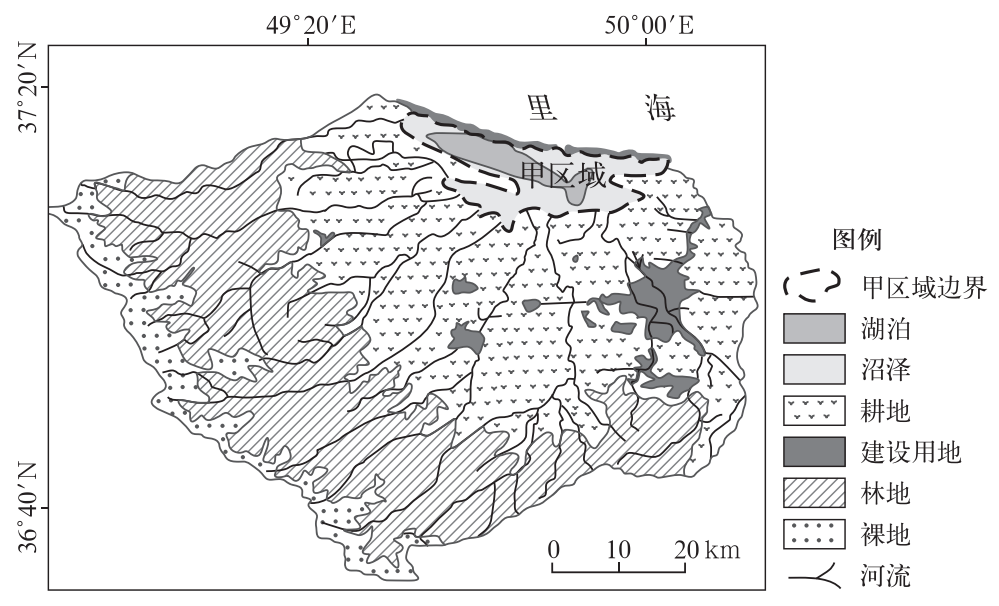

# 2024年湖南高考地理真题 · 综合题第18题（小问1–3）

## 来源
- 来源文档：精品解析：2024年湖南省高考地理真题（解析版）.docx
- 题号：第18题（非选择题，共3小问）

## 题组材料
18\. 阅读图文材料，完成下列要求。

湿地包括湖泊、沼泽、河流等类型。甲区域曾是里海的一部分，现为淡水湿地，有狭窄水道与里海相连。该湿地流域位于伊朗北部，年均降水量超过1000毫米。据预测，21世纪60年代该湿地将全部变为沼泽。如图示意该湿地位置及湿地流域的土地利用状况。

## 相关图片


### 第18题（1）
question_id: `2024-湖南-地理-2024年湖南高考地理真题-Q18-1`

**题干**：（1）简述甲区域演变为淡水湿地的过程。

**答案**：（1）甲区域逐渐与里海分离，水域相对封闭；湿地流域降水充沛，多条河流汇入，淡水补给量大，且有外泄通道，水体不断被稀释，最终变为淡水湿地。

**解析**：【小问1详解】

甲区域曾是里海的一部分，读图可知，甲区域南侧有众多河流注入湖泊，这些河流挟带泥沙等物质注入里海后，不断发生沉积，后经流水的搬运作用逐渐发育成水下沙坝；随着沙坝泥沙堆积量的不断增多，水下沙坝逐渐抬高，直至出露水面，将甲区域与里海隔开，形成湖泊，水域相对封闭；随着河水不断注入，甲区域湖水盐度逐渐被稀释，且甲区域湖水与里海有狭窄水道沟通，盐分可以流出，湖泊盐度逐渐下降。

**知识点归属**：
- **核心考点 · 权重 1.0**：自然地理 → 水文与海洋 → 陆地水体及其相互关系
- **支撑知识 · 权重 0.7**：自然地理 → 地表形态 → 河流地貌

**整体置信度**：高
<!-- MANAGED-KM-START Q18-1
```yaml
question_id: "2024-湖南-地理-2024年湖南高考地理真题-Q18-1"
question_number: 18
sub_question: 1
knowledge_points:
  - role: core_exam_point
    weight: 1.0
    domain_id: DM-NAT
    domain: "自然地理"
    theme_id: TH-NAT-WATER
    theme: "水文与海洋"
    knowledge_unit_id: KU-NAT-WATER-005
    knowledge_unit: "陆地水体及其相互关系"
    evidence: "甲区域与里海逐渐分离后接受充足河流淡水补给并可外泄盐分，水体被持续淡化。"
  - role: supporting_knowledge
    weight: 0.7
    domain_id: DM-NAT
    domain: "自然地理"
    theme_id: TH-NAT-LANDFORM
    theme: "地表形态"
    knowledge_unit_id: KU-NAT-LANDFORM-002
    knowledge_unit: "河流地貌"
    evidence: "入海泥沙沉积形成并抬高沙坝，使甲区域与里海分隔。"
extra_tags:
  - "滨海湖泊淡化演变"
taxonomy_version: "config-v0.2-draft"
confidence: "high"
label_status: "completed"
needs_review: false
taxonomy_review:
  needs_review: false
  issue_type: "none"
  review_note: ""
note: ""
```
-->

### 第18题（2）
question_id: `2024-湖南-地理-2024年湖南高考地理真题-Q18-2`

**题干**：（2）推测从现在到21世纪60年代，该湿地类型结构的变化及主要原因。

**答案**：（2）湖泊逐渐变为沼泽，湿地类型由湖泊和沼泽变化为单一沼泽：湖泊比重减少，沼泽比重增加。主要原因：里海水位下降，河流注入水量减少，湿地水量减少；河流携带的泥沙不断淤积，湖泊逐渐变为沼泽。

**解析**：【小问2详解】

结合材料信息可知，21世纪60年代该湿地将全部变成沼泽，因此湿地中的湖泊消失，全部变成沼泽，湖泊比重减少，沼泽比重增加。结合所学知识可知，当今全球气候变暖趋势明显，随着气温升高，蒸发加剧，湖泊水量支出增多，水位下降；随着人口的增长和产业的发展，流域内生产生活用水的需求量增多，加大了对河流水的消耗，使注入湿地的水量减少，湿地水量减少，且河流搬运能力下降，携带的泥沙不断淤积，湖泊逐渐变为沼泽，因此湿地中的湖泊消失，全部变成沼泽。

**知识点归属**：
- **核心考点 · 权重 1.0**：自然地理 → 水文与海洋 → 陆地水体及其相互关系
- **支撑知识 · 权重 0.7**：自然地理 → 地表形态 → 河流地貌

**整体置信度**：高
<!-- MANAGED-KM-START Q18-2
```yaml
question_id: "2024-湖南-地理-2024年湖南高考地理真题-Q18-2"
question_number: 18
sub_question: 2
knowledge_points:
  - role: core_exam_point
    weight: 1.0
    domain_id: DM-NAT
    domain: "自然地理"
    theme_id: TH-NAT-WATER
    theme: "水文与海洋"
    knowledge_unit_id: KU-NAT-WATER-005
    knowledge_unit: "陆地水体及其相互关系"
    evidence: "入湖水量减少和蒸发消耗使湖泊水位下降，湖泊面积缩小并向沼泽转变。"
  - role: supporting_knowledge
    weight: 0.7
    domain_id: DM-NAT
    domain: "自然地理"
    theme_id: TH-NAT-LANDFORM
    theme: "地表形态"
    knowledge_unit_id: KU-NAT-LANDFORM-002
    knowledge_unit: "河流地貌"
    evidence: "河流携带泥沙持续淤积使湖盆变浅，推动湖泊沼泽化。"
extra_tags:
  - "湖泊沼泽化的水量与泥沙机制"
taxonomy_version: "config-v0.2-draft"
confidence: "high"
label_status: "completed"
needs_review: false
taxonomy_review:
  needs_review: false
  issue_type: "none"
  review_note: ""
note: ""
```
-->

### 第18题（3）
question_id: `2024-湖南-地理-2024年湖南高考地理真题-Q18-3`

**题干**：（3）为减缓该湿地变成沼泽的速度，请提出可行的措施。

**答案**：（3）提高用水效率，减少中上游生产生活用水；保护流域植被，减少湿地泥沙淤积；优化流域土地利用结构，减少水土流失；与里海相连处建立拦水闸坝，减少淡水外泄。

**解析**：【小问3详解】

该湿地变成沼泽与湖泊水量减少、湖水变浅有关，因此可以发展滴灌等节水农业，调整农业结构，提高水资源利用率，减少中上游生产生活用水，减少流域水量的消耗，增加入湖径流量；修筑水利工程，调节径流，减少淡水外泄。流域内植树种草，加强水土保持，提高流域涵养水源的能力，调节湖泊水量，减少湿地泥沙淤积。优化流域土地利用结构，减少水土流失。

**知识点归属**：
- **核心考点 · 权重 1.0**：区域发展 → 区际联系与区域协调发展 → 流域内协调发展
- **支撑知识 · 权重 0.7**：资源、环境与国家安全 → 资源环境安全保障 → 可持续发展

**整体置信度**：高
<!-- MANAGED-KM-START Q18-3
```yaml
question_id: "2024-湖南-地理-2024年湖南高考地理真题-Q18-3"
question_number: 18
sub_question: 3
knowledge_points:
  - role: core_exam_point
    weight: 1.0
    domain_id: DM-REG
    domain: "区域发展"
    theme_id: TH-REG-INTERREGION
    theme: "区际联系与区域协调发展"
    knowledge_unit_id: KU-REG-INTERREGION-001
    knowledge_unit: "流域内协调发展"
    evidence: "节水、水土保持、土地利用优化和水利调控需在整个流域统筹，以减缓湿地沼泽化。"
  - role: supporting_knowledge
    weight: 0.7
    domain_id: DM-RES
    domain: "资源、环境与国家安全"
    theme_id: TH-RES-STRATEGY
    theme: "资源环境安全保障"
    knowledge_unit_id: KU-RES-STR-004
    knowledge_unit: "可持续发展"
    evidence: "措施兼顾流域生产用水、植被保护和湿地生态维持。"
extra_tags:
  - "流域湿地综合治理"
taxonomy_version: "config-v0.2-draft"
confidence: "high"
label_status: "completed"
needs_review: false
taxonomy_review:
  needs_review: false
  issue_type: "none"
  review_note: ""
note: ""
```
-->

## 教学备注
<!-- TEACHER-NOTES-START -->
- 易错点：
- 课堂提示：
- 讲解建议：
<!-- TEACHER-NOTES-END -->
