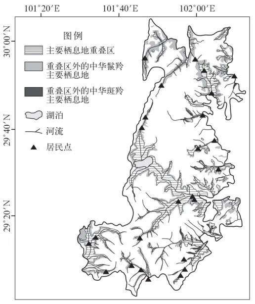

# 2024年湖南高考地理真题 · 综合题第19题（小问1–4）

## 来源
- 来源文档：精品解析：2024年湖南省高考地理真题（解析版）.docx
- 题号：第19题（非选择题，共4小问）

## 题组材料
19\. 阅读图文材料，完成下列要求。

四川贡嘎山国家级自然保护区位于青藏高原东缘，野生动植物丰富，是国家级风景名胜区。中华斑羚和中华鬣羚是近缘物种，主要栖息地为针叶林和针阔混交林，在贡嘎山和秦岭均有分布。两物种日活动高峰都出现在清晨和傍晚，但中华鬣羚的活动早高峰早于中华斑羚，晚高峰晚于中华斑羚，且夜间活动强度高于中华斑羚。如图示意两物种在贡嘎山自然保护区主要栖息地的分布。

## 相关图片


### 第19题（1）
question_id: `2024-湖南-地理-2024年湖南高考地理真题-Q19-1`

**题干**：（1）两物种主要栖息地空间分布重叠程度较高且能共存，试分析其原因。

**答案**：（1）两物种为近缘物种，生活习性（生态习性）相近；重叠区位于河谷地区，水源条件好，食物充足及隐蔽性强，对两物种均适宜；两物种活动节律有差异（日活动强度不同），减少竞争。

**解析**：【小问1详解】

材料提及"中华斑羚和中华鬣羚是近缘物种，主要栖息地为针叶林和针阔混交林"，两物种具有亲缘关系，同时栖息地较为接近，有着较为相似的生活习性；重叠区位于青藏高原东缘河谷地区，发育良好的植被且较少的人类活动，能够提供充足的食物、水源和良好的隐蔽条件，满足两种生物生存发展的需要；中华鬣羚的活动早高峰早于中华斑羚，晚高峰晚于中华斑羚，且夜间活动强度高于中华斑羚，两物种活动节律有差异（日活动强度不同），减少竞争。

**知识点归属**：
- **核心考点 · 权重 1.0**：自然地理 → 自然环境的整体性与差异性 → 生物多样性及其保护

**整体置信度**：高
<!-- MANAGED-KM-START Q19-1
```yaml
question_id: "2024-湖南-地理-2024年湖南高考地理真题-Q19-1"
question_number: 19
sub_question: 1
knowledge_points:
  - role: core_exam_point
    weight: 1.0
    domain_id: DM-NAT
    domain: "自然地理"
    theme_id: TH-NAT-INTEGRITY
    theme: "自然环境的整体性与差异性"
    knowledge_unit_id: KU-NAT-INTEGRITY-008
    knowledge_unit: "生物多样性及其保护"
    evidence: "近缘物种共享适宜河谷生境并通过活动节律差异减少竞争，说明生境条件和物种关系共同维持生物多样性。"
extra_tags:
  - "近缘物种共存"
taxonomy_version: "config-v0.2-draft"
confidence: "high"
label_status: "completed"
needs_review: false
taxonomy_review:
  needs_review: false
  issue_type: "none"
  review_note: ""
note: ""
```
-->

### 第19题（2）
question_id: `2024-湖南-地理-2024年湖南高考地理真题-Q19-2`

**题干**：（2）与中华斑羚相比，中华鬣羚环境适应能力更强，请从其活动时间和空间的角度给出依据。

**答案**：（2）中华鬣羚主要栖息地分布范围更广；中华鬣羚晚上活动强度较大。

**解析**：【小问2详解】

材料提及"两物种日活动高峰都出现在清晨和傍晚"，时间上，两物种的日活动高峰均出现在清晨和傍晚，"但中华鬣羚的活动早高峰早于中华斑羚，晚高峰晚于中华斑羚，且夜间活动强度高于中华斑羚"，但两物种对晨昏时间段的利用区间和强度存在差异，中华鬣羚的早、晚活动高峰分别早于和晚于中华斑羚，且对夜晚时间段的利用强度更高，故其时间利用上存在一定优势性；从空间上来看，中华鬣羚适宜栖息地的面积远大于中华斑羚。故中华鬣羚环境适应能力更强。

**知识点归属**：
- **核心考点 · 权重 1.0**：自然地理 → 自然环境的整体性与差异性 → 生物多样性保护与生态位理论
- **支撑知识 · 权重 0.7**：自然地理 → 自然环境的整体性与差异性 → 生物多样性及其保护

**整体置信度**：高
<!-- MANAGED-KM-START Q19-2
```yaml
question_id: "2024-湖南-地理-2024年湖南高考地理真题-Q19-2"
question_number: 19
sub_question: 2
knowledge_points:
  - role: core_exam_point
    weight: 1.0
    domain_id: DM-NAT
    domain: "自然地理"
    theme_id: TH-NAT-INTEGRITY
    theme: "自然环境的整体性与差异性"
    knowledge_unit_id: KU-NAT-INTEGRITY-009
    knowledge_unit: "生物多样性保护与生态位理论"
    evidence: "中华鬣羚利用更广的栖息空间和更长的夜间活动时段，体现其生态位在空间和时间维度上的扩展。"
  - role: supporting_knowledge
    weight: 0.7
    domain_id: DM-NAT
    domain: "自然地理"
    theme_id: TH-NAT-INTEGRITY
    theme: "自然环境的整体性与差异性"
    knowledge_unit_id: KU-NAT-INTEGRITY-008
    knowledge_unit: "生物多样性及其保护"
    evidence: "比较物种的栖息范围与活动节律可以识别适应差异，为生物多样性保护确定重点生境和时段。"
extra_tags:
  - "物种环境适应能力的时空证据"
taxonomy_version: "config-v0.2-draft"
confidence: "high"
label_status: "completed"
needs_review: false
taxonomy_review:
  needs_review: false
  issue_type: "none"
  review_note: ""
note: ""
```
-->

### 第19题（3）
question_id: `2024-湖南-地理-2024年湖南高考地理真题-Q19-3`

**题干**：（3）判断中华斑羚主要栖息地在贡嘎山与秦岭分布的海拔高低，并分析原因。

**答案**：（3）在贡嘎山分布海拔较高（或在秦岭分布海拔较低）。原因：贡嘎山纬度较低，在较高海拔与秦岭较低海拔形成相近的水热条件（或秦岭纬度较高，较低海拔与贡嘎山较高海拔形成相近的水热条件）。

**解析**：【小问3详解】

由于贡嘎山纬度比秦岭相对较低，气温较高，而秦岭纬度相对较高，气温较低，因不同纬度与不同海拔的组合形成了相似的局部水热条件，从而均形成了适宜中华斑羚栖息的环境条件。故中华斑羚主要栖息地在贡嘎山海拔要相对高一些，秦岭山区海拔要相对低一些。

**知识点归属**：
- **核心考点 · 权重 1.0**：自然地理 → 自然环境的整体性与差异性 → 垂直地域分异规律

**整体置信度**：高
<!-- MANAGED-KM-START Q19-3
```yaml
question_id: "2024-湖南-地理-2024年湖南高考地理真题-Q19-3"
question_number: 19
sub_question: 3
knowledge_points:
  - role: core_exam_point
    weight: 1.0
    domain_id: DM-NAT
    domain: "自然地理"
    theme_id: TH-NAT-INTEGRITY
    theme: "自然环境的整体性与差异性"
    knowledge_unit_id: KU-NAT-INTEGRITY-006
    knowledge_unit: "垂直地域分异规律"
    evidence: "贡嘎山纬度较低，需在更高海拔才能形成与较高纬秦岭相近的水热和植被条件。"
extra_tags:
  - "纬度与海拔对垂直带谱位置的共同影响"
taxonomy_version: "config-v0.2-draft"
confidence: "high"
label_status: "completed"
needs_review: false
taxonomy_review:
  needs_review: false
  issue_type: "none"
  review_note: ""
note: ""
```
-->

### 第19题（4）
question_id: `2024-湖南-地理-2024年湖南高考地理真题-Q19-4`

**题干**：（4）请从降低人类活动强度的角度，提出加强该保护区两物种保护的合理建议。

**答案**：（4）生态移民；生态退耕、合理放牧；禁止盗猎、禁止非法采伐；控制旅游活动强度。

**解析**：【小问4详解】

本题要求从降低人类活动强度的角度回答。因人类活动会影响栖息地的动物，可以加强栖息地的管控，减少无关人员进入保护区，以降低人为干扰的负面影响，进行生态移民，生态退耕、合理放牧；禁止盗猎、禁止非法采伐，破坏野生动物栖息环境；该地是国家级风景名胜区，游客众多，应控制旅游活动强度。

**知识点归属**：
- **核心考点 · 权重 1.0**：资源、环境与国家安全 → 环境安全 → 生态保护与国家安全

**整体置信度**：高
<!-- MANAGED-KM-START Q19-4
```yaml
question_id: "2024-湖南-地理-2024年湖南高考地理真题-Q19-4"
question_number: 19
sub_question: 4
knowledge_points:
  - role: core_exam_point
    weight: 1.0
    domain_id: DM-RES
    domain: "资源、环境与国家安全"
    theme_id: TH-RES-ENV
    theme: "环境安全"
    knowledge_unit_id: KU-RES-ENV-003
    knowledge_unit: "生态保护与国家安全"
    evidence: "生态移民、退耕和合理放牧、禁猎禁伐及控制旅游强度都通过降低人为干扰保护栖息地。"
extra_tags:
  - "自然保护区人为干扰管控"
taxonomy_version: "config-v0.2-draft"
confidence: "high"
label_status: "completed"
needs_review: false
taxonomy_review:
  needs_review: false
  issue_type: "none"
  review_note: ""
note: ""
```
-->

## 教学备注
<!-- TEACHER-NOTES-START -->
- 易错点：
- 课堂提示：
- 讲解建议：
<!-- TEACHER-NOTES-END -->
