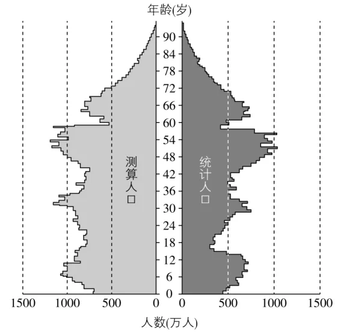

# 2024年湖南高考地理真题 · 选择题题组 G2（第4–5题）

## 来源
- 来源文档：精品解析：2024年湖南省高考地理真题（解析版）.docx
- 题号：第4–5题（选择题，共2小题）

## 题组材料
某学者以2010年常住人口为基础，在不考虑城乡人口迁移的条件下，测算出2020年我国乡村各年龄段常住人口数量。下图示意2020年我国乡村常住人口的测算结果与统计结果。据此完成下面小题。

## 相关图片


## 第4题
question_id: `2024-湖南-地理-2024年湖南高考地理真题-Q4`

**题干**：

4\. 测算人口数量与统计人口数量差异最显著的年龄段及该年龄段两者数量差异形成的原因（    ）

A. 15～21岁　人口自然增长慢　B. 36～42岁　人口自然增长慢

C. 15～21岁　人口净流出量高　D. 36～42岁　人口净流出量高

**答案**：

【答案】4. C

**解析**：

【4题详解】

某年龄段测算人口数量与统计人口数量差异=该年龄段时期人口数量最大值－该年龄段时期人口数量最小值。结合题干选项并读图分析可知，15～21岁年龄段，统计人口数量最小值为300万人左右，而同期测算人口数量最大值为900万人左右，两者数量差异约为600万人；36～42岁年龄段，测算人口数量最大值为900万人左右，同期统计人口数量最小值为500万人，两者数量差异约为400万人，故测算人口数量与统计人口数量差异最显著的年龄段为15～21岁，排除BD选项；2020年我国乡村15～21岁常住人口的测算结果大于统计结果，说明该年我国乡村存在青壮年劳动力外出务工现象，人口净流出量高，C正确；人口自然增长率＝人口出生率－人口死亡率，根据图文材料信息无法判断2020年我国乡村人口自然增长快慢，A错误。故选C。

**知识点归属**：
- **核心考点 · 权重 1.0**：人文地理 → 人口 → 人口迁移

**整体置信度**：高
<!-- MANAGED-KM-START Q4
```yaml
question_id: "2024-湖南-地理-2024年湖南高考地理真题-Q4"
question_number: 4
knowledge_points:
  - role: core_exam_point
    weight: 1.0
    domain_id: DM-HUM
    domain: "人文地理"
    theme_id: TH-HUM-POPULATION
    theme: "人口"
    knowledge_unit_id: KU-HUM-POP-002
    knowledge_unit: "人口迁移"
    evidence: "测算人口显著高于乡村统计人口，需用15—21岁人口净流出来解释差值。"
extra_tags:
  - "年龄结构图判断人口净流出"
taxonomy_version: "config-v0.2-draft"
confidence: "high"
label_status: "completed"
needs_review: false
taxonomy_review:
  needs_review: false
  issue_type: "none"
  review_note: ""
note: ""
```
-->

## 第5题
question_id: `2024-湖南-地理-2024年湖南高考地理真题-Q5`

**题干**：

5\. 图示统计人口的年龄结构可能会给乡村振兴带来的影响是（    ）

①阻碍农民增收　　②造成生态破坏　　③导致乡愁淡化　　④增加耕地撂荒

A. ①②　B. ②③　C. ①④　D. ③④

**答案**：

【答案】5. D

**解析**：

【5题详解】

结合上题分析可知，2020年我国乡村15～21岁人口净流出量高。乡愁是深切思念家乡的忧伤的心情，太年轻的时候就离开家乡，对家乡的感情不深，以后乡愁会变淡，③正确；青壮年人口迁出导致乡村人才外流，劳动力不足，影响乡村经济的进一步发展，增加耕地撂荒现象，④正确；农民增收的途径有外出打工、发展特色种养殖业、结合旅游开展乡村服务业、利用振兴乡村战略创业致富等，乡村青壮年人口外出务工有利于农民增收，①错误；人口迁出可缓解当地人地矛盾，有利于生态环境改善，②错误。故本题选D。

【点睛】人口迁移的影响

对迁出地：加强了迁出地与外界社会在经济、科技、文化等方面的联系，有利于社会经济的发展；人口迁出可缓解当地人地矛盾，更好地开发利用土地资源。人口迁出导致当地人才外流，劳动力不足，从而影响迁出地经济的进一步发展。

对迁入地：为迁入地提供大量廉价的劳动力，促进迁入地商品流通和经济的发展，促进迁入地第三产业的发展。大量人口迁入，增加了公共设施的负担和城市管理的难度，尤其在住房、交通、卫生、教育、城市环境等方面产生巨大压力。

**知识点归属**：
- **核心考点 · 权重 1.0**：人文地理 → 人口 → 人口迁移

**整体置信度**：高
<!-- MANAGED-KM-START Q5
```yaml
question_id: "2024-湖南-地理-2024年湖南高考地理真题-Q5"
question_number: 5
knowledge_points:
  - role: core_exam_point
    weight: 1.0
    domain_id: DM-HUM
    domain: "人文地理"
    theme_id: TH-HUM-POPULATION
    theme: "人口"
    knowledge_unit_id: KU-HUM-POP-002
    knowledge_unit: "人口迁移"
    evidence: "青少年人口迁出造成乡土联系减弱和乡村劳动力不足，进而带来乡愁淡化与耕地撂荒。"
extra_tags:
  - "人口迁出对乡村的影响"
taxonomy_version: "config-v0.2-draft"
confidence: "high"
label_status: "completed"
needs_review: false
taxonomy_review:
  needs_review: false
  issue_type: "none"
  review_note: ""
note: ""
```
-->

## 教学备注
<!-- TEACHER-NOTES-START -->
- 易错点：
- 课堂提示：
- 讲解建议：
<!-- TEACHER-NOTES-END -->
