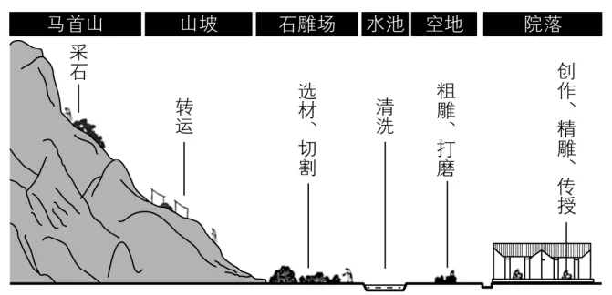

# 2024年湖南高考地理真题 · 选择题题组 G3（第6–8题）

## 来源
- 来源文档：精品解析：2024年湖南省高考地理真题（解析版）.docx
- 题号：第6–8题（选择题，共3小题）

## 题组材料
山西省新绛县西庄村附近盛产青石，自宋代以来形成了以石雕加工为主的传统手工业。为保持行业的家族垄断优势，当地主要采取子承父业的技艺传承方式。近年来，在政府扶持下，西庄村规划建设了石雕工业园。如图示意农耕时代西庄村石雕生产的空间次序。据此完成下面小题。

## 相关图片


## 第6题
question_id: `2024-湖南-地理-2024年湖南高考地理真题-Q6`

**题干**：

6\. 西庄村形成图示空间次序，是因为（    ）

A. 地形地势　B. 河流分布　C. 生产流程　D. 宗族关系

**答案**：

【答案】6. C

**解析**：

【6题详解】

根据图示信息可知，西庄村在聚落空间层面，以生产流程为导向，形成一系列不同功能的场所空间，呈现出系统的生产空间链条，石雕制作经过采选石材—构图绘画—制坯—粗雕—精雕—打磨—抛光—做旧等多道极为复杂的工艺，形成了：马首山（采石）—西庄坡村（转运）—石雕场（选材、切割）—水池（清洗）—村里空地（粗雕、打磨）—庭院（创作、精雕、传授）系列生产空间序列，C正确；地形地势是影响聚落选址的区位因素，但不是影响空间次序的主要因素，A错误；河流分布、宗族关系不是影响空间次序的主要因素，BD错误。所以选C。

**知识点归属**：
- **核心考点 · 权重 1.0**：人文地理 → 产业区位 → 工业区位因素

**整体置信度**：高
<!-- MANAGED-KM-START Q6
```yaml
question_id: "2024-湖南-地理-2024年湖南高考地理真题-Q6"
question_number: 6
knowledge_points:
  - role: core_exam_point
    weight: 1.0
    domain_id: DM-HUM
    domain: "人文地理"
    theme_id: TH-HUM-INDUSTRY
    theme: "产业区位"
    knowledge_unit_id: KU-HUM-IND-002
    knowledge_unit: "工业区位因素"
    evidence: "采石、转运、切割、清洗、粗雕和精雕依生产流程依次布局，体现生产环节对工业空间的组织。"
extra_tags:
  - "传统手工业生产流程的空间组织"
taxonomy_version: "config-v0.2-draft"
confidence: "high"
label_status: "completed"
needs_review: false
taxonomy_review:
  needs_review: false
  issue_type: "none"
  review_note: ""
note: ""
```
-->

## 第7题
question_id: `2024-湖南-地理-2024年湖南高考地理真题-Q7`

**题干**：

7\. "精雕"选择在以厅堂为中心的院落中进行，主要是为了（    ）

A. 石材堆放　B. 陈列展览　C. 技艺保密　D. 交流合作

**答案**：

【答案】7. C

**解析**：

【7题详解】

根据材料信息"为保持行业的家族垄断优势，当地主要采取子承父业的技艺传承方式。"可知，当地"精雕"选择在以厅堂为中心的院落中进行，能够减少家族技艺的外流，有利于子承父业、家族垄断，C正确；院落面积较小，不利于石材堆放，A错误；厅堂面积较小，不利于陈列展览，B错误；为了家族垄断，一般很少交流合作，D错误。所以选C。

**知识点归属**：
- **核心考点 · 权重 1.0**：人文地理 → 产业区位 → 文化传承与技艺保护对工业区位的影响

**整体置信度**：高
<!-- MANAGED-KM-START Q7
```yaml
question_id: "2024-湖南-地理-2024年湖南高考地理真题-Q7"
question_number: 7
knowledge_points:
  - role: core_exam_point
    weight: 1.0
    domain_id: DM-HUM
    domain: "人文地理"
    theme_id: TH-HUM-INDUSTRY
    theme: "产业区位"
    knowledge_unit_id: KU-HUM-IND-006
    knowledge_unit: "文化传承与技艺保护对工业区位的影响"
    evidence: "精雕安排在封闭院落并采用子承父业方式，关键是维护家族技艺垄断和保密。"
extra_tags:
  - "传统技艺家族传承与生产空间"
taxonomy_version: "config-v0.2-draft"
confidence: "high"
label_status: "completed"
needs_review: false
taxonomy_review:
  needs_review: false
  issue_type: "none"
  review_note: ""
note: ""
```
-->

## 第8题
question_id: `2024-湖南-地理-2024年湖南高考地理真题-Q8`

**题干**：

8\. 该村石雕生产由分散的家庭作坊集聚到工业园，有利于（    ）

①形成合理的功能分区　　②融合生产和生活空间

③限制生态空间的扩张　　④营造良好的人居环境

A. ①③　B. ①④　C. ②③　D. ②④

**答案**：

【答案】8. B

**解析**：

【8题详解】

该村石雕生产由分散的家庭作坊集聚到工业园，能够使得生产区和生活区分开，有利于形成合理的功能分区，①正确，②错误；不会限制生态空间的扩张，③错误；可以减少石材加工对生活区的污染，能够有利于营造良好的人居环境，④正确。所以选B。

【点睛】坐落在吕梁山麓、马首山下的西庄村，掩映在青山之下，举目远眺，高耸的山峦酷似马首，这里便是天然的石料场。五代后周时期此处就有了村庄，石匠们就住在石料场附近，从事石头加工为主导的石雕产业。现在，在800户3000多人的村庄里，有700多人从事石雕产业，是名副其实的"因石而生，因石而传，因石而居，因石而美，因石而兴"的专业村。西庄石雕产品远销海内外，被用于乔家大院、王家大院、尧庙、秋风楼、普救寺等景区以及陇南、河南、晋南诸多古民居。

**知识点归属**：
- **核心考点 · 权重 1.0**：人文地理 → 乡村与城镇 → 合理利用城乡空间

**整体置信度**：高
<!-- MANAGED-KM-START Q8
```yaml
question_id: "2024-湖南-地理-2024年湖南高考地理真题-Q8"
question_number: 8
knowledge_points:
  - role: core_exam_point
    weight: 1.0
    domain_id: DM-HUM
    domain: "人文地理"
    theme_id: TH-HUM-SETTLEMENT
    theme: "乡村与城镇"
    knowledge_unit_id: KU-HUM-SET-004
    knowledge_unit: "合理利用城乡空间"
    evidence: "家庭作坊集聚到工业园可分离生产与生活空间，形成合理功能分区并改善人居环境。"
extra_tags:
  - "乡村产业园功能分区"
taxonomy_version: "config-v0.2-draft"
confidence: "high"
label_status: "completed"
needs_review: false
taxonomy_review:
  needs_review: false
  issue_type: "none"
  review_note: ""
note: ""
```
-->

## 教学备注
<!-- TEACHER-NOTES-START -->
- 易错点：
- 课堂提示：
- 讲解建议：
<!-- TEACHER-NOTES-END -->
