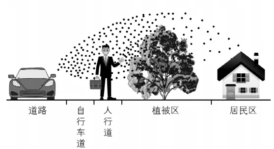
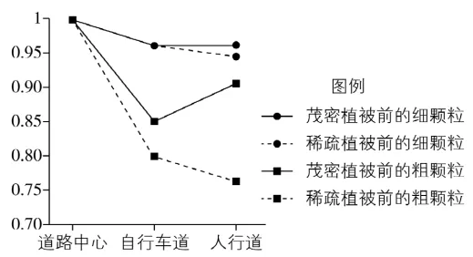

# 2024年湖南高考地理真题 · 选择题题组 G4（第9–11题）

## 来源
- 来源文档：精品解析：2024年湖南省高考地理真题（解析版）.docx
- 题号：第9–11题（选择题，共3小题）

## 题组材料
某大都市城市用地紧缺，道路与居民区距离较近，交通排放颗粒物对居民区有一定的影响，绿化植被可减轻此影响。在该都市采样监测发现，不同植被类型对颗粒物的拦截效果不同。如左图示意采样监测区基本情况。右图显示道路中心、自行车道、人行道与道路中心的颗粒物浓度的比值。据此完成下面小题。

## 相关图片




## 第9题
question_id: `2024-湖南-地理-2024年湖南高考地理真题-Q9`

**题干**：

9\. 理想的采样监测天气是（    ）

A. 晴朗微风　B. 逆温天气　C. 阴雨少光　D. 风向多变

**答案**：

【答案】9. A

**解析**：

【9题详解】

晴朗微风的天气，当地颗粒污染物受外界干扰较少，有利于监测不同区域污染物状况，分析植被对颗粒污染物的拦截效果，A正确；逆温天气不利于近地面污染物的扩散，会加重污染状况，B错误；阴雨天气产生的降水会吸附大气中的污染物，降低污染物浓度，C错误；风向多变会导致污染物浓度受到风的影响，不能反应植被类型对污染物扩散的拦截效果，D错误。所以选A。

**知识点归属**：
- **核心考点 · 权重 1.0**：人文地理 → 地理调查与实践 → 地理调查方案设计

**整体置信度**：高
<!-- MANAGED-KM-START Q9
```yaml
question_id: "2024-湖南-地理-2024年湖南高考地理真题-Q9"
question_number: 9
knowledge_points:
  - role: core_exam_point
    weight: 1.0
    domain_id: DM-HUM
    domain: "人文地理"
    theme_id: TH-HUM-GEOPRACTICE
    theme: "地理调查与实践"
    knowledge_unit_id: KU-HUM-PRACTICE-001
    knowledge_unit: "地理调查方案设计"
    evidence: "为比较植被拦截效应，采样天气应尽量减少降水和风向变化等干扰变量。"
extra_tags:
  - "环境监测的控制变量"
taxonomy_version: "config-v0.2-draft"
confidence: "high"
label_status: "completed"
needs_review: false
taxonomy_review:
  needs_review: false
  issue_type: "none"
  review_note: ""
note: ""
```
-->

## 第10题
question_id: `2024-湖南-地理-2024年湖南高考地理真题-Q10`

**题干**：

10\. 与自行车道相比，关于人行道上积累最明显的颗粒物及其对应的植被类型，判断正确的是（    ）

A. 细颗粒　茂密植被　B. 粗颗粒　茂密植被　C. 细颗粒　稀疏植被　D. 粗颗粒　稀疏植被

**答案**：

【答案】10. B

**解析**：

【10题详解】

根据图示信息可知，与自行车道相比，人行道上茂密植被前的粗颗粒的比值较高，说明积累明显，B正确；与自行车道相比，人行道稀疏植被前的细颗粒、稀疏植被前的粗颗粒、茂密植被前的细颗粒比值较小或基本一致，说明积累不明显，ACD错误。所以选B。

**知识点归属**：
- **核心考点 · 权重 1.0**：资源、环境与国家安全 → 资源环境与人类社会 → 自然环境的服务功能

**整体置信度**：高
<!-- MANAGED-KM-START Q10
```yaml
question_id: "2024-湖南-地理-2024年湖南高考地理真题-Q10"
question_number: 10
knowledge_points:
  - role: core_exam_point
    weight: 1.0
    domain_id: DM-RES
    domain: "资源、环境与国家安全"
    theme_id: TH-RES-SOC
    theme: "资源环境与人类社会"
    knowledge_unit_id: KU-RES-SOC-001
    knowledge_unit: "自然环境的服务功能"
    evidence: "图中茂密植被前人行道粗颗粒物比值最高，反映植被拦截污染物的环境服务功能。"
extra_tags:
  - "植被滞尘效应的图表判读"
taxonomy_version: "config-v0.2-draft"
confidence: "high"
label_status: "completed"
needs_review: false
taxonomy_review:
  needs_review: false
  issue_type: "none"
  review_note: ""
note: ""
```
-->

## 第11题
question_id: `2024-湖南-地理-2024年湖南高考地理真题-Q11`

**题干**：

11\. 在优先考虑降低颗粒物对居民区影响的同时，为尽量减少其对行人的影响，该都市从人行道到居民区绿化植被配置合理的是（    ）

A. 从稀疏到茂密　B. 从茂密到稀疏　C. 均用稀疏植被　D. 均用茂密植被

**答案**：

【答案】11. A

**解析**：

【11题详解】

根据图示信息和上题分析可知，茂密植被对颗粒污染物的拦截效果较好，应该在靠近居民区一侧种植茂密植被，减少对居民区的影响；根据上题分析可知，茂密植被前粗颗粒污染物较多，对行人的影响较大，稀疏植被拦截的污染物较少，为了减少对行人的影响，应在靠近人行道种植稀疏植被。所以从人行道到居民区绿化植被配置合理的是从稀疏到茂密，A正确，BCD错误。所以选A。

【点睛】植被具有调节气候，吸收、拦截空气中各种污染物等生态系统服务功能，是具有自净功能的最大生态系统，可在防治大气颗粒物污染方面发挥重要作用。植被拦截颗粒物有叶面、单株、群落和生态系统等尺度，每个尺度上都是一种跨介质、跨界面的复杂过程。目前的研究主要集中在，利用单叶尺度上测定的单位叶面积滞尘量去评价植物的滞尘效果，以选择适宜的植物类型，以及合理的树种配置和空间营林管理。

**知识点归属**：
- **核心考点 · 权重 1.0**：资源、环境与国家安全 → 资源环境与人类社会 → 自然环境的服务功能
- **支撑知识 · 权重 0.7**：人文地理 → 乡村与城镇 → 合理利用城乡空间

**整体置信度**：高
<!-- MANAGED-KM-START Q11
```yaml
question_id: "2024-湖南-地理-2024年湖南高考地理真题-Q11"
question_number: 11
knowledge_points:
  - role: core_exam_point
    weight: 1.0
    domain_id: DM-RES
    domain: "资源、环境与国家安全"
    theme_id: TH-RES-SOC
    theme: "资源环境与人类社会"
    knowledge_unit_id: KU-RES-SOC-001
    knowledge_unit: "自然环境的服务功能"
    evidence: "靠居民区配置茂密植被利用其较强滞尘功能，降低交通颗粒物影响。"
  - role: supporting_knowledge
    weight: 0.7
    domain_id: DM-HUM
    domain: "人文地理"
    theme_id: TH-HUM-SETTLEMENT
    theme: "乡村与城镇"
    knowledge_unit_id: KU-HUM-SET-004
    knowledge_unit: "合理利用城乡空间"
    evidence: "从人行道侧稀疏到居民区侧茂密的配置兼顾行人暴露与居住环境。"
extra_tags:
  - "城市绿化植被梯度配置"
taxonomy_version: "config-v0.2-draft"
confidence: "high"
label_status: "completed"
needs_review: false
taxonomy_review:
  needs_review: false
  issue_type: "none"
  review_note: ""
note: ""
```
-->

## 教学备注
<!-- TEACHER-NOTES-START -->
- 易错点：
- 课堂提示：
- 讲解建议：
<!-- TEACHER-NOTES-END -->
