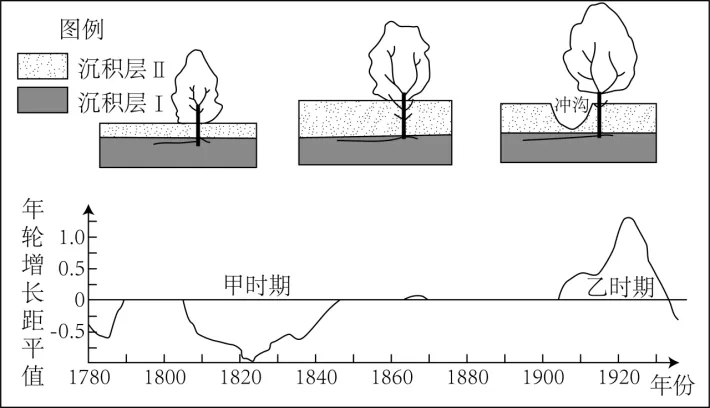

# 2024年湖南高考地理真题 · 选择题题组 G5（第12–14题）

## 来源
- 来源文档：精品解析：2024年湖南省高考地理真题（解析版）.docx
- 题号：第12–14题（选择题，共3小题）

## 题组材料
美国西南部某河源的小型谷地，气候较干旱。该地品尼松生长缓慢，分枝点低，雨水下渗为其生长提供水源，外力作用会影响其生长状态。1905年后该地降水增多。如图示意谷底的品尼松生长演变过程，以及相应的年轮增长距平值。据此完成下面小题。

## 相关图片


## 第12题
question_id: `2024-湖南-地理-2024年湖南高考地理真题-Q12`

**题干**：

12\. 关于甲、乙两时期谷底品尼松生长状态和影响其生长的外力作用，推断正确的是（    ）

A. 甲时期生长较慢　沉积为主　B. 甲时期生长较快　侵蚀为主

C. 乙时期生长较快　沉积为主　D. 乙时期生长较慢　侵蚀为主

**答案**：

【答案】12. A

**解析**：

【12题详解】

由图可知，甲时期年轮增长距平值小于0，说明甲时期，年轮增长缓慢，可推出品尼松生长缓慢；乙时期年轮增长距平值大于0，说明乙时期，年轮增长较快，可推出品尼松生长较快；BD错误；由图中品尼松生长演变过程可知，甲时期沉积层Ⅱ增厚，说明沉积为主，A正确；乙时期出现了冲沟，说明以侵蚀为主，C错误。故选A。

**知识点归属**：
- **核心考点 · 权重 1.0**：自然地理 → 地表形态 → 塑造地表形态的内力与外力作用
- **支撑知识 · 权重 0.7**：自然地理 → 植被与土壤 → 树木年轮宽度的判读

**整体置信度**：高
<!-- MANAGED-KM-START Q12
```yaml
question_id: "2024-湖南-地理-2024年湖南高考地理真题-Q12"
question_number: 12
knowledge_points:
  - role: core_exam_point
    weight: 1.0
    domain_id: DM-NAT
    domain: "自然地理"
    theme_id: TH-NAT-LANDFORM
    theme: "地表形态"
    knowledge_unit_id: KU-NAT-LANDFORM-006
    knowledge_unit: "塑造地表形态的内力与外力作用"
    evidence: "沉积层增厚与冲沟出现分别指示沉积和侵蚀，决定甲乙时期外力作用判断。"
  - role: supporting_knowledge
    weight: 0.7
    domain_id: DM-NAT
    domain: "自然地理"
    theme_id: TH-NAT-VEGETATION-SOIL
    theme: "植被与土壤"
    knowledge_unit_id: KU-NAT-VEG-SOIL-007
    knowledge_unit: "树木年轮宽度的判读"
    evidence: "年轮增长距平的正负用于判断品尼松生长快慢。"
extra_tags:
  - "沉积侵蚀过程与年轮响应"
taxonomy_version: "config-v0.2-draft"
confidence: "high"
label_status: "completed"
needs_review: false
taxonomy_review:
  needs_review: false
  issue_type: "none"
  review_note: ""
note: ""
```
-->

## 第13题
question_id: `2024-湖南-地理-2024年湖南高考地理真题-Q13`

**题干**：

13\. 在谷底冲沟附近，有部分品尼松树干下半部原有枝条消失，最可能是因为（    ）

A. 常受干热风影响　B. 土壤养分流失　C. 曾被沉积物掩埋　D. 遭受低温冻害

**答案**：

【答案】13. C

**解析**：

【13题详解】

由图可知，谷底冲沟附近分布大量的沉积物Ⅱ，在品尼松生长演变过程中下半部原有枝条容易被沉积物掩埋，被掩埋后，原有枝条枯落，进入沉积物，沉积物受侵蚀而出现冲沟，C正确；受干热风影响、土壤养分流失、遭受低温冻害，会影响品尼松树整体的生长速度和生长状态，可能造成品尼松树干枯死亡，而不是仅下半部原有枝条消失，ABD错误。故选C。

**知识点归属**：
- **核心考点 · 权重 1.0**：自然地理 → 地表形态 → 塑造地表形态的内力与外力作用

**整体置信度**：高
<!-- MANAGED-KM-START Q13
```yaml
question_id: "2024-湖南-地理-2024年湖南高考地理真题-Q13"
question_number: 13
knowledge_points:
  - role: core_exam_point
    weight: 1.0
    domain_id: DM-NAT
    domain: "自然地理"
    theme_id: TH-NAT-LANDFORM
    theme: "地表形态"
    knowledge_unit_id: KU-NAT-LANDFORM-006
    knowledge_unit: "塑造地表形态的内力与外力作用"
    evidence: "树干下部枝条先被沉积物掩埋枯落，后因侵蚀形成冲沟而重新暴露。"
extra_tags:
  - "沉积掩埋的生物形态证据"
taxonomy_version: "config-v0.2-draft"
confidence: "high"
label_status: "completed"
needs_review: false
taxonomy_review:
  needs_review: false
  issue_type: "none"
  review_note: ""
note: ""
```
-->

## 第14题
question_id: `2024-湖南-地理-2024年湖南高考地理真题-Q14`

**题干**：

14\. 在乙时期，谷坡的品尼松年轮增长距平值与谷底的相反，可能原因是谷坡（    ）

A. 降水增加改善了水分条件　B. 坡面有利于阳光照射

C. 地下水位上升加剧盐碱化　D. 被侵蚀导致根系裸露

**答案**：

【答案】14. D

**解析**：

【14题详解】

由图可知，乙时期谷底品尼松年轮增长距平值大于0，谷坡与其相反，说明谷坡品尼松年轮增长距平值小于0，可推测谷坡品尼松生长较慢；结合图中乙时期出现冲沟以及材料中提到1905年后降水增多，可推测谷坡受流水侵蚀加剧，导致谷坡上品尼松根部沉积物受侵蚀，导致根系裸露，不利于品尼松从土壤中获取水分和养分，影响了其生长，D正确；若考虑降水增加改善了水分条件，坡面有利于阳光照射，则AB项均有利于植物生长，使得品尼松生长较快，AB错误；谷坡地势较高，地下水位上升加剧盐碱化主要影响谷底植被生长，谷坡植被受影响不大，C错误。故选D。

【点睛】年轮指的是树木由于周期性季节生长速度不同，而在木质部横切面上形成肉眼可分辨的层层同心轮状结构。气象学上，可通过年轮的宽窄了解各年的气候状况，利用年轮上的信息可推测出几千年来的气候变迁情况。年轮宽表示那年光照充足，风调雨顺；若年轮较窄，则表示那年温度低、雨量少，气候恶劣。如果某地气候优劣有一定的周期性，反映在年轮上也会出现相应的宽窄周期性变化。

**知识点归属**：
- **核心考点 · 权重 1.0**：自然地理 → 植被与土壤 → 植被与环境
- **支撑知识 · 权重 0.7**：自然地理 → 地表形态 → 塑造地表形态的内力与外力作用

**整体置信度**：高
<!-- MANAGED-KM-START Q14
```yaml
question_id: "2024-湖南-地理-2024年湖南高考地理真题-Q14"
question_number: 14
knowledge_points:
  - role: core_exam_point
    weight: 1.0
    domain_id: DM-NAT
    domain: "自然地理"
    theme_id: TH-NAT-VEGETATION-SOIL
    theme: "植被与土壤"
    knowledge_unit_id: KU-NAT-VEG-SOIL-001
    knowledge_unit: "植被与环境"
    evidence: "谷坡侵蚀导致根系裸露，削弱水分和养分吸收并使年轮生长减慢。"
  - role: supporting_knowledge
    weight: 0.7
    domain_id: DM-NAT
    domain: "自然地理"
    theme_id: TH-NAT-LANDFORM
    theme: "地表形态"
    knowledge_unit_id: KU-NAT-LANDFORM-006
    knowledge_unit: "塑造地表形态的内力与外力作用"
    evidence: "降水增多加强坡面侵蚀，是根系裸露的外力过程。"
extra_tags:
  - "坡面侵蚀对树木生长的影响"
taxonomy_version: "config-v0.2-draft"
confidence: "high"
label_status: "completed"
needs_review: false
taxonomy_review:
  needs_review: false
  issue_type: "none"
  review_note: ""
note: ""
```
-->

## 教学备注
<!-- TEACHER-NOTES-START -->
- 易错点：
- 课堂提示：
- 讲解建议：
<!-- TEACHER-NOTES-END -->
