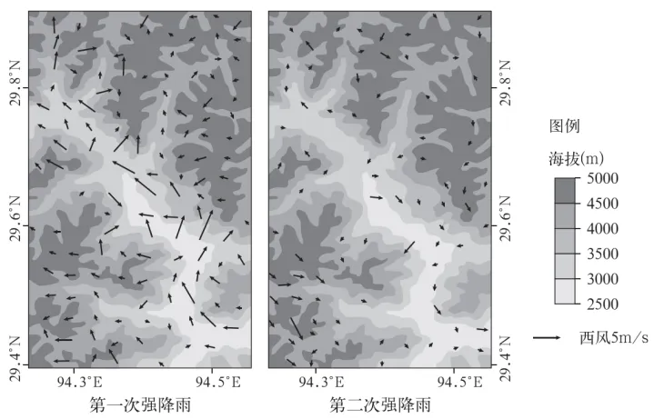

# 2024年湖南高考地理真题 · 选择题题组 G6（第15–16题）

## 来源
- 来源文档：精品解析：2024年湖南省高考地理真题（解析版）.docx
- 题号：第15–16题（选择题，共2小题）

## 题组材料
2019年9月17—18日西藏林芝地区出现了两次强降雨。研究表明，深入谷地的季风为该地降雨提供了充足的水汽，山谷风影响了降雨的时空变化，使降雨呈现明显的时段特征。如图示意两次强降雨时距地面10米处的风向与风速。据此完成下面小题。

## 相关图片


## 第15题
question_id: `2024-湖南-地理-2024年湖南高考地理真题-Q15`

**题干**：

15\. 第一次和第二次强降雨可能出现的时段分别为（    ）

A. 17日00：00—01：00　18日12：00—13：00　B. 17日07：00—08：00　18日12：00—13：00

C. 17日22：00—23：00　18日01：00—02：00　D. 17日13：00—14：00　18日00：00—01：00

**答案**：

【答案】15. D

**解析**：

【15题详解】

结合所学知识，阅读图文材料可知，西藏林芝发生第一次强降雨时段，该区域主要是季风的影响，距地面十米处的近地面风向由山谷吹向山顶，属于谷风，根据热力循环的原理，应该属于白天时间，故AC错误；右图中显示第二天强降雨，近地面风向发生了变化，风向主要由山峰吹向山谷，根据热力环流属于山风，应发生在晚上，故B错误，D正确。答案选择D。

**知识点归属**：
- **核心考点 · 权重 1.0**：自然地理 → 大气 → 大气热力环流

**整体置信度**：高
<!-- MANAGED-KM-START Q15
```yaml
question_id: "2024-湖南-地理-2024年湖南高考地理真题-Q15"
question_number: 15
knowledge_points:
  - role: core_exam_point
    weight: 1.0
    domain_id: DM-NAT
    domain: "自然地理"
    theme_id: TH-NAT-ATMOSPHERE
    theme: "大气"
    knowledge_unit_id: KU-NAT-ATM-HEAT-005
    knowledge_unit: "大气热力环流"
    evidence: "白天谷风沿坡上升、夜间山风沿坡下沉，据风向可判定两次强降雨时段。"
extra_tags:
  - "山谷风日变化判时"
taxonomy_version: "config-v0.2-draft"
confidence: "high"
label_status: "completed"
needs_review: false
taxonomy_review:
  needs_review: false
  issue_type: "none"
  review_note: ""
note: ""
```
-->

## 第16题
question_id: `2024-湖南-地理-2024年湖南高考地理真题-Q16`

**题干**：

16\. 两次强降雨时谷地风速差异显著，主要原因是（    ）

A. 地形阻挡　B. 东南风影响　C. 气温变化　D. 摩擦力作用

**答案**：

【答案】16. B

**解析**：

【16题详解】

结合所学知识，材料显示该区域谷地主要受季风影响，且左图中显示受东南风影响导致风速较快，右图中显示第二天风速减弱，没有受到东南风影响，因此两次强降雨时谷地风速差异主要是受东南风的影响，故B正确；左图和右图中显示的同一区域，风速在河谷区域有较大差异，因此主要不是受地形阻挡和摩擦力作用，故AD错误；西藏地区海拔高，气温较低，位于河谷地区温差更小，因此主要不是受到气温变化影响，故C错误。答案选择B。

【点睛】热力环流--山谷风：1.白天的谷风：白天山坡坡面获得的太阳辐射量多，升温快，气流沿山坡爬升形成谷风。（垂直方向）白天，相对同海拔的坡面，山谷气温低，气流下沉，补偿谷底沿坡面上升的气流。2.夜晚的山风：夜晚山坡散热快，气温低，气流沿山坡下沉，形成山风。（垂直方向）夜晚，相对同海拔的坡面，山谷散热慢，气温高，气流上升，补偿坡面下沉空气。

**知识点归属**：
- **核心考点 · 权重 1.0**：自然地理 → 大气 → 季风

**整体置信度**：高
<!-- MANAGED-KM-START Q16
```yaml
question_id: "2024-湖南-地理-2024年湖南高考地理真题-Q16"
question_number: 16
knowledge_points:
  - role: core_exam_point
    weight: 1.0
    domain_id: DM-NAT
    domain: "自然地理"
    theme_id: TH-NAT-ATMOSPHERE
    theme: "大气"
    knowledge_unit_id: KU-NAT-ATM-CIRC-005
    knowledge_unit: "季风"
    evidence: "第一次降雨叠加深入谷地的东南季风而风速较大，第二次缺少该气流影响。"
extra_tags:
  - "季风与谷地局地风叠加"
taxonomy_version: "config-v0.2-draft"
confidence: "high"
label_status: "completed"
needs_review: false
taxonomy_review:
  needs_review: false
  issue_type: "none"
  review_note: ""
note: ""
```
-->

## 教学备注
<!-- TEACHER-NOTES-START -->
- 易错点：
- 课堂提示：
- 讲解建议：
<!-- TEACHER-NOTES-END -->
