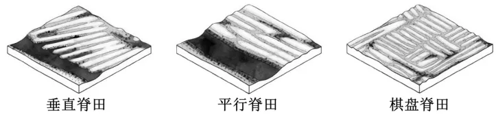

# 2025年湖南高考地理真题 · 综合题第17题（小问1–3）

## 来源
- 来源文档：精品解析：2025年湖南高考地理真题（解析版）.docx
- 题号：第17题（非选择题，共3小问）

## 题组材料
17\. 阅读图文材料，完成下列要求。

哥伦比亚首都波哥大市位于安第斯山北部山间盆地，旱雨季分明，暴雨和洪水多发，洪泛平原广布。1492年以前，当地居民就开始在洪泛平原修建脊田，并利用脊田的不同形态对地表径流进行调控，发展农业生产。其中，垂直脊田和平行脊田临近河流，棋盘脊田距离河流较远。后来，随着社会经济的发展，脊田逐渐从人们的生活中消失。进入21世纪，城市向洪泛平原快速扩张，面临严重的雨洪危机。近年来，城市规划者尝试将历史脊田与现代城市功能相结合，如居住区规划设计中，在现有建筑之间建造雨水花园，并将停车场改造为下沉式的雨水储存场所。下图示意三种不同形态的脊田。

## 相关图片


### 第17题（1）
question_id: `2025-湖南-地理-2025年湖南高考地理真题-Q17-1`

**题干**：（1）分别推测三种脊田对雨洪的主要调控作用。

**答案**：（1）垂直脊田：利于将雨洪期积水快速排入河流，减少积水时间。平行脊田：减缓洪水速度，削弱洪水危害。棋盘脊田：减缓地表径流流速，蓄积雨水。

**解析**：【小问1详解】

根据脊田的形态分析其对雨洪的调控作用。结合图示信息，垂直脊田（临近河流）的田垄与坡向一致，可以进行有效排水，在洪水期时将积水迅速排入河流，减少积水的时间和数量。平行脊田（临近河流）的田垄与坡向垂直、大致沿等高线分布，与径流走向垂直，洪水期时平行脊田有助于拦截洪水，减缓洪水流动速度，减轻洪水危害。棋盘脊田的田垄呈网格状分布，距离河流较远，在洪水期时可以减缓地表径流的流速，起到蓄积雨水的作用。

**知识点归属**：
- **核心考点 · 权重 1.0**：自然地理 → 水文与海洋 → 水循环
- **支撑知识 · 权重 0.7**：自然地理 → 地表形态 → 河流地貌

**整体置信度**：高

<!-- MANAGED-KM-START Q17-1
```yaml
question_id: "2025-湖南-地理-2025年湖南高考地理真题-Q17-1"
question_number: 17
sub_question: 1
knowledge_points:
  - role: core_exam_point
    weight: 1.0
    domain_id: DM-NAT
    domain: "自然地理"
    theme_id: TH-NAT-WATER
    theme: "水文与海洋"
    knowledge_unit_id: KU-NAT-WATER-001
    knowledge_unit: "水循环"
    evidence: "三种脊田通过加快排水、拦截径流或蓄积雨水，调节地表径流的汇流与滞蓄过程。"
  - role: supporting_knowledge
    weight: 0.7
    domain_id: DM-NAT
    domain: "自然地理"
    theme_id: TH-NAT-LANDFORM
    theme: "地表形态"
    knowledge_unit_id: KU-NAT-LANDFORM-002
    knowledge_unit: "河流地貌"
    evidence: "脊田与河流距离、垄向和坡向关系决定洪水流速及排水方向。"
extra_tags:
  - "脊田雨洪调控"
taxonomy_version: "config-v0.2-draft"
confidence: "high"
label_status: "completed"
needs_review: false
taxonomy_review:
  needs_review: false
  issue_type: "none"
  review_note: ""
note: ""
```
-->

### 第17题（2）
question_id: `2025-湖南-地理-2025年湖南高考地理真题-Q17-2`

**题干**：（2）简述脊田在现代商品农业中难以存续的原因。

**答案**：（2）现代商品农业为规模化生产模式，平坦的地形更利于进行机械化耕作和农田灌溉；而脊田沟—脊相间分布的地形，不利于大规模机械化耕作和灌溉，会降低劳动效率，进而影响收益。

**解析**：【小问2详解】

结合材料及所学知识，随着经济的快速发展，农业生产的规模不断扩大，农业呈现规模化、机械化、科技化发展趋势。现代商品农业快速发展，机械化水平不断提升，对大面积集中连片的平坦土地要求更高。而脊田呈现垄沟相间分布或棋盘状分布，不利于大规模机械化作业和大规模灌溉、劳动效率降低，不符合现代化商品农业的需求，可能影响农业收益，导致脊田在现代商品农业中难以存续。

**知识点归属**：
- **核心考点 · 权重 1.0**：人文地理 → 产业区位 → 农业区位因素

**整体置信度**：高

<!-- MANAGED-KM-START Q17-2
```yaml
question_id: "2025-湖南-地理-2025年湖南高考地理真题-Q17-2"
question_number: 17
sub_question: 2
knowledge_points:
  - role: core_exam_point
    weight: 1.0
    domain_id: DM-HUM
    domain: "人文地理"
    theme_id: TH-HUM-INDUSTRY
    theme: "产业区位"
    knowledge_unit_id: KU-HUM-IND-001
    knowledge_unit: "农业区位因素"
    evidence: "现代商品农业要求规模化、机械化和高效灌溉，沟脊相间地形降低作业效率和收益。"
extra_tags:
  - "商品农业规模化机械化"
taxonomy_version: "config-v0.2-draft"
confidence: "high"
label_status: "completed"
needs_review: false
taxonomy_review:
  needs_review: false
  issue_type: "none"
  review_note: ""
note: ""
```
-->

### 第17题（3）
question_id: `2025-湖南-地理-2025年湖南高考地理真题-Q17-3`

**题干**：（3）城市规划者将历史脊田的形态融入到洪泛平原的居住区规划设计中。指出这种设计的主要目的。

**答案**：（3）将历史脊田的形态融入居住区规划设计，可以减轻城市雨涝危害，增加城市湿地与绿地面积，改善居住环境，发挥生态效益；可以恢复历史文化景观，提升城市建设的历史文化内涵，同时降低洪灾对居住区的危害，创建健康安全的社会环境；可以带动商业、旅游业发展，增加城市收入，取得良好经济效益。

**解析**：【小问3详解】

将历史脊田的形态融入到洪泛平原的居住区规划设计可以获得经济、生态、社会等多种效益。从经济效益来看，这种设计有助于保护传统农业遗产景观，可以借助这些景观带动商业、旅游业发展，增加城市经济收入，促进经济发展。从生态效益来看，历史脊田具有良好的蓄水、排水、拦截洪水等功能，这种设计可以有助于居住区减轻雨涝危害，增加湿地与绿地面积，从而改善居民的居住环境。从社会效益来看，这种设计保护了脊田这一农业遗产，有助于恢复历史文化景观，提升城市建设的历史文化内涵，同时降低洪灾对居住区的危害，创建健康安全的社会环境。

**知识点归属**：
- **核心考点 · 权重 1.0**：人文地理 → 乡村与城镇 → 城镇化问题
- **支撑知识 · 权重 0.7**：资源、环境与国家安全 → 资源环境安全保障 → 可持续发展

**整体置信度**：高

<!-- MANAGED-KM-START Q17-3
```yaml
question_id: "2025-湖南-地理-2025年湖南高考地理真题-Q17-3"
question_number: 17
sub_question: 3
knowledge_points:
  - role: core_exam_point
    weight: 1.0
    domain_id: DM-HUM
    domain: "人文地理"
    theme_id: TH-HUM-SETTLEMENT
    theme: "乡村与城镇"
    knowledge_unit_id: KU-HUM-SET-007
    knowledge_unit: "城镇化问题"
    evidence: "把脊田形态转化为雨水花园和下沉式储水空间，主要用于缓解洪泛平原居住区的城市雨涝。"
  - role: supporting_knowledge
    weight: 0.7
    domain_id: DM-RES
    domain: "资源、环境与国家安全"
    theme_id: TH-RES-STRATEGY
    theme: "资源环境安全保障"
    knowledge_unit_id: KU-RES-STR-004
    knowledge_unit: "可持续发展"
    evidence: "设计兼顾蓄水生态效益、历史文化景观和经济社会效益，体现生态经济社会协调。"
extra_tags:
  - "海绵城市"
  - "农业遗产景观活化"
taxonomy_version: "config-v0.2-draft"
confidence: "high"
label_status: "completed"
needs_review: false
taxonomy_review:
  needs_review: false
  issue_type: "none"
  review_note: ""
note: ""
```
-->

## 教学备注
<!-- TEACHER-NOTES-START -->
- 易错点：
- 课堂提示：
- 讲解建议：
<!-- TEACHER-NOTES-END -->
