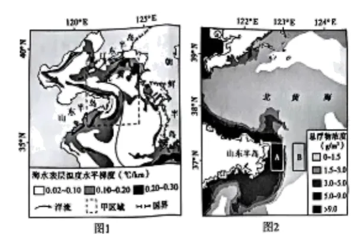

# 2025年湖南高考地理真题 · 综合题第18题（小问1–3）

## 来源
- 来源文档：精品解析：2025年湖南高考地理真题（解析版）.docx
- 题号：第18题（非选择题，共3小问）

## 题组材料
18\. 阅读图文材料，完成下列要求。

海洋温度锋是指海水温度呈极大水平梯度的现象，全年广泛分布在大陆架海域。它的存在会阻挡海岸陆源物质向外陆架海域输送。研究表明，山东半岛附近海域沿岸波短期性显著加强时，局地的海洋温度锋会被破坏，这是海岸陆源物质输送到外陆架海域的主要时期。图1示意我国部分海域冬季海水表层温度水平梯度的空间分布，图2示意2019年冬季某日甲区域海水悬浮物浓度的空间分布。

## 相关图片


### 第18题（1）
question_id: `2025-湖南-地理-2025年湖南高考地理真题-Q18-1`

**题干**：（1）简述图1中甲区域冬季海洋温度锋的空间分布，并分析该季节海洋温度锋显著的原因。

**答案**：（1）甲区域冬季，海洋温度锋空间分布不均；海洋温度锋呈带状，主要分布于山东半岛沿岸和北黄海北部（大陆架海域）；甲区域东南海域海洋温度锋不显著。

原因：冬季，陆地降温快，加上沿岸寒流影响，近岸海水温度低；大陆架外部海水较深，加上受由南向北的暖流影响，海水温度高。大陆架海域海水温度呈现极大的水平梯度分布，因此，海洋温度锋显著。

**解析**：【小问1详解】

根据图1中不同灰度的温度水平梯度可以判断海洋温度锋的空间分布规律，主要包括分布趋势、形状、分布区域等角度。读图可知，甲区域冬季海洋温度锋整体呈现不均匀的分布趋势。具体表现为海洋温度锋呈带状分布，主要分布在山东半岛沿岸海域和北黄海北部海域，海水深度较浅，主要为大陆架海域。另外，从图中可以看出，甲区域东南海域表层海水温度水平梯度较小，海洋温度锋不明显。

冬季，海洋温度锋显著，表明表层海水温度水平梯度较大，即近岸海域与深海区海水温度差异明显。冬季，受海陆热力性质差异影响，大陆降温较快，温度较低，近岸海域受陆地影响明显，海水温度较低。另外，受沿岸寒流的降温作用，导致近岸海域海水温度更低。相对而言，大陆架外部的深海区海水深度较大、海水热容量较高，加上由南向北的暖流增温作用，导致深海区海水温度较高。于是，形成明显的近岸海域水温低、深海水温高的分布特点，呈现极大的温度水平梯度分布，形成显著的海洋温度锋。

**知识点归属**：
- **核心考点 · 权重 1.0**：自然地理 → 水文与海洋 → 海水的性质
- **支撑知识 · 权重 0.7**：自然地理 → 水文与海洋 → 洋流

**整体置信度**：高

<!-- MANAGED-KM-START Q18-1
```yaml
question_id: "2025-湖南-地理-2025年湖南高考地理真题-Q18-1"
question_number: 18
sub_question: 1
knowledge_points:
  - role: core_exam_point
    weight: 1.0
    domain_id: DM-NAT
    domain: "自然地理"
    theme_id: TH-NAT-WATER
    theme: "水文与海洋"
    knowledge_unit_id: KU-NAT-WATER-002
    knowledge_unit: "海水的性质"
    evidence: "近岸浅海与外侧深水区因冬季冷却差异形成强海温水平梯度，表现为带状海洋温度锋。"
  - role: supporting_knowledge
    weight: 0.7
    domain_id: DM-NAT
    domain: "自然地理"
    theme_id: TH-NAT-WATER
    theme: "水文与海洋"
    knowledge_unit_id: KU-NAT-WATER-004
    knowledge_unit: "洋流"
    evidence: "沿岸寒流降温和由南向北暖流增温共同扩大近岸与外海温差。"
extra_tags:
  - "海洋温度锋"
taxonomy_version: "config-v0.2-draft"
confidence: "high"
label_status: "completed"
needs_review: false
taxonomy_review:
  needs_review: false
  issue_type: "none"
  review_note: ""
note: ""
```
-->

### 第18题（2）
question_id: `2025-湖南-地理-2025年湖南高考地理真题-Q18-2`

**题干**：（2）分析图2中A、B海域悬浮物浓度存在显著差异的原因。

**答案**：（2）A海域靠近陆地，受陆地径流影响，悬浮物多，浓度高；冬季，山东半岛海洋温度锋显著，阻挡海岸陆源物质向外陆架海域输送，B海域悬浮物少，浓度低；受海岸线形态约束，沿岸流挟带陆源物质南下并在A处聚集。

**解析**：【小问2详解】

读图2可知，A海域悬浮物浓度大，B海域悬浮物浓度小。结合材料，海洋温度锋的存在会阻挡海岸陆源物质向外陆架海域输送。结合上题可知，冬季，山东半岛海洋温度锋显著，可以阻挡陆源物质输送，引起B海域悬浮物来源少、浓度低。相对而言，A海域距离陆地更近，受陆地径流等影响更明显，陆地径流携带大量的悬浮物在A海域聚集。加上弯曲的海岸线形态影响，沿岸海水携带陆源悬浮物南下也在A处聚集，导致A处悬浮物数量多、浓度大。

**知识点归属**：
- **核心考点 · 权重 1.0**：自然地理 → 水文与海洋 → 海水的性质
- **支撑知识 · 权重 0.7**：自然地理 → 水文与海洋 → 水循环
- **材料线索 · 权重 0.4**：自然地理 → 水文与海洋 → 洋流

**整体置信度**：高

<!-- MANAGED-KM-START Q18-2
```yaml
question_id: "2025-湖南-地理-2025年湖南高考地理真题-Q18-2"
question_number: 18
sub_question: 2
knowledge_points:
  - role: core_exam_point
    weight: 1.0
    domain_id: DM-NAT
    domain: "自然地理"
    theme_id: TH-NAT-WATER
    theme: "水文与海洋"
    knowledge_unit_id: KU-NAT-WATER-002
    knowledge_unit: "海水的性质"
    evidence: "显著海洋温度锋阻挡陆源悬浮物向外陆架输送，造成锋两侧悬浮物浓度差异。"
  - role: supporting_knowledge
    weight: 0.7
    domain_id: DM-NAT
    domain: "自然地理"
    theme_id: TH-NAT-WATER
    theme: "水文与海洋"
    knowledge_unit_id: KU-NAT-WATER-001
    knowledge_unit: "水循环"
    evidence: "陆地径流向近岸输送悬浮物，使靠岸A海域物质来源更多。"
  - role: material_clue
    weight: 0.4
    domain_id: DM-NAT
    domain: "自然地理"
    theme_id: TH-NAT-WATER
    theme: "水文与海洋"
    knowledge_unit_id: KU-NAT-WATER-004
    knowledge_unit: "洋流"
    evidence: "沿岸流携带陆源物质南下并受海岸线约束在A海域聚集。"
extra_tags:
  - "温度锋的物质阻隔作用"
taxonomy_version: "config-v0.2-draft"
confidence: "high"
label_status: "completed"
needs_review: false
taxonomy_review:
  needs_review: false
  issue_type: "none"
  review_note: ""
note: ""
```
-->

### 第18题（3）
question_id: `2025-湖南-地理-2025年湖南高考地理真题-Q18-3`

**题干**：（3）判断山东半岛附近海域陆源物质向外陆架海域输送的主要季节，并说明理由。

**答案**：（3）冬季。冬季该地受西北季风影响；冬季风不断增强，黄海暖流及环山东半岛沿岸流的流速都得到增强；局地的海洋温度锋会被破坏，海岸陆源物质输送到外陆架海域。

**解析**：【小问3详解】

冬季，该地受西北季风影响。受冬季风暴驱动，黄海暖流及环山东半岛沿岸流的流速都得到增强，受海平面波动及地形等约束，黄海暖流与沿岸流间的海洋温度锋出现波动；冬季风暴持续作用下，海洋温度锋波动的形变进一步增大；波动的形变达到一定程度，海洋温度锋将被破坏，进而完成两侧物质的交换。

**知识点归属**：
- **核心考点 · 权重 1.0**：自然地理 → 水文与海洋 → 洋流
- **支撑知识 · 权重 0.7**：自然地理 → 大气 → 季风

**整体置信度**：高

<!-- MANAGED-KM-START Q18-3
```yaml
question_id: "2025-湖南-地理-2025年湖南高考地理真题-Q18-3"
question_number: 18
sub_question: 3
knowledge_points:
  - role: core_exam_point
    weight: 1.0
    domain_id: DM-NAT
    domain: "自然地理"
    theme_id: TH-NAT-WATER
    theme: "水文与海洋"
    knowledge_unit_id: KU-NAT-WATER-004
    knowledge_unit: "洋流"
    evidence: "冬季风增强黄海暖流和环山东半岛沿岸流，使海洋温度锋波动直至破坏并促进跨锋物质交换。"
  - role: supporting_knowledge
    weight: 0.7
    domain_id: DM-NAT
    domain: "自然地理"
    theme_id: TH-NAT-ATMOSPHERE
    theme: "大气"
    knowledge_unit_id: KU-NAT-ATM-CIRC-005
    knowledge_unit: "季风"
    evidence: "冬季西北季风及风暴的加强为沿岸流和暖流变化提供动力。"
extra_tags:
  - "冬季风暴破坏海洋温度锋"
taxonomy_version: "config-v0.2-draft"
confidence: "high"
label_status: "completed"
needs_review: false
taxonomy_review:
  needs_review: false
  issue_type: "none"
  review_note: ""
note: ""
```
-->

## 教学备注
<!-- TEACHER-NOTES-START -->
- 易错点：
- 课堂提示：
- 讲解建议：
<!-- TEACHER-NOTES-END -->
