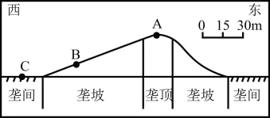
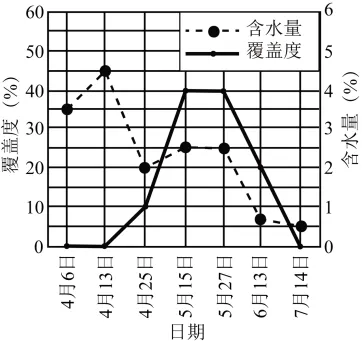

# 2025年湖南高考地理真题 · 综合题第19题（小问1–3）

## 来源
- 来源文档：精品解析：2025年湖南高考地理真题（解析版）.docx
- 题号：第19题（非选择题，共3小问）

## 题组材料
19\. 阅读图文材料，完成下列要求。

我国西部某沙漠年降水量70—150mm，冬季有一定厚度的稳定积雪。某些短期生植物在该沙漠广泛分布，其生长期在4—6月，根系深约30cm。某中学地理小组为了研究沙垄不同地貌部位表层土壤水分与植被生长的关系，制定了如下调查方案：

在一条典型沙垄上选定A、B、C三个采样地（下图）、合理设置样方，通过日测获取植被覆盖度，在样方中采集20cm深度的土壤样品，密封后送实验室测量样品土壤含水量。在4—7月分7次按同样的方法进行采样调查。


通过调查和实验，获得了相关数据（下表）。

| **采样日期** | **A样地覆盖度（%）** | **A样地含水量（%）** | **B样地覆盖度（%）** | **B样地含水量（%）** | **C样地覆盖度（%）** | **C样地含水量（%）** |
| -------- | ------------- | ------------- | ------------- | ------------- | ------------- | ------------- |
| 4月6日     | 0             | 3.5           | 0             | 5.0           | 2             | 5.2           |
| 4月13日    | 0             | 4.5           | 5             | 5.3           | 5             | 5.6           |
| 4月25日    | 1             | 2.0           | 15            | 4.5           | 21            | 4.6           |
| 5月15日    | 4             | 2.6           | 30            | 4.0           | 52            | 1.5           |
| 5月27日    | 4             | 2.5           | 30            | 1.5           | 38            | 1.0           |
| 6月13日    | 2             | 0.7           | 20            | 0.5           | 30            | 1.0           |
| 7月14日    | 0             | 0.5           | 0             | 0.4           | 0             | 0.7           |

## 相关图片


### 第19题（1）
question_id: `2025-湖南-地理-2025年湖南高考地理真题-Q19-1`

**题干**：（1）某同学准备在同一坐标图中绘制A、B、C三个样地覆盖度与含水量折线图，在绘制了A样地折线图（下图）后，发现其中一条折线存在错误。请指出错误之处。



**答案**：（1）植被覆盖度折线存在错误。4月25日至6月13日4个时间点植被覆盖度数值错误，是真实数据的10倍。

**解析**：【小问1详解】

对比表中数据与图中数据差异，指出错误。从表中给定数据来看，A样地4月25日至6月13日的植被覆盖度实际数值分别为1%、4%、4%、2%，而在绘制的折线图中，这几个时间点折线对应的数值明显偏离实际数据，呈现出过高的覆盖度，是真实数据放大了10倍，这属于明显的绘制错误。这种错误可能是在标注数据或绘图过程中出现误读或误写，导致折线图不能真实反映A样地植被覆盖度的变化情况。

**知识点归属**：
- **核心考点 · 权重 1.0**：人文地理 → 地理调查与实践 → 地理调查方案设计

**整体置信度**：高

<!-- MANAGED-KM-START Q19-1
```yaml
question_id: "2025-湖南-地理-2025年湖南高考地理真题-Q19-1"
question_number: 19
sub_question: 1
knowledge_points:
  - role: core_exam_point
    weight: 1.0
    domain_id: DM-HUM
    domain: "人文地理"
    theme_id: TH-HUM-GEOPRACTICE
    theme: "地理调查与实践"
    knowledge_unit_id: KU-HUM-PRACTICE-001
    knowledge_unit: "地理调查方案设计"
    evidence: "将A样地折线与调查表逐点核对，可发现4月25日至6月13日覆盖度被误绘为真实值的10倍。"
extra_tags:
  - "调查数据图表校核"
  - "折线图数据一致性"
taxonomy_version: "config-v0.2-draft"
confidence: "high"
label_status: "completed"
needs_review: false
taxonomy_review:
  needs_review: false
  issue_type: "none"
  review_note: ""
note: "原始导出表格与解析中的数值依据教师确认修正：C样地含水量4.6%、1.0%，4月25日覆盖度21%。"
```
-->

### 第19题（2）
question_id: `2025-湖南-地理-2025年湖南高考地理真题-Q19-2`

**题干**：（2）描述沙垄植被覆盖度时空总体变化特征。

**答案**：（2）4月至7月，沙垄植被覆盖度先增大后减小，5月植被覆盖度最大；由垄顶经垄坡至垄间，随海拔降低，植被覆盖度呈现增大趋势，垄顶植被覆盖度最小，垄间植被覆盖度最大。

**解析**：【小问2详解】

沙垄植被覆盖度时空总体变化特征可以分别从表格中体现的三个采样点时间变化、图中三个采样点空间位置差异描述植被覆盖度的变化特征。从时间变化看：从表中4月至7月的数据纵向对比可以看出，4月植被处于萌发初期，沙垄植被覆盖度较低；随着气温升高，积雪融水和土壤水分条件改善，5月植被进入快速生长期，植被覆盖度达到最大；6、7月，由于土壤水分逐渐减少，加上气温持续升高，蒸发加剧，植被生长受限并逐渐枯萎，覆盖度减小。整体呈现先增大后减小的趋势，5月为植被生长最为旺盛的时期。从空间变化看：读图，横向对比A（垄顶）、B（垄坡）、C（垄间）三个样地的数据，A样地（垄顶）海拔最高，其植被覆盖度始终处于最低水平；B样地（垄坡）次之；C样地（垄间）海拔最低，植被覆盖度最大；这是因为在沙漠环境中，水分是植被生长的关键限制因素，垄顶地势高，积雪融水和降水容易快速流失，难以留存水分，土壤含水量低，不利于植被生长；而垄间地势低洼，积雪融水和降水会向此处汇聚，土壤含水量相对较高，能够为植被提供更好的水分条件，所以植被覆盖度更高。

**知识点归属**：
- **核心考点 · 权重 1.0**：自然地理 → 植被与土壤 → 植被与环境
- **支撑知识 · 权重 0.7**：自然地理 → 自然环境的整体性与差异性 → 地方性分异规律

**整体置信度**：高

<!-- MANAGED-KM-START Q19-2
```yaml
question_id: "2025-湖南-地理-2025年湖南高考地理真题-Q19-2"
question_number: 19
sub_question: 2
knowledge_points:
  - role: core_exam_point
    weight: 1.0
    domain_id: DM-NAT
    domain: "自然地理"
    theme_id: TH-NAT-VEGETATION-SOIL
    theme: "植被与土壤"
    knowledge_unit_id: KU-NAT-VEG-SOIL-001
    knowledge_unit: "植被与环境"
    evidence: "覆盖度数据表明短期生植物4—7月先增后减，且由垄顶经垄坡至垄间总体增大，反映植被与水分环境的关系。"
  - role: supporting_knowledge
    weight: 0.7
    domain_id: DM-NAT
    domain: "自然地理"
    theme_id: TH-NAT-INTEGRITY
    theme: "自然环境的整体性与差异性"
    knowledge_unit_id: KU-NAT-INTEGRITY-007
    knowledge_unit: "地方性分异规律"
    evidence: "沙垄不同地貌部位的高程和汇水条件差异造成小尺度植被覆盖度空间分异。"
extra_tags:
  - "植被覆盖度时空变化"
  - "沙垄微地形"
taxonomy_version: "config-v0.2-draft"
confidence: "high"
label_status: "completed"
needs_review: false
taxonomy_review:
  needs_review: false
  issue_type: "none"
  review_note: ""
note: "原始导出表格与解析中的数值依据教师确认修正：C样地含水量4.6%、1.0%，4月25日覆盖度21%。"
```
-->

### 第19题（3）
question_id: `2025-湖南-地理-2025年湖南高考地理真题-Q19-3`

**题干**：（3）分析C样地土壤含水量变化趋势的原因。

**答案**：（3）4月中上旬，气温逐渐升高，积雪融水补给土壤，加上蒸发和植被根系吸收较弱，土壤含水量呈增加趋势，并在4月13日达到最高；进入4月下旬后，积雪融水补给停止，且气温升高，土壤水分蒸发增加，随着植被覆盖度逐渐增加，植被生长耗水量及蒸腾量逐渐增加，导致土壤含水量持续减少，在7月14日降至最低值。

**解析**：【小问3详解】

从水分来源和水分支出两方面分析C样地土壤含水量变化的趋势。读表可知，C样地4月份含水量较高且在4月13日达最高值，之后，含水量减少，到7月14日达最小值。原因是4月中上旬，气温逐渐回升，冬季积累的稳定积雪开始融化，由于C样地位于垄间，地势较低，积雪融水较多，且补给土壤水分较多；此时，气温还不是很高，蒸发作用较弱，同时植被刚刚开始萌发，根系对水分的吸收量也较少，所以土壤含水量呈现增加趋势，并在4月13日达到最高值5.6%。进入4月下旬，积雪融水基本补给完毕，后续没有充足的水源补充；随着气温不断升高，蒸发量显著增加，土壤中的水分快速散失；与此同时，植被覆盖度从4月25日的21%逐渐增加，植被生长进入旺盛期，根系吸收土壤水分用于自身生长和蒸腾作用的水量大幅增加；而该区域本身年降水量稀少（70-130mm），无法有效补充土壤水分，多重因素叠加导致土壤含水量持续减少，直至7月14日降至最低值0.7%。

**知识点归属**：
- **核心考点 · 权重 1.0**：自然地理 → 水文与海洋 → 水循环
- **支撑知识 · 权重 0.7**：自然地理 → 植被与土壤 → 植被与环境
- **支撑知识 · 权重 0.7**：自然地理 → 植被与土壤 → 土壤的功能与养护

**整体置信度**：高

<!-- MANAGED-KM-START Q19-3
```yaml
question_id: "2025-湖南-地理-2025年湖南高考地理真题-Q19-3"
question_number: 19
sub_question: 3
knowledge_points:
  - role: core_exam_point
    weight: 1.0
    domain_id: DM-NAT
    domain: "自然地理"
    theme_id: TH-NAT-WATER
    theme: "水文与海洋"
    knowledge_unit_id: KU-NAT-WATER-001
    knowledge_unit: "水循环"
    evidence: "C样地土壤水分由积雪融水补给增加，随后因补给停止、蒸发和植被耗水增强而持续减少。"
  - role: supporting_knowledge
    weight: 0.7
    domain_id: DM-NAT
    domain: "自然地理"
    theme_id: TH-NAT-VEGETATION-SOIL
    theme: "植被与土壤"
    knowledge_unit_id: KU-NAT-VEG-SOIL-001
    knowledge_unit: "植被与环境"
    evidence: "植被进入旺盛生长期后根系吸水和蒸腾增强，加快土壤水分消耗。"
  - role: supporting_knowledge
    weight: 0.7
    domain_id: DM-NAT
    domain: "自然地理"
    theme_id: TH-NAT-VEGETATION-SOIL
    theme: "植被与土壤"
    knowledge_unit_id: KU-NAT-VEG-SOIL-006
    knowledge_unit: "土壤的功能与养护"
    evidence: "垄间土壤承接融雪汇水并储存水分，其含水量反映土壤蓄水功能的季节变化。"
extra_tags:
  - "融雪补给与土壤水分收支"
  - "短期生植物耗水"
taxonomy_version: "config-v0.2-draft"
confidence: "high"
label_status: "completed"
needs_review: false
taxonomy_review:
  needs_review: false
  issue_type: "none"
  review_note: ""
note: "原始导出表格与解析中的数值依据教师确认修正：C样地含水量4.6%、1.0%，4月25日覆盖度21%。"
```
-->

## 教学备注
<!-- TEACHER-NOTES-START -->
- 易错点：
- 课堂提示：
- 讲解建议：
<!-- TEACHER-NOTES-END -->
