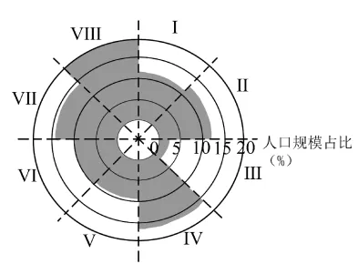

# 2025年湖南高考地理真题 · 选择题题组 G2（第4–5题）

## 来源
- 来源文档：精品解析：2025年湖南高考地理真题（解析版）.docx
- 题号：第4–5题（选择题，共2小题）

## 题组材料
近年来，广州市南沙区的法人单位数量占全市比重位次上升。预测广州市未来人口分布将从主城区向南沙区扩张。下图示意广州市各区间人口规模占比。据此完成下面小题。

## 相关图片


## 第4题
question_id: `2025-湖南-地理-2025年湖南高考地理真题-Q4`

**题干**：

4\. 有关广州市人口分布说法正确的是（   ）

A. Ⅱ区间比Ⅳ区间人口规模大　B. Ⅳ区间的人口数量最多

C. Ⅵ区间人口数量比重约9%　D. Ⅶ区间比Ⅴ区间人口规模大

**答案**：

【答案】4. D

**解析**：

【4题详解】

据图示信息可知Ⅱ区间人口规模占比小于15%，而Ⅳ区间人口规模占比大于15%，所以Ⅱ区间比Ⅳ区间人口规模小，A错误；据图示信息可知Ⅷ的人口规模占比最大，对应的人口数量最多，B错误；Ⅵ区间人口数量比重大于10%，C错误；Ⅶ区间人口规模占比大于10%，Ⅴ区间人口规模占比小于10%，故Ⅶ区间比Ⅴ区间人口规模大，D正确。故选D。

**知识点归属**：
- **核心考点 · 权重 1.0**：人文地理 → 人口 → 人口分布

**整体置信度**：高

<!-- MANAGED-KM-START Q4
```yaml
question_id: "2025-湖南-地理-2025年湖南高考地理真题-Q4"
question_number: 4
knowledge_points:
  - role: core_exam_point
    weight: 1.0
    domain_id: DM-HUM
    domain: "人文地理"
    theme_id: TH-HUM-POPULATION
    theme: "人口"
    knowledge_unit_id: KU-HUM-POP-001
    knowledge_unit: "人口分布"
    evidence: "需要比较统计图中各区间人口规模占比，判断广州市人口空间分布差异。"
extra_tags:
  - "人口规模占比图判读"
taxonomy_version: "config-v0.2-draft"
confidence: "high"
label_status: "completed"
needs_review: false
taxonomy_review:
  needs_review: false
  issue_type: "none"
  review_note: ""
note: ""
```
-->

## 第5题
question_id: `2025-湖南-地理-2025年湖南高考地理真题-Q5`

**题干**：

5\. 影响广州市未来人口分布向南沙区扩张主要因素是（   ）

A. 就业承载　B. 通勤时间　C. 医疗卫生　D. 文化教育

**答案**：

【答案】5. A

**解析**：

【5题详解】

当今影响人口迁移的、常常起主导作用的是经济因素，若一个地区的经济发展状况较好，提供的就业岗位多，就业承载较高，则会吸引更多的人口流入。结合材料信息可知，近年来，广州市南沙区的法人单位数量占全市比重位次上升，说明南沙区企业增多，提供的就业机会多，就业承载力提高，促进了广州市未来人口分布向南沙区扩张，A正确；南沙区没有位于主城区，主城区和南沙区的通勤距离较远，通勤时间较长，不利于人口向南沙区扩张，B错误；与主城区相比，南沙区基础设施无突出优势，医疗卫生、文化教育等方面没有突出优势，难以吸引人口流入，排除CD。故选A。

【点睛】影响人口迁移的因素：自然环境因素：气候、水源、土壤、矿产资源、自然灾害等；经济因素：经济发展水平、交通和通讯的发展等；社会因素：政策、战争、社会变革、宗教信仰、文化教育的发展、家庭和婚姻等。

**知识点归属**：
- **核心考点 · 权重 1.0**：人文地理 → 人口 → 影响人口迁移的因素
- **材料线索 · 权重 0.4**：人文地理 → 人口 → 人口分布

**整体置信度**：高

<!-- MANAGED-KM-START Q5
```yaml
question_id: "2025-湖南-地理-2025年湖南高考地理真题-Q5"
question_number: 5
knowledge_points:
  - role: core_exam_point
    weight: 1.0
    domain_id: DM-HUM
    domain: "人文地理"
    theme_id: TH-HUM-POPULATION
    theme: "人口"
    knowledge_unit_id: KU-HUM-POP-003
    knowledge_unit: "影响人口迁移的因素"
    evidence: "南沙区法人单位增多带来就业机会，是吸引人口向该区扩张的主导经济因素。"
  - role: material_clue
    weight: 0.4
    domain_id: DM-HUM
    domain: "人文地理"
    theme_id: TH-HUM-POPULATION
    theme: "人口"
    knowledge_unit_id: KU-HUM-POP-001
    knowledge_unit: "人口分布"
    evidence: "题干预测人口由主城区向南沙区扩张，提供人口空间变化线索。"
extra_tags:
  - "就业承载与人口迁移"
taxonomy_version: "config-v0.2-draft"
confidence: "high"
label_status: "completed"
needs_review: false
taxonomy_review:
  needs_review: false
  issue_type: "none"
  review_note: ""
note: ""
```
-->

## 教学备注
<!-- TEACHER-NOTES-START -->
- 易错点：
- 课堂提示：
- 讲解建议：
<!-- TEACHER-NOTES-END -->
