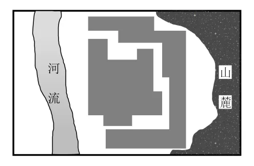
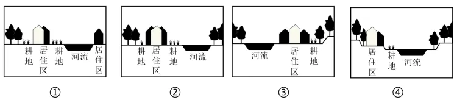

# 2025年湖南高考地理真题 · 选择题题组 G3（第6–8题）

## 来源
- 来源文档：精品解析：2025年湖南高考地理真题（解析版）.docx
- 题号：第6–8题（选择题，共3小题）

## 题组材料
浙江省楠溪江流域的屿北村坐落在山麓河谷地带。在由南向北发展的过程中，该传统村落逐渐形成了“小型房屋-中型院落-房族大院-族群单元”4个层级的院落空间形态。宗祠具有同族人共同祭祀祖先的功能，通常坐落在村落中心位置。下图示意屿北村空间形态。据此完成下面小题。

## 相关图片


## 第6题
question_id: `2025-湖南-地理-2025年湖南高考地理真题-Q6`

**题干**：

6\. 与该村落空间形态特征最符合的是（   ）

A. ①　B. ②　C. ③　D. ④



**答案**：

【答案】6. C

**解析**：

【6题详解】

读图可知，屿北村位于河流一侧，①图中河流两侧都有居住区，不符合题意；屿北村坐落在山麓河谷地带，居民区应靠近河流分布，方便生活用水，而耕地则位于居民区和林地（山地）之间的地势较平坦的区域，③正确，排除②④。综上所述，C正确，ABD错误。故选C。

**知识点归属**：
- **核心考点 · 权重 1.0**：人文地理 → 乡村与城镇 → 乡村土地利用

**整体置信度**：高

<!-- MANAGED-KM-START Q6
```yaml
question_id: "2025-湖南-地理-2025年湖南高考地理真题-Q6"
question_number: 6
knowledge_points:
  - role: core_exam_point
    weight: 1.0
    domain_id: DM-HUM
    domain: "人文地理"
    theme_id: TH-HUM-SETTLEMENT
    theme: "乡村与城镇"
    knowledge_unit_id: KU-HUM-SET-001
    knowledge_unit: "乡村土地利用"
    evidence: "依据河流、山地、林地、耕地与居民区的相对位置判断山麓河谷村落土地利用格局。"
extra_tags:
  - "山麓河谷村落布局"
taxonomy_version: "config-v0.2-draft"
confidence: "high"
label_status: "completed"
needs_review: false
taxonomy_review:
  needs_review: false
  issue_type: "none"
  review_note: ""
note: ""
```
-->

## 第7题
question_id: `2025-湖南-地理-2025年湖南高考地理真题-Q7`

**题干**：

7\. 该村院落空间形态层级形成的主要原因是（   ）

A. 适应地理环境　B. 家族繁衍发展

C. 道路交通演变　D. 居住条件改善

**答案**：

【答案】7. B

**解析**：

【7题详解】

在由南向北发展的过程中，该传统村落逐渐形成了“小型房屋-中型院落-房族大院-族群单元”4个层级的院落空间形态，在演化过程中，院落规模越来越大，可承载的人口越来越多，主要是由于家族繁衍发展，家族人口越来越多，需要规模更大的院落来承载更多的人口，B正确；地理环境并没有发生明显变化，该村院落空间形态层级形成并不是为了适应地理环境，A错误；该村院落空间形态层级形成主要体现了院落规模的扩大情况，与道路交通演变没有直接关联，C错误；院落规模扩大在一定程度上可以改善居住条件，但改善居住条件有很多方式，不一定要不断扩大院落规模，因此居住条件改善不是该村院落空间形态层级形成的主要原因，D错误。故选B。

**知识点归属**：
- **核心考点 · 权重 1.0**：人文地理 → 乡村与城镇 → 地域文化与城乡景观

**整体置信度**：高

<!-- MANAGED-KM-START Q7
```yaml
question_id: "2025-湖南-地理-2025年湖南高考地理真题-Q7"
question_number: 7
knowledge_points:
  - role: core_exam_point
    weight: 1.0
    domain_id: DM-HUM
    domain: "人文地理"
    theme_id: TH-HUM-SETTLEMENT
    theme: "乡村与城镇"
    knowledge_unit_id: KU-HUM-SET-008
    knowledge_unit: "地域文化与城乡景观"
    evidence: "院落由房屋、院落、房族大院到族群单元的层级扩大由家族繁衍与宗族组织推动。"
extra_tags:
  - "宗族聚落院落层级"
taxonomy_version: "config-v0.2-draft"
confidence: "high"
label_status: "completed"
needs_review: false
taxonomy_review:
  needs_review: false
  issue_type: "none"
  review_note: ""
note: ""
```
-->

## 第8题
question_id: `2025-湖南-地理-2025年湖南高考地理真题-Q8`

**题干**：

8\. 该村宗祠未处于村落中心的主要原因是（   ）

A. 村落发展　B. 聚落布局　C. 街巷格局　D. 风俗习惯

**答案**：

【答案】8. A

**解析**：

【8题详解】

宗祠具有同族人共同祭祀祖先的功能，通常坐落在村落中心位置，但该村宗祠未处于村落中心，主要是由于宗祠建立后，随着家族繁衍发展，村落不断由南向北发展扩张，导致原有的宗祠没有处于村落中心，A正确；聚落布局一般会选择宗祠布局在村落中心，B错误；图文材料中没有体现街巷格局和风俗习惯相关信息，不是该村宗祠未处于村落中心的主要原因，CD错误。故选A。

【点睛】在我国，地域文化一般是指特定区域源远流长、独具特色，仍发挥作用的文化传统，是特定区域的生态、民俗、传统、习惯等文明表现。

**知识点归属**：
- **核心考点 · 权重 1.0**：人文地理 → 乡村与城镇 → 地域文化与城乡景观

**整体置信度**：高

<!-- MANAGED-KM-START Q8
```yaml
question_id: "2025-湖南-地理-2025年湖南高考地理真题-Q8"
question_number: 8
knowledge_points:
  - role: core_exam_point
    weight: 1.0
    domain_id: DM-HUM
    domain: "人文地理"
    theme_id: TH-HUM-SETTLEMENT
    theme: "乡村与城镇"
    knowledge_unit_id: KU-HUM-SET-008
    knowledge_unit: "地域文化与城乡景观"
    evidence: "宗祠原处于聚落中心，村落向北扩展后其相对位置改变，体现传统聚落景观的演变。"
extra_tags:
  - "宗祠与村落扩展"
taxonomy_version: "config-v0.2-draft"
confidence: "high"
label_status: "completed"
needs_review: false
taxonomy_review:
  needs_review: false
  issue_type: "none"
  review_note: ""
note: ""
```
-->

## 教学备注
<!-- TEACHER-NOTES-START -->
- 易错点：
- 课堂提示：
- 讲解建议：
<!-- TEACHER-NOTES-END -->
