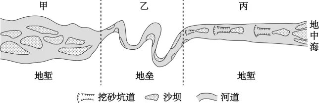

# 2025年湖南高考地理真题 · 选择题题组 G4（第9–11题）

## 来源
- 来源文档：精品解析：2025年湖南高考地理真题（解析版）.docx
- 题号：第9–11题（选择题，共3小题）

## 题组材料
塞尔韦拉河是西班牙东部的季节性河流，全长44千米，中下游流经三个地质构造单元。下游河道因过去开采砂砾破坏严重，后来政府对开采行为进行了限制，河道缓慢恢复。下图示意该河流中下游甲、乙、丙三个河段的河道形态。

## 相关图片


## 第9题
question_id: `2025-湖南-地理-2025年湖南高考地理真题-Q9`

**题干**：

9\. 大量开采砂砾会导致丙河段（   ）

A. 河道拓宽　B. 流量增大　C. 河床下降　D. 水位上升

**答案**：

【答案】9. C

**解析**：

【9题详解】

丙河段位于河流下游，大量开采砂砾会使河床中的沉积物减少，河床下降，水位顺势降低，C正确，D错误；开采砂砾主要是在河床中向下采挖，而不是向两侧采挖，因此不会导致河道拓宽，A错误；河流流量主要取决于上游来水量以及河流补给情况，大量开采砂砾并没有增加河流补给，不会导致流量增大，B错误。故选C。

**知识点归属**：
- **核心考点 · 权重 1.0**：自然地理 → 地表形态 → 河流地貌

**整体置信度**：高

<!-- MANAGED-KM-START Q9
```yaml
question_id: "2025-湖南-地理-2025年湖南高考地理真题-Q9"
question_number: 9
knowledge_points:
  - role: core_exam_point
    weight: 1.0
    domain_id: DM-NAT
    domain: "自然地理"
    theme_id: TH-NAT-LANDFORM
    theme: "地表形态"
    knowledge_unit_id: KU-NAT-LANDFORM-002
    knowledge_unit: "河流地貌"
    evidence: "直接开采河床砂砾会减少河床沉积物并造成河床下切。"
extra_tags:
  - "采砂引起河床下降"
taxonomy_version: "config-v0.2-draft"
confidence: "high"
label_status: "completed"
needs_review: false
taxonomy_review:
  needs_review: false
  issue_type: "none"
  review_note: ""
note: ""
```
-->

## 第10题
question_id: `2025-湖南-地理-2025年湖南高考地理真题-Q10`

**题干**：

10\. 该河流水动力最弱、沉积恢复最慢的季节是（   ）

A. 春季　B. 夏季　C. 秋季　D. 冬季

**答案**：

【答案】10. B

**解析**：

【10题详解】

该河流水动力最弱、沉积恢复最慢季节应是河流流量最小的季节。该河流是西班牙东部的季节性河流，注入地中海，处于地中海气候区，地中海气候夏季炎热干燥，冬季温和湿润，夏季由于降水少且蒸发旺盛，是一年中河流流量最小的季节，甚至可能出现断流现象，因此该河流水动力最弱、沉积恢复最慢的季节是夏季，B正确，ACD错误，故选B。

**知识点归属**：
- **核心考点 · 权重 1.0**：自然地理 → 大气 → 气压带和风带对气候的影响
- **支撑知识 · 权重 0.7**：自然地理 → 水文与海洋 → 陆地水体及其相互关系

**整体置信度**：高

<!-- MANAGED-KM-START Q10
```yaml
question_id: "2025-湖南-地理-2025年湖南高考地理真题-Q10"
question_number: 10
knowledge_points:
  - role: core_exam_point
    weight: 1.0
    domain_id: DM-NAT
    domain: "自然地理"
    theme_id: TH-NAT-ATMOSPHERE
    theme: "大气"
    knowledge_unit_id: KU-NAT-ATM-CIRC-006
    knowledge_unit: "气压带和风带对气候的影响"
    evidence: "西班牙东部地中海气候夏季受副热带高压影响而炎热干燥，使季节性河流水动力最弱。"
  - role: supporting_knowledge
    weight: 0.7
    domain_id: DM-NAT
    domain: "自然地理"
    theme_id: TH-NAT-WATER
    theme: "水文与海洋"
    knowledge_unit_id: KU-NAT-WATER-005
    knowledge_unit: "陆地水体及其相互关系"
    evidence: "降水少且蒸发强导致夏季河流流量最小，沉积物恢复最慢。"
extra_tags:
  - "季节性河流水动力"
taxonomy_version: "config-v0.2-draft"
confidence: "high"
label_status: "completed"
needs_review: false
taxonomy_review:
  needs_review: false
  issue_type: "none"
  review_note: ""
note: ""
```
-->

## 第11题
question_id: `2025-湖南-地理-2025年湖南高考地理真题-Q11`

**题干**：

11\. 为了促进丙河段的河道沉积恢复，下列措施合理的是（   ）

①甲河段——植树造林　②甲河段——冲淤排沙　③乙河段——裁弯取直　④丙河段——人工补沙

A. ①③　B. ②④　C. ①④　D. ②③

**答案**：

【答案】11. B

**解析**：

【11题详解】

丙河道是因为过去开采砂砾导致河道破坏严重，因此为了促进丙河段的河道沉积恢复，要增加丙河道的泥沙沉积。甲河段位于丙河段更上游，植树造林会减少甲河段的河流含沙量，导致带至丙河段的泥沙减少，不利于丙河段泥沙淤积，①错误；甲河段位于丙河段更上游，冲淤排沙可以增加带至丙河段的泥沙，利于丙河道的泥沙沉积，②正确；乙河段也位于丙河段更上游，裁弯取直后乙河段河流流速加快，侵蚀能力增强，可以增加带至丙河段的泥沙，但同时在丙河段的流速和搬运能力也变强了，不利于泥沙堆积，③错误；人工补沙可以增加河床物质，直接促进丙河段的河道沉积恢复，④正确。综上所述，B正确，ACD错误，故选B。

【点睛】地中海气候区夏季受副高控制，炎热干燥；冬季受盛行西风控制，温和湿润。

**知识点归属**：
- **核心考点 · 权重 1.0**：自然地理 → 地表形态 → 河流地貌

**整体置信度**：高

<!-- MANAGED-KM-START Q11
```yaml
question_id: "2025-湖南-地理-2025年湖南高考地理真题-Q11"
question_number: 11
knowledge_points:
  - role: core_exam_point
    weight: 1.0
    domain_id: DM-NAT
    domain: "自然地理"
    theme_id: TH-NAT-LANDFORM
    theme: "地表形态"
    knowledge_unit_id: KU-NAT-LANDFORM-002
    knowledge_unit: "河流地貌"
    evidence: "促进下游河段沉积恢复需要增加泥沙来源并创造堆积条件，冲淤排沙与人工补沙符合这一机制。"
extra_tags:
  - "受损河床沉积恢复"
taxonomy_version: "config-v0.2-draft"
confidence: "high"
label_status: "completed"
needs_review: false
taxonomy_review:
  needs_review: false
  issue_type: "none"
  review_note: ""
note: ""
```
-->

## 教学备注
<!-- TEACHER-NOTES-START -->
- 易错点：
- 课堂提示：
- 讲解建议：
<!-- TEACHER-NOTES-END -->
