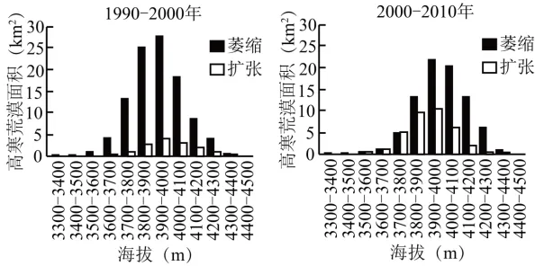

# 2025年湖南高考地理真题 · 选择题题组 G5（第12–14题）

## 来源
- 来源文档：精品解析：2025年湖南高考地理真题（解析版）.docx
- 题号：第12–14题（选择题，共3小题）

## 题组材料
高寒荒漠是祁连山垂直带谱的组成部分，对气温变化响应敏感。祁连山冷龙岭海拔3300-4400米为高山草甸与高寒荒漠的交错地带。下图示意1990-2010年祁连山冷龙岭不同海拔高寒荒漠的变化情况。据此完成下面小题。

## 相关图片


## 第12题
question_id: `2025-湖南-地理-2025年湖南高考地理真题-Q12`

**题干**：

12\. 与1990—2000年相比，2000—2010年高寒荒漠总面积变化趋势和可能原因是（   ）

A. 萎缩变缓　气温上升幅度减小　B. 萎缩变缓　气温上升幅度增大

C. 扩张加剧　气温上升幅度减小　D. 扩张加剧　气温下降幅度增大

**答案**：

【答案】12. A

**解析**：

【12题详解】

结合图中信息可以看到，1990-2000年和2000-2010年两个时间段均以萎缩为主（萎缩数值高于扩张数值）。与1990—2000年相比，2000—2010年萎缩和扩张的差值趋于减小趋势，反映高寒荒漠总面积萎缩趋缓，CD错误；其可能的原因是气温升高的幅度减小，植被（高寒草甸）生长的速度变慢，导致植被覆盖率提高的速度变慢，高寒荒漠的萎缩趋缓，A正确，B错误。故选A。

**知识点归属**：
- **核心考点 · 权重 1.0**：自然地理 → 植被与土壤 → 植被与环境
- **支撑知识 · 权重 0.7**：自然地理 → 自然环境的整体性与差异性 → 垂直地域分异规律

**整体置信度**：高

<!-- MANAGED-KM-START Q12
```yaml
question_id: "2025-湖南-地理-2025年湖南高考地理真题-Q12"
question_number: 12
knowledge_points:
  - role: core_exam_point
    weight: 1.0
    domain_id: DM-NAT
    domain: "自然地理"
    theme_id: TH-NAT-VEGETATION-SOIL
    theme: "植被与土壤"
    knowledge_unit_id: KU-NAT-VEG-SOIL-001
    knowledge_unit: "植被与环境"
    evidence: "气温升高幅度减小会使高山草甸扩展速度放缓，从而使高寒荒漠萎缩趋缓。"
  - role: supporting_knowledge
    weight: 0.7
    domain_id: DM-NAT
    domain: "自然地理"
    theme_id: TH-NAT-INTEGRITY
    theme: "自然环境的整体性与差异性"
    knowledge_unit_id: KU-NAT-INTEGRITY-006
    knowledge_unit: "垂直地域分异规律"
    evidence: "高寒荒漠与高山草甸位于山地垂直带谱的交错地带。"
extra_tags:
  - "增温与高寒荒漠面积变化"
taxonomy_version: "config-v0.2-draft"
confidence: "high"
label_status: "completed"
needs_review: false
taxonomy_review:
  needs_review: false
  issue_type: "none"
  review_note: ""
note: ""
```
-->

## 第13题
question_id: `2025-湖南-地理-2025年湖南高考地理真题-Q13`

**题干**：

13\. 与3700-3800米相比，3600-3700米在1990-2000年高寒荒漠萎缩面积小，这主要是该地带（   ）

A. 高寒荒漠分布面积小　B. 高山草甸生长条件差

C. 高寒荒漠分布面积大　D. 高山草甸分布面积小

**答案**：

【答案】13. A

**解析**：

【13题详解】

结合所学知识可知，一般来说，山地海拔越高、面积越小。研究区域为高山草甸与高寒荒漠的交错地带。根据自然植被的分布规律可以判断，低海拔处以高寒草甸为主，而高海拔处以高寒荒漠为主。与3700-3800米相比，3600-3700米海拔较低，山地面积较大，高寒草甸分布面积较大、高寒荒漠的分布面积较小，在1990-2000年高寒荒漠萎缩面积小，A正确，CD错误。3600-3700米海拔较低，热量条件较好、适合高寒草甸生长，B错误。故选A。

**知识点归属**：
- **核心考点 · 权重 1.0**：自然地理 → 自然环境的整体性与差异性 → 垂直地域分异规律
- **支撑知识 · 权重 0.7**：自然地理 → 植被与土壤 → 植被与环境

**整体置信度**：高

<!-- MANAGED-KM-START Q13
```yaml
question_id: "2025-湖南-地理-2025年湖南高考地理真题-Q13"
question_number: 13
knowledge_points:
  - role: core_exam_point
    weight: 1.0
    domain_id: DM-NAT
    domain: "自然地理"
    theme_id: TH-NAT-INTEGRITY
    theme: "自然环境的整体性与差异性"
    knowledge_unit_id: KU-NAT-INTEGRITY-006
    knowledge_unit: "垂直地域分异规律"
    evidence: "较低海拔的3600—3700米地带以高山草甸为主，高寒荒漠原有面积较小，因而萎缩面积较小。"
  - role: supporting_knowledge
    weight: 0.7
    domain_id: DM-NAT
    domain: "自然地理"
    theme_id: TH-NAT-VEGETATION-SOIL
    theme: "植被与土壤"
    knowledge_unit_id: KU-NAT-VEG-SOIL-001
    knowledge_unit: "植被与环境"
    evidence: "海拔变化造成热量和植被生长条件差异，影响草甸与荒漠的分布。"
extra_tags:
  - "高山草甸—高寒荒漠交错带"
taxonomy_version: "config-v0.2-draft"
confidence: "high"
label_status: "completed"
needs_review: false
taxonomy_review:
  needs_review: false
  issue_type: "none"
  review_note: ""
note: ""
```
-->

## 第14题
question_id: `2025-湖南-地理-2025年湖南高考地理真题-Q14`

**题干**：

14\. 下列特征中，最有可能导致1990-2010年高寒荒漠扩张区呈零星分布状态的是（   ）

A. 海拔高，热量条件差　B. 风力大，水分条件差

C. 气温低，土壤养分少　D. 坡度大，土壤不稳定

**答案**：

【答案】14. D

**解析**：

【14题详解】

结合材料及所学知识，高寒荒漠扩张区呈现零星分布状态，体现自然环境的地方性分异规律，受地方性因素的影响，可能受局部地区坡度较大导致土壤条件不稳定的影响，D正确。海拔高导致热量条件差，风力大导致水分条件差，气温低导致土壤养分少等因素影响整片地区，而不是产生局地差异，ABC错误。故选D。

【点睛】高寒草甸是在寒冷的环境条件下，发育在高原和高山的一种草地类型。生长环境一般年平均温度在0℃以下，年降水量约400\~500毫米。

**知识点归属**：
- **核心考点 · 权重 1.0**：自然地理 → 自然环境的整体性与差异性 → 地方性分异规律

**整体置信度**：高

<!-- MANAGED-KM-START Q14
```yaml
question_id: "2025-湖南-地理-2025年湖南高考地理真题-Q14"
question_number: 14
knowledge_points:
  - role: core_exam_point
    weight: 1.0
    domain_id: DM-NAT
    domain: "自然地理"
    theme_id: TH-NAT-INTEGRITY
    theme: "自然环境的整体性与差异性"
    knowledge_unit_id: KU-NAT-INTEGRITY-007
    knowledge_unit: "地方性分异规律"
    evidence: "局部坡度大、土壤不稳定造成小尺度斑块差异，可解释高寒荒漠扩张区零星分布。"
extra_tags:
  - "坡度引起地方性分异"
taxonomy_version: "config-v0.2-draft"
confidence: "high"
label_status: "completed"
needs_review: false
taxonomy_review:
  needs_review: false
  issue_type: "none"
  review_note: ""
note: ""
```
-->

## 教学备注
<!-- TEACHER-NOTES-START -->
- 易错点：
- 课堂提示：
- 讲解建议：
<!-- TEACHER-NOTES-END -->
