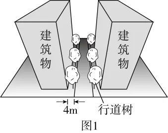
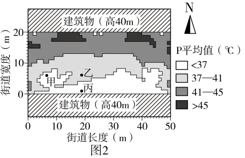

# 2025年湖南高考地理真题 · 选择题题组 G6（第15–16题）

## 来源
- 来源文档：精品解析：2025年湖南高考地理真题（解析版）.docx
- 题号：第15–16题（选择题，共2小题）

## 题组材料
中欧地区城市夏季常出现热浪天气，街道两侧建筑物和树木的阴影可缓解行人的热感，行人热感可用生理等效温度（P）衡量。图1示意中欧地区某市（48°N，8°E）一条东西向街道行道树布置，图2示意该街道某年夏至日（天气晴朗、风力微弱）当地时间9-15时P平均值的分布。tan65.5°≈2.19。据此完成下面小题。

## 相关图片




## 第15题
question_id: `2025-湖南-地理-2025年湖南高考地理真题-Q15`

**题干**：

15\. 甲、乙两处P平均值的差异主要源于（   ）

A. 全时段两侧建筑物的遮阴　B. 上午西侧行道树的遮阴

C. 全时段东侧行道树的遮阴　D. 下午西侧行道树的遮阴

**答案**：

【答案】15. D

**解析**：

【15题详解】

结合图2可知，甲处P平均值低于乙处，反映甲处生理等效温度低于乙处。主要原因是与乙处相比，甲处受到建筑物和行道树的遮挡更明显。结合材料，街道为东西走向，行道树排列方向与街道走向一致。当天为夏至日，该市（48°N）东北日出、西北日落，正午太阳位于正南。当地时间9-15时太阳的视运动轨迹为东南—正南—西南。由此分析，甲处上午受到东侧行道树遮阴、下午受到西侧行道树遮阴，D正确，BC错误。甲处全时段受到南侧建筑物的遮阴，A错误。故选D。

**知识点归属**：
- **核心考点 · 权重 1.0**：自然地理 → 地球的运动 → 地球的自转

**整体置信度**：高

<!-- MANAGED-KM-START Q15
```yaml
question_id: "2025-湖南-地理-2025年湖南高考地理真题-Q15"
question_number: 15
knowledge_points:
  - role: core_exam_point
    weight: 1.0
    domain_id: DM-NAT
    domain: "自然地理"
    theme_id: TH-NAT-EARTH-MOTION
    theme: "地球的运动"
    knowledge_unit_id: KU-NAT-EARTH-MOTION-001
    knowledge_unit: "地球的自转"
    evidence: "9—15时太阳由东南经正南移向西南，树影方向随太阳周日视运动改变，从而造成甲乙热感差异。"
extra_tags:
  - "太阳周日视运动与树影"
taxonomy_version: "config-v0.2-draft"
confidence: "high"
label_status: "completed"
needs_review: false
taxonomy_review:
  needs_review: false
  issue_type: "none"
  review_note: ""
note: ""
```
-->

## 第16题
question_id: `2025-湖南-地理-2025年湖南高考地理真题-Q16`

**题干**：

16\. 同样情境下，若降低两侧建筑物高度至10米，乙、丙两处P平均值的差异将（   ）

A. 变小　B. 变大　C. 不变　D. 不确定

**答案**：

【答案】16. B

**解析**：

【16题详解】

结合材料，当地位于欧洲48°N，夏至日太阳直射23.5°N。根据正午太阳高度的计算公式，可以得出夏至日当天当地的正午太阳高度H=90°-（48°-23.5°）=65.5°。若当地的南建筑物高度减小为10米，正午时南侧建筑物的影子长度大致为10米÷2.19=4.57米。根据图2，乙处位于南侧建筑物北方，距离约为6米，大于4.57米。正午时南侧建筑物不能为乙处遮阴，可以为丙处遮阴。因此乙处P平均值将变大，丙处P平均值无明显变化，乙、丙两处P平均值的差异将变大，B正确，ACD错误。故选B。

【点睛】夏至日，北半球昼长达到一年中最长。除极昼区外，各地东北日出、西北日落。在极昼区，正北日出、正北日落。

**知识点归属**：
- **核心考点 · 权重 1.0**：自然地理 → 地球的运动 → 正午太阳高度的变化

**整体置信度**：高

<!-- MANAGED-KM-START Q16
```yaml
question_id: "2025-湖南-地理-2025年湖南高考地理真题-Q16"
question_number: 16
knowledge_points:
  - role: core_exam_point
    weight: 1.0
    domain_id: DM-NAT
    domain: "自然地理"
    theme_id: TH-NAT-EARTH-MOTION
    theme: "地球的运动"
    knowledge_unit_id: KU-NAT-EARTH-MOTION-007
    knowledge_unit: "正午太阳高度的变化"
    evidence: "利用夏至正午太阳高度65.5°计算10米建筑物影长，并比较乙、丙位置判断遮阴变化。"
extra_tags:
  - "建筑物高度与正午影长"
taxonomy_version: "config-v0.2-draft"
confidence: "high"
label_status: "completed"
needs_review: false
taxonomy_review:
  needs_review: false
  issue_type: "none"
  review_note: ""
note: ""
```
-->

## 教学备注
<!-- TEACHER-NOTES-START -->
- 易错点：
- 课堂提示：
- 讲解建议：
<!-- TEACHER-NOTES-END -->
