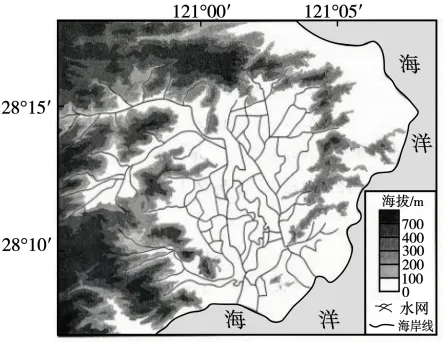
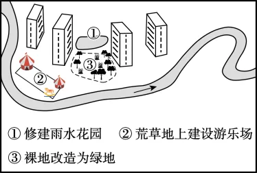

# 2025年福建高考地理真题 · 综合题第17题（小问1–3）

## 来源
- 来源文档：精品解析：2025年福建高考地理真题（解析版）.docx
- 题号：第17题（非选择题，共3小问）

## 题组材料
1. 阅读图文材料，完成下列要求。

我国东南某流域（下左图）在台风影响下，暴雨、山洪和风暴潮叠加，易出现严重内涝。当地政府采取了诸多防灾减灾措施，工作初见成效。政府拟按海绵城市理念，完善城镇建设方案；改变传统的筑坝挡潮方式，将临近海岸的水网开放为潮流通道，使部分区域形成红树林湿地，助力打造休闲文旅带。

## 相关图片




### 第17题（1）
question_id: `2025-福建-地理-2025年福建高考地理真题-Q17-1`

**题干**：（1）从地形角度，分析台风产生的暴雨易在该流域造成内涝的原因。

**答案**：台风受地形阻挡和抬升，降雨量增多；盆地周围坡度大，汇水快；中间地势低平，排水不畅。

**解析**：内涝是指由于强降水或连续性降水超过城市排水能力致使城市内产生积水灾害的现象。内涝产生的诱因是降水量大，据当地地势分布图可知当地地势起伏较大，台风会受地形阻挡和抬升，水汽抬升，降雨量增多；流域中部盆地周围地势起伏大，水流速度快，汇水速度快；盆地中部地势低平，水流速度缓慢，排水不畅。

**知识点归属**：
- **核心考点 · 权重 1.0**：自然地理 → 自然灾害 → 气象灾害
- **支撑知识 · 权重 0.7**：自然地理 → 水文与海洋 → 水循环

**整体置信度**：高

<!-- MANAGED-KM-START Q17-1
```yaml
question_id: "2025-福建-地理-2025年福建高考地理真题-Q17-1"
question_number: 17
sub_question: 1
knowledge_points:
  - role: core_exam_point
    weight: 1.0
    domain_id: DM-NAT
    domain: "自然地理"
    theme_id: TH-NAT-HAZARD
    theme: "自然灾害"
    knowledge_unit_id: KU-NAT-HAZARD-001
    knowledge_unit: "气象灾害"
    evidence: "台风暴雨在盆地地形中叠加坡面快速汇流和低平区排水不畅，形成严重洪涝内涝。"
  - role: supporting_knowledge
    weight: 0.7
    domain_id: DM-NAT
    domain: "自然地理"
    theme_id: TH-NAT-WATER
    theme: "水文与海洋"
    knowledge_unit_id: KU-NAT-WATER-001
    knowledge_unit: "水循环"
    evidence: "坡面径流快速汇集而低地排水受阻，体现水循环中地表径流与汇流过程。"
extra_tags:
  - "地形对城市内涝的影响"
  - "台风复合灾害"
taxonomy_version: "config-v0.2-draft"
confidence: "high"
label_status: "completed"
needs_review: false
taxonomy_review:
  needs_review: false
  issue_type: "none"
  review_note: ""
note: ""
```
-->

### 第17题（2）
question_id: `2025-福建-地理-2025年福建高考地理真题-Q17-2`

**题干**：（2）右图为某地建设方案（包括①、②和③三种做法），选出不利于削减下游洪峰的做法，并说明理由。

**答案**：②。理由：不透水面积增大，降水难以向土壤下渗，土壤蓄水减少，汇入下游河道水量变大、汇入速度加快。

**解析**：荒草地上建游乐场②会使原来的自然地面变成硬化地面，地表水下渗减少，原土地中的土壤水分大幅度减少，地表径流增加，导致汇入下游河道水量变大，汇入速度加快，加剧内涝发生产生的危害。而①修建雨水花园能促进地表水下渗，另外也有一定的蓄水功能，利于削减下游洪峰，减轻内涝带来的不利影响，③裸地改造为绿地能促进地表水的下渗，削减地表径流，削减下游洪峰，也能缓解内涝。

**知识点归属**：
- **核心考点 · 权重 1.0**：自然地理 → 水文与海洋 → 水循环
- **支撑知识 · 权重 0.7**：人文地理 → 乡村与城镇 → 合理利用城乡空间

**整体置信度**：高

<!-- MANAGED-KM-START Q17-2
```yaml
question_id: "2025-福建-地理-2025年福建高考地理真题-Q17-2"
question_number: 17
sub_question: 2
knowledge_points:
  - role: core_exam_point
    weight: 1.0
    domain_id: DM-NAT
    domain: "自然地理"
    theme_id: TH-NAT-WATER
    theme: "水文与海洋"
    knowledge_unit_id: KU-NAT-WATER-001
    knowledge_unit: "水循环"
    evidence: "荒草地硬化为游乐场会减少下渗、增加并加快地表径流，从而抬高下游洪峰。"
  - role: supporting_knowledge
    weight: 0.7
    domain_id: DM-HUM
    domain: "人文地理"
    theme_id: TH-HUM-SETTLEMENT
    theme: "乡村与城镇"
    knowledge_unit_id: KU-HUM-SET-004
    knowledge_unit: "合理利用城乡空间"
    evidence: "雨水花园和绿地通过增加渗蓄削减径流，体现海绵城市对城乡空间的合理利用。"
extra_tags:
  - "海绵城市"
  - "雨洪调蓄"
taxonomy_version: "config-v0.2-draft"
confidence: "high"
label_status: "completed"
needs_review: false
taxonomy_review:
  needs_review: false
  issue_type: "none"
  review_note: ""
note: ""
```
-->

### 第17题（3）
question_id: `2025-福建-地理-2025年福建高考地理真题-Q17-3`

**题干**：（3）与传统的大规模筑坝挡潮方式相比，举出将临近海岸的水网开放为潮流通道产生的三点经济效益。

**答案**：节省建设和维护大坝的费用；增加旅游收入；提高生态系统服务价值，具有潜在的经济效益；受益地区土地增值。

**解析**：传统的大规模筑坝工程量极大，且后期维护成本高昂，而将临近海岸的水网开放为潮流通道工程量小，成本较低；近海岸的水网开放为潮流通道能增加自然景观，吸引游客，从而增加旅游收入；而将临近海岸的水网开放为潮流通道，有利于鱼类的洄游，维护生物多样性，能提高生态系统服务价值，具有潜在的经济效益；将临近海岸的水网开放为潮流通道能有效促进当地经济发展，从而使周边土地增值。

**知识点归属**：
- **核心考点 · 权重 1.0**：资源、环境与国家安全 → 资源环境与人类社会 → 自然环境的服务功能
- **支撑知识 · 权重 0.7**：资源、环境与国家安全 → 资源环境安全保障 → 可持续发展

**整体置信度**：高

<!-- MANAGED-KM-START Q17-3
```yaml
question_id: "2025-福建-地理-2025年福建高考地理真题-Q17-3"
question_number: 17
sub_question: 3
knowledge_points:
  - role: core_exam_point
    weight: 1.0
    domain_id: DM-RES
    domain: "资源、环境与国家安全"
    theme_id: TH-RES-SOC
    theme: "资源环境与人类社会"
    knowledge_unit_id: KU-RES-SOC-001
    knowledge_unit: "自然环境的服务功能"
    evidence: "开放潮流通道形成红树林湿地，可提供生态调节、旅游文化和土地增值等自然环境服务。"
  - role: supporting_knowledge
    weight: 0.7
    domain_id: DM-RES
    domain: "资源、环境与国家安全"
    theme_id: TH-RES-STRATEGY
    theme: "资源环境安全保障"
    knowledge_unit_id: KU-RES-STR-004
    knowledge_unit: "可持续发展"
    evidence: "以自然水网替代大规模筑坝可节省建设维护成本，并兼顾生态、经济和社会效益。"
extra_tags:
  - "基于自然的海岸治理"
  - "湿地生态系统服务"
taxonomy_version: "config-v0.2-draft"
confidence: "high"
label_status: "completed"
needs_review: false
taxonomy_review:
  needs_review: false
  issue_type: "none"
  review_note: ""
note: ""
```
-->

## 教学备注
<!-- TEACHER-NOTES-START -->
- 易错点：
- 课堂提示：
- 讲解建议：
<!-- TEACHER-NOTES-END -->

