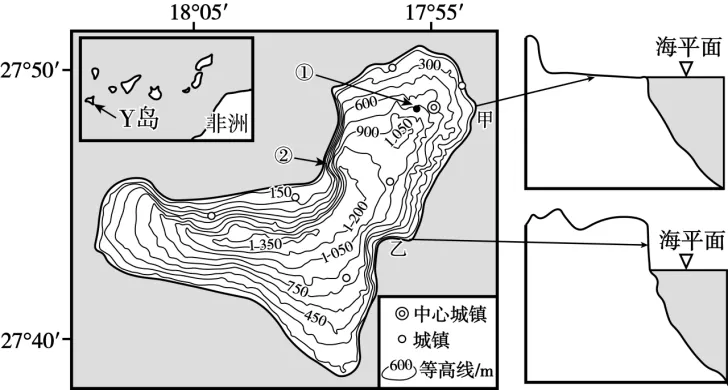

# 2025年福建高考地理真题 · 综合题第18题（小问1–3）

## 来源
- 来源文档：精品解析：2025年福建高考地理真题（解析版）.docx
- 题号：第18题（非选择题，共3小问）

## 题组材料
1. 阅读图文材料，完成下列要求。

大西洋中Y火山岛（下图）上，火山熔岩在海岸形成陡崖，因火山地貌典型多样，该岛入选联合国教科文组织世界地质公园名录。为保障电力供应稳定，该岛采用风能和水能协调发电，其中水电由蓄能电站（利用风电抽取海水到蓄水池，再适时利用蓄水发电）提供。该岛拟合理开发西南海域旅游资源。

## 相关图片


### 第18题（1）
question_id: `2025-福建-地理-2025年福建高考地理真题-Q18-1`

**题干**：（1）甲、乙海岸的火山熔岩形成于同一时期。分别指出甲、乙的海岸侵蚀地貌类型，并从位置角度说明甲、乙海岸侵蚀作用的强弱。

**答案**：甲：海蚀平台。乙：海蚀崖。

甲位于东北信风迎风处，乙位于背风处；与乙相比，甲风力较强，海浪较大，受到海浪的侵蚀较强。

或甲位于东北信风迎风处，乙位于背风处；与甲相比，乙风力较弱，海浪较小，受到海浪的侵蚀较弱。

**解析**：海蚀平台是海蚀崖形成后，继续受海蚀作用不断后退，结果在海蚀崖前出现一个平台状地形，据图分析甲处呈平台状，为海蚀平台；乙处地形剖面图中海岸处地形陡立，结合图中等高线也可知地势起伏极大，应为海蚀崖。当地地处北半球低纬地区，受东北信风影响大，甲地位于岛屿的东北侧，地处东北信风迎风坡位置，风力大，风浪大，海浪侵蚀较严重；乙地北部有地形阻挡，地处东北信风背风坡，受信风影响小，风力较小，风浪小，海浪侵蚀作用较小。

**知识点归属**：
- **核心考点 · 权重 1.0**：自然地理 → 地表形态 → 海岸地貌
- **支撑知识 · 权重 0.7**：自然地理 → 水文与海洋 → 海浪

**整体置信度**：高

<!-- MANAGED-KM-START Q18-1
```yaml
question_id: "2025-福建-地理-2025年福建高考地理真题-Q18-1"
question_number: 18
sub_question: 1
knowledge_points:
  - role: core_exam_point
    weight: 1.0
    domain_id: DM-NAT
    domain: "自然地理"
    theme_id: TH-NAT-LANDFORM
    theme: "地表形态"
    knowledge_unit_id: KU-NAT-LANDFORM-004
    knowledge_unit: "海岸地貌"
    evidence: "依据岸形识别甲为海蚀平台、乙为海蚀崖，并比较迎风岸与背风岸的海浪侵蚀强弱。"
  - role: supporting_knowledge
    weight: 0.7
    domain_id: DM-NAT
    domain: "自然地理"
    theme_id: TH-NAT-WATER
    theme: "水文与海洋"
    knowledge_unit_id: KU-NAT-WATER-003
    knowledge_unit: "海浪"
    evidence: "东北信风迎风侧风浪更大、海浪侵蚀更强，背风侧则相反。"
extra_tags:
  - "海蚀平台与海蚀崖"
  - "迎风岸侵蚀"
taxonomy_version: "config-v0.2-draft"
confidence: "high"
label_status: "completed"
needs_review: false
taxonomy_review:
  needs_review: false
  issue_type: "none"
  review_note: ""
note: ""
```
-->

### 第18题（2）
question_id: `2025-福建-地理-2025年福建高考地理真题-Q18-2`

**题干**：（2）从①②两地选择更适合建设蓄能电站的地点，并给出选择依据。

**答案**：地点：①。依据：地势起伏较小，建设空间较大；距中心城镇较近且周边城镇较多，更好满足用电需求；距风电场较近，建设成本较小。

**解析**：蓄能电站需要有一定的占地面积，这需要建在地形平坦开阔处，①地较②地等高线分布稀疏，说明地势起伏较小，平地多，建设蓄能电站空间较大；蓄能电站的选址需要考虑与能源消费市场的距离，①地距中心城镇较近且周边城镇较多，城镇地区能源需求量大，更能接近能源消费市场；甲地地形平坦开阔，且地处沿海地区，受东北信风影响大，风力大，是良好的风能发电选址地，蓄能电站需要外界的能源输入，①地距风电场较近，便于风电的输入。因此①地更适合建设蓄能电站。

**知识点归属**：
- **核心考点 · 权重 1.0**：人文地理 → 产业区位 → 工业区位因素
- **支撑知识 · 权重 0.7**：区域发展 → 区域发展的条件 → 自然条件与区域发展

**整体置信度**：高

<!-- MANAGED-KM-START Q18-2
```yaml
question_id: "2025-福建-地理-2025年福建高考地理真题-Q18-2"
question_number: 18
sub_question: 2
knowledge_points:
  - role: core_exam_point
    weight: 1.0
    domain_id: DM-HUM
    domain: "人文地理"
    theme_id: TH-HUM-INDUSTRY
    theme: "产业区位"
    knowledge_unit_id: KU-HUM-IND-002
    knowledge_unit: "工业区位因素"
    evidence: "蓄能电站选址需综合建设空间、接近电力市场和靠近风电场等工业区位因素。"
  - role: supporting_knowledge
    weight: 0.7
    domain_id: DM-REG
    domain: "区域发展"
    theme_id: TH-REG-CONDITION
    theme: "区域发展的条件"
    knowledge_unit_id: KU-REG-CONDITION-001
    knowledge_unit: "自然条件与区域发展"
    evidence: "①地地势起伏较小、可建设空间较大，自然条件更适合电站布局。"
extra_tags:
  - "抽水蓄能电站选址"
  - "能源设施区位"
taxonomy_version: "config-v0.2-draft"
confidence: "high"
label_status: "completed"
needs_review: false
taxonomy_review:
  needs_review: false
  issue_type: "none"
  review_note: ""
note: ""
```
-->

### 第18题（3）
question_id: `2025-福建-地理-2025年福建高考地理真题-Q18-3`

**题干**：（3）为该岛西南海域的旅游宣传提供两个能体现海水特色的关键词，并分别说明理由。

**答案**：海水清澈（或透明度高）：西南部城镇少，西南海域受人类活动干扰小；海水温度适宜：纬度较低；碧波荡漾：晴朗天气多，风浪小；水质洁净：入海径流少，陆源污染少。

**解析**：该岛西南海域地处东北信风背风坡，降水少，晴天多，风浪很小，因此可用"碧波荡漾"和"风浪小"作为宣传语；该岛西南部城镇少，西南海域受人类活动干扰小，且西南部入海径流数量少，生产生活排放废水少，海水透明度高，因此可用"海水清澈"或"水质洁净"作为宣传语；该岛西南海域地处低纬，海水水温较高，因此可用"海水温度适宜"作为宣传语。

**知识点归属**：
- **核心考点 · 权重 1.0**：自然地理 → 水文与海洋 → 海水的性质
- **支撑知识 · 权重 0.7**：自然地理 → 大气 → 气压带和风带对气候的影响

**整体置信度**：高

<!-- MANAGED-KM-START Q18-3
```yaml
question_id: "2025-福建-地理-2025年福建高考地理真题-Q18-3"
question_number: 18
sub_question: 3
knowledge_points:
  - role: core_exam_point
    weight: 1.0
    domain_id: DM-NAT
    domain: "自然地理"
    theme_id: TH-NAT-WATER
    theme: "水文与海洋"
    knowledge_unit_id: KU-NAT-WATER-002
    knowledge_unit: "海水的性质"
    evidence: "宣传关键词中的海水温度、透明度和洁净程度均需结合海水性质及其影响因素说明。"
  - role: supporting_knowledge
    weight: 0.7
    domain_id: DM-NAT
    domain: "自然地理"
    theme_id: TH-NAT-ATMOSPHERE
    theme: "大气"
    knowledge_unit_id: KU-NAT-ATM-CIRC-006
    knowledge_unit: "气压带和风带对气候的影响"
    evidence: "西南海域位于东北信风背风侧，晴天较多且风浪较小，支持碧波荡漾等海水特色。"
extra_tags:
  - "海水透明度"
  - "滨海旅游资源评价"
taxonomy_version: "config-v0.2-draft"
confidence: "high"
label_status: "completed"
needs_review: false
taxonomy_review:
  needs_review: false
  issue_type: "none"
  review_note: ""
note: ""
```
-->

## 教学备注
<!-- TEACHER-NOTES-START -->
- 易错点：
- 课堂提示：
- 讲解建议：
<!-- TEACHER-NOTES-END -->
