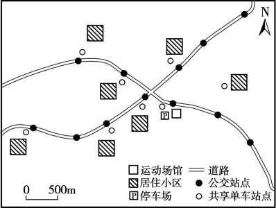

# 2025年福建高考地理真题 · 综合题第19题

## 来源
- 来源文档：精品解析：2025年福建高考地理真题（解析版）.docx
- 题号：第19题（非选择题，共1题）

## 题组材料
1. 阅读图文材料，完成下列要求。

服务业在进行区位选择时必须考虑人口规模、交通因素以及被服务对象的需求与分布等。某区域（下图）致力打造15分钟运动圈，新建了一个运动场馆。这一场馆主要服务该区域居民，开放时段为6：00-11：30，14：00-22：00。

请你设计一份调查方案（包括调查对象、调查方法、调查内容等），调查目标如下：

①该场馆能否满足该区域居民的不同运动需求；

②该区域具有运动需求的居民在15分钟出行时间内能否到达该场馆。

## 相关图片


### 第19题
question_id: `2025-福建-地理-2025年福建高考地理真题-Q19`

**题干**：设计一份调查方案（包括调查对象、调查方法、调查内容等），以回答上述两个调查目标。

**答案**：调查对象：运动场馆、居民。

调查方法：实地调查运动场馆、交通站点、线路情况等；向小区居民发放调查问卷；对运动场馆内的健身居民与管理人员等进行访谈。

调查内容：场馆提供的运动项目和数量、容纳能力、运动时间、运动器械使用情况等；小区居民人数、运动项目偏好、运动时段、出行方式和出行时间等。

数据处理：应用GIS等方法，通过数据处理，估算该区域到该场馆运动的居民人数、运动项目偏好、运动时段和出行时间。

结果分析：根据调查结果，回答调查目标中的问题，例如该场馆提供的运动项目、容纳能力与到该场馆居民的运动项目偏好和人数是否匹配。

**解析**：1、调查对象选择：聚焦核心关联方为运动场馆：直接评估设施供给能力（如项目类型、器械数量、开放时间等）。居民：通过问卷与访谈获取需求数据（如偏好、出行习惯），确保供需匹配分析的基础。

2、调查方法设计：多维度数据采集：实地调查：记录场馆实际运营状态（如器械损耗率、高峰时段拥挤度）及交通条件（如公交站点距离、步行路径、交通线路情况等）。向附近小区的居民发放问卷调查，覆盖居民运动频率、偏好项目、出行障碍（如"是否因距离放弃运动"）。对运动场馆内的健身居民和管理人员等进行访谈，补充定性数据（如场馆管理者对设施不足的反馈）。

3、调查内容细化：供需双视角进行调查。场馆侧：量化指标（场馆提供的运动项目和数量，如篮球场数量、泳池容量；场馆的容纳能力；场馆的开放时间）与质性信息（如预约制度灵活性、运动器械的使用情况等）。居民侧：小区的居民人数、运动项目偏好统计（如老年群体偏好太极、青年倾向羽毛球），居民的运动时间，并标注居住地与场馆的直线/实际路径距离，调查出行方式和出行时间等。

4、数据处理技术：GIS的空间分析价值，可达性建模，通过数据处理，估算该区域到该场馆运动的居民人数；叠加居民分布热力图与交通网络，计算步行/骑行/公交的覆盖人口比例，分析出行时间；需求匹配度分析，对比居民偏好项目与场馆供给；分析居民的运动时段等。

5、结果分析逻辑：根据调查结果，回答调查目标中的问题。目标①验证：若场馆项目与居民偏好重合度＞70%，且容纳量满足高峰需求，则判定"满足需求"。目标②验证：若GIS显示85%居民在15分钟内可达，且问卷中80%受访者认可"出行便捷"。

**知识点归属**：
- **核心考点 · 权重 1.0**：人文地理 → 产业区位 → 服务业区位因素
- **支撑知识 · 权重 0.7**：人文地理 → 地理调查与实践 → 地理调查方案设计
- **支撑知识 · 权重 0.7**：人文地理 → 地理信息技术 → GIS技术原理与应用

**整体置信度**：高

<!-- MANAGED-KM-START Q19
```yaml
question_id: "2025-福建-地理-2025年福建高考地理真题-Q19"
question_number: 19
knowledge_points:
  - role: core_exam_point
    weight: 1.0
    domain_id: DM-HUM
    domain: "人文地理"
    theme_id: TH-HUM-INDUSTRY
    theme: "产业区位"
    knowledge_unit_id: KU-HUM-IND-003
    knowledge_unit: "服务业区位因素"
    evidence: "调查需比较场馆运动项目、容量和开放时段与居民规模、偏好和时段，并分析人口需求与服务供给是否匹配。"
  - role: supporting_knowledge
    weight: 0.7
    domain_id: DM-HUM
    domain: "人文地理"
    theme_id: TH-HUM-GEOPRACTICE
    theme: "地理调查与实践"
    knowledge_unit_id: KU-HUM-PRACTICE-001
    knowledge_unit: "地理调查方案设计"
    evidence: "需要围绕两个调查目标系统设计调查对象、实地调查、问卷访谈、调查指标、数据处理和结果分析。"
  - role: supporting_knowledge
    weight: 0.7
    domain_id: DM-HUM
    domain: "人文地理"
    theme_id: TH-HUM-GEOINFO
    theme: "地理信息技术"
    knowledge_unit_id: KU-HUM-GIT-002
    knowledge_unit: "GIS技术原理与应用"
    evidence: "利用居民分布、交通网络和出行时间开展GIS网络与可达性分析，判断15分钟服务范围。"
extra_tags:
  - "问卷与访谈调查"
  - "GIS可达性分析"
  - "15分钟运动圈"
taxonomy_version: "config-v0.2-draft"
confidence: "high"
label_status: "completed"
needs_review: false
taxonomy_review:
  needs_review: false
  issue_type: "none"
  review_note: ""
note: "“地理实践力”按可独立教学的地理调查方案设计方法落入 taxonomy，不把核心素养名称直接作为知识节点。"
```
-->

## 教学备注
<!-- TEACHER-NOTES-START -->
- 易错点：
- 课堂提示：
- 讲解建议：
<!-- TEACHER-NOTES-END -->
