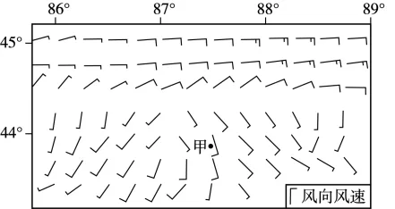

# 2025年福建高考地理真题 · 选择题题组 G3（第6–8题）

## 来源
- 来源文档：精品解析：2025年福建高考地理真题（解析版）.docx
- 题号：第6–8题（选择题，共3小题）

## 题组材料
较小的风速、充足的水汽和深厚的低空逆温层(对流层中气温随着高度增加而上升的层次)是形成浓雾的有利条件。甲地位于天山山脉北坡，海拔约650m。2021年冬季某日受某地面天气系统的影响，该地经历了一次浓雾过程。下图示意甲地所在区域当日10：00(北京时间)的地面风场。据此完成下面小题。

## 相关图片


## 第6题
question_id: `2025-福建-地理-2025年福建高考地理真题-Q6`

**题干**：6. 当日10：00(北京时间)，甲地的天气情况是（   ）

**选项**：
- A. 浓雾弥漫
- B. 寒风凛冽
- C. 云淡风轻
- D. 微风细雨

**答案**：C

**解析**：题目已知形成浓雾需要较小的风速、充足的水汽和深厚的低空逆温层这三个条件。从图中可以看到，甲地的风向为偏南风，结合风向风速图例能判断出其风速较小。当日10：00（北京时间），相当于当地时间8：00左右，随着太阳升起，地面温度逐渐升高，逆温层可能被破坏，水汽也会因温度升高而蒸发，所以浓雾不太可能持续弥漫，A错误。"寒风凛冽"通常意味着风速很大，而甲地风速较小，B错误。图示时刻甲地为偏南风，该地位于天山北坡，偏南风为下沉气流，难以形成降水，D错误。"云淡风轻"表示风速小且天气晴朗，这与此时甲地风速小以及因逆温层被破坏、天气转好的情况相符，C正确。故选C。

**知识点归属**：
- **核心考点 · 权重 1.0**：自然地理 → 大气 → 大气的水平运动

**整体置信度**：高

<!-- MANAGED-KM-START Q6
```yaml
question_id: "2025-福建-地理-2025年福建高考地理真题-Q6"
question_number: 6
knowledge_points:
  - role: core_exam_point
    weight: 1.0
    domain_id: DM-NAT
    domain: "自然地理"
    theme_id: TH-NAT-ATMOSPHERE
    theme: "大气"
    knowledge_unit_id: KU-NAT-ATM-HEAT-006
    knowledge_unit: "大气的水平运动"
    evidence: "判断云淡风轻需要读取地面风场中甲地的风向与较小风速，并结合地形分析气流性质。"
extra_tags:
  - "地面风场判读"
  - "山地背风天气"
taxonomy_version: "config-v0.2-draft"
confidence: "high"
label_status: "completed"
needs_review: false
taxonomy_review:
  needs_review: false
  issue_type: "none"
  review_note: ""
note: "教师已确认并统一为偏南风。"
```
-->

## 第7题
question_id: `2025-福建-地理-2025年福建高考地理真题-Q7`

**题干**：7. 此次浓雾过程中，水汽的来源主要是（   ）

**选项**：
- A. 南侧暖湿气流
- B. 局地地面蒸发
- C. 北侧冷湿气流
- D. 冰洋冷湿气流

**答案**：C

**解析**：此次浓雾过程中的水汽来源，需要结合甲地的地理位置和冬季的气候特点来分析。甲地位于天山山脉北坡，属于中纬度地区，冬季受西风带的影响。西风带来的气流在天山北坡受地形抬升，气温降低，水汽凝结成雾，C正确；南侧为塔里木盆地，气候干燥，水汽含量少，A错误；冬季气温低，局地地面蒸发量弱，难以提供充足水汽形成浓雾，B错误；北冰洋距甲地较远，且中间有山脉阻挡，对甲地影响小，D错误。故选C。

**知识点归属**：
- **核心考点 · 权重 1.0**：自然地理 → 大气 → 气压带和风带对气候的影响
- **支撑知识 · 权重 0.7**：自然地理 → 大气 → 大气的水平运动

**整体置信度**：高

<!-- MANAGED-KM-START Q7
```yaml
question_id: "2025-福建-地理-2025年福建高考地理真题-Q7"
question_number: 7
knowledge_points:
  - role: core_exam_point
    weight: 1.0
    domain_id: DM-NAT
    domain: "自然地理"
    theme_id: TH-NAT-ATMOSPHERE
    theme: "大气"
    knowledge_unit_id: KU-NAT-ATM-CIRC-006
    knowledge_unit: "气压带和风带对气候的影响"
    evidence: "冬季西风环流影响天山北坡，冷湿气流为浓雾形成输送水汽。"
  - role: supporting_knowledge
    weight: 0.7
    domain_id: DM-NAT
    domain: "自然地理"
    theme_id: TH-NAT-ATMOSPHERE
    theme: "大气"
    knowledge_unit_id: KU-NAT-ATM-HEAT-006
    knowledge_unit: "大气的水平运动"
    evidence: "地面风场用于判断水汽输送方向，天山北坡的地形抬升使冷湿气流降温并促进成雾。"
extra_tags:
  - "西风带水汽输送"
  - "地形抬升对雾形成的影响"
taxonomy_version: "config-v0.2-draft"
confidence: "high"
label_status: "completed"
needs_review: false
taxonomy_review:
  needs_review: false
  issue_type: "none"
  review_note: ""
note: ""
```
-->

## 第8题
question_id: `2025-福建-地理-2025年福建高考地理真题-Q8`

**题干**：8. 此次浓雾过程初期，气流抬升降温是低空逆温层形成的重要原因。此后，有助于维持逆温层的是（   ）

**选项**：
- A. 锋上空气抬升降温
- B. 东南气流下沉增温
- C. 空气对流上升降温
- D. 冷暖空气混合增温

**答案**：B

**解析**：逆温层是对流层中气温随高度增加而上升的层次。东南气流下沉过程中，绝热增温，会使近地面上方的气温升高，从而有助于维持低空逆温层，B正确；锋上空气抬升降温，对近地面逆温层影响较小，A错误；空气对流上升降温会导致上下层空气对流运动增强，破坏逆温层，C错误；冷暖空气混合增温可能使上下层空气温度差异减小，不利于逆温层维持，D错误。故选B。

【点睛】雾是指在接近地球表面、大气中悬浮的由小水滴或冰晶组成的水汽凝结物，是一种常见的天气现象。当气温达到露点温度时（或接近露点），空气里的水蒸气凝结生成雾。雾和云的不同在于，云生成于大气的高层，而雾接近地表。

**知识点归属**：
- **核心考点 · 权重 1.0**：自然地理 → 大气 → 大气热力环流
- **支撑知识 · 权重 0.7**：自然地理 → 大气 → 大气的垂直分层

**整体置信度**：高

<!-- MANAGED-KM-START Q8
```yaml
question_id: "2025-福建-地理-2025年福建高考地理真题-Q8"
question_number: 8
knowledge_points:
  - role: core_exam_point
    weight: 1.0
    domain_id: DM-NAT
    domain: "自然地理"
    theme_id: TH-NAT-ATMOSPHERE
    theme: "大气"
    knowledge_unit_id: KU-NAT-ATM-HEAT-005
    knowledge_unit: "大气热力环流"
    evidence: "山谷风热力环流中的下沉气流发生绝热增温，维持低空逆温并驱动浓雾时空分布变化。"
  - role: supporting_knowledge
    weight: 0.7
    domain_id: DM-NAT
    domain: "自然地理"
    theme_id: TH-NAT-ATMOSPHERE
    theme: "大气"
    knowledge_unit_id: KU-NAT-ATM-HEAT-002
    knowledge_unit: "大气的垂直分层"
    evidence: "低空逆温层的垂直温度结构决定雾的维持条件，并受山谷风下沉增温作用影响。"
extra_tags:
  - "山谷风热力环流"
  - "浓雾时空分布变化的驱动作用"
taxonomy_version: "config-v0.2-draft"
confidence: "high"
label_status: "completed"
needs_review: false
taxonomy_review:
  needs_review: false
  issue_type: "none"
  review_note: ""
note: ""
```
-->

## 教学备注
<!-- TEACHER-NOTES-START -->
- 易错点：
- 课堂提示：
- 讲解建议：
<!-- TEACHER-NOTES-END -->
