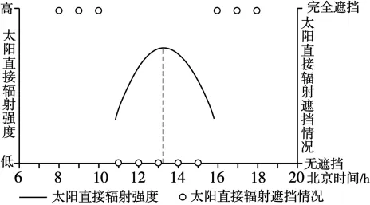
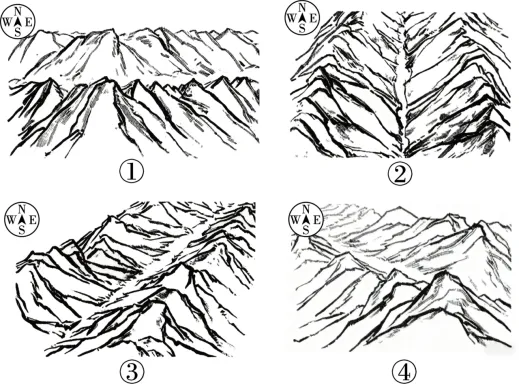

# 2025年福建高考地理真题 · 选择题题组 G4（第9–10题）

## 来源
- 来源文档：精品解析：2025年福建高考地理真题（解析版）.docx
- 题号：第9–10题（选择题，共2小题）

## 题组材料
为了研究山体遮挡对太阳辐射的影响，在我国某峡谷谷底中部设立观测站点。该峡谷两侧山体海拔相当、坡度均约45°。下图示意该站点某日太阳直接辐射强度和整点时刻的太阳直接辐射遮挡情况。据此完成下面小题。

## 相关图片




## 第9题
question_id: `2025-福建-地理-2025年福建高考地理真题-Q9`

**题干**：9. 该峡谷所在的山脉及该日最接近的分别是（   ）

**选项**：
- A. 昆仑山脉，夏至日
- B. 祁连山脉，夏至日
- C. 太行山脉，冬至日
- D. 横断山脉，冬至日

**答案**：D

**解析**：根据图示信息可知，该地有太阳辐射的时长为8时至18时，说明昼长为10小时，应为北半球的冬至日，AB错误；根据图示信息可知，太阳直接辐射强度最大值出现在北京时间13点稍多一点，说明当地应位于105°E靠西一点，横断山脉符合，太行山脉不符合，C错误，D正确。故选D。

**知识点归属**：
- **核心考点 · 权重 1.0**：自然地理 → 地球的运动 → 昼夜长短的变化
- **支撑知识 · 权重 0.7**：自然地理 → 地球的运动 → 地球的自转

**整体置信度**：高

<!-- MANAGED-KM-START Q9
```yaml
question_id: "2025-福建-地理-2025年福建高考地理真题-Q9"
question_number: 9
knowledge_points:
  - role: core_exam_point
    weight: 1.0
    domain_id: DM-NAT
    domain: "自然地理"
    theme_id: TH-NAT-EARTH-MOTION
    theme: "地球的运动"
    knowledge_unit_id: KU-NAT-EARTH-MOTION-006
    knowledge_unit: "昼夜长短的变化"
    evidence: "观测到约10小时日照时段，需用北半球冬半年昼短夜长规律判断接近冬至日。"
  - role: supporting_knowledge
    weight: 0.7
    domain_id: DM-NAT
    domain: "自然地理"
    theme_id: TH-NAT-EARTH-MOTION
    theme: "地球的运动"
    knowledge_unit_id: KU-NAT-EARTH-MOTION-001
    knowledge_unit: "地球的自转"
    evidence: "太阳辐射峰值约在北京时间13时，用地方时与经度关系判断站点约在105°E附近。"
extra_tags:
  - "太阳辐射日变化判读"
taxonomy_version: "config-v0.2-draft"
confidence: "high"
label_status: "completed"
needs_review: false
taxonomy_review:
  needs_review: false
  issue_type: "none"
  review_note: ""
note: ""
```
-->

## 第10题
question_id: `2025-福建-地理-2025年福建高考地理真题-Q10`

**题干**：10. 与该峡谷走向最符合的是（   ）

**选项**：
- A. ①
- B. ②
- C. ③
- D. ④

**答案**：B

**解析**：该日该地太阳东南升西南落，正午太阳位于正南方。根据图示信息可知，该峡谷太阳直接辐射强度和太阳直接辐射遮挡情况大致关于13时（该地正午）对称，说明当地峡谷走向应为正南正北走向，B正确，ACD错误。故选B。

【点睛】影响太阳辐射的因素：1．纬度位置：太阳辐射的强弱主要受正午太阳高度的影响。纬度低则正午太阳高度角大，太阳辐射经过大气的路程短，被大气削弱得少，到达地面的太阳辐射就多；反之，则少。2．天气状况：晴朗的天气，由于云层少且薄，大气对太阳辐射的削弱作用弱，到达地面的太阳辐射就强；阴雨的天气，由于云层厚且多，大气对太阳辐射的削弱作用强，到达地面的太阳辐射就弱。如赤道地区被赤道低压带控制，多对流雨，而副热带地区被副高控制，多晴朗天气，所以赤道地区的太阳辐射要弱于副热带地区。3．海拔高低：海拔高，空气稀薄，大气对太阳辐射的削弱作用弱，到达地面的太阳辐射就强；反之，则弱。如青藏高原成为我国太阳辐射最强的地区，主要就是这个原因。4．日照长短：日照时间长，获得太阳辐射强；日照时间短，获得太阳辐射弱。

**知识点归属**：
- **核心考点 · 权重 1.0**：自然地理 → 地球的运动 → 正午太阳高度的变化
- **支撑知识 · 权重 0.7**：自然地理 → 地球的运动 → 地球的自转

**整体置信度**：高

<!-- MANAGED-KM-START Q10
```yaml
question_id: "2025-福建-地理-2025年福建高考地理真题-Q10"
question_number: 10
knowledge_points:
  - role: core_exam_point
    weight: 1.0
    domain_id: DM-NAT
    domain: "自然地理"
    theme_id: TH-NAT-EARTH-MOTION
    theme: "地球的运动"
    knowledge_unit_id: KU-NAT-EARTH-MOTION-007
    knowledge_unit: "正午太阳高度的变化"
    evidence: "冬至日前后太阳东南升、西南落且正午位于正南方，辐射遮挡关于正午对称可反推峡谷为南北走向。"
  - role: supporting_knowledge
    weight: 0.7
    domain_id: DM-NAT
    domain: "自然地理"
    theme_id: TH-NAT-EARTH-MOTION
    theme: "地球的运动"
    knowledge_unit_id: KU-NAT-EARTH-MOTION-001
    knowledge_unit: "地球的自转"
    evidence: "以当地太阳正午对应北京时间约13时作为遮挡对称轴，需要地方时判读。"
extra_tags:
  - "太阳方位与峡谷走向"
  - "山体遮挡"
taxonomy_version: "config-v0.2-draft"
confidence: "high"
label_status: "completed"
needs_review: false
taxonomy_review:
  needs_review: false
  issue_type: "none"
  review_note: ""
note: ""
```
-->

## 教学备注
<!-- TEACHER-NOTES-START -->
- 易错点：
- 课堂提示：
- 讲解建议：
<!-- TEACHER-NOTES-END -->
